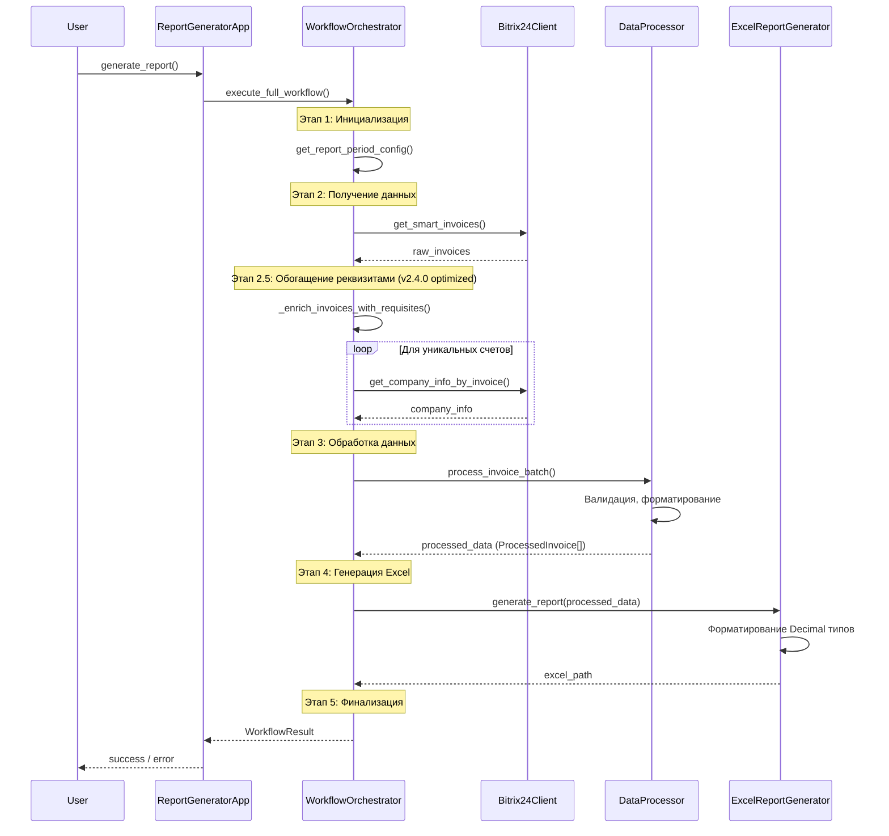

# 🏗️ Архитектура проекта ReportB24

## 📋 Содержание
- [Обзор архитектуры](#обзор-архитектуры)
- [SOLID Принципы](#solid-принципы)
- [Компоненты системы](#компоненты-системы)
- [Диаграмма взаимодействия](#диаграмма-взаимодействия)
- [Patterns и Best Practices](#patterns-и-best-practices)

---

## Обзор архитектуры

Проект ReportB24 построен на модульной архитектуре с четким разделением ответственностей (Separation of Concerns). Система состоит из пяти основных слоев:

```
┌─────────────────────────────────────────────────────────┐
│                   APPLICATION LAYER                     │
│                (ReportGeneratorApp)                     │
└────────────────────┬────────────────────────────────────┘
                     │
         ┌───────────┴───────────┐
         │                       │
┌────────▼─────────┐   ┌────────▼──────────┐
│  ORCHESTRATION   │   │  CONFIGURATION    │
│  WorkflowOrchest │   │  ConfigReader     │
│  rator           │   │  Settings         │
└────────┬─────────┘   └───────────────────┘
         │
    ┌────┴────┬─────────┬──────────┐
    │         │         │          │
┌───▼───┐ ┌──▼───┐ ┌───▼────┐ ┌──▼────┐
│Bitrix │ │Data  │ │Excel   │ │Error  │
│Client │ │Proc  │ │Gen     │ │Handle │
└───────┘ └──────┘ └────────┘ └───────┘
```

---

## SOLID Принципы

### 1️⃣ Single Responsibility Principle (SRP)

Каждый компонент имеет одну, четко определенную ответственность:

| Компонент | Ответственность |
|-----------|----------------|
| `ReportGeneratorApp` | Инициализация и координация приложения |
| `WorkflowOrchestrator` | Оркестрация процесса генерации отчета |
| `Bitrix24Client` | Коммуникация с Bitrix24 API |
| `DataProcessor` | Обработка и валидация бизнес-данных |
| `ExcelReportGenerator` | Генерация Excel отчетов |
| `ConfigReader` | Чтение и парсинг конфигурации |

**Пример соблюдения SRP:**
```python
# ✅ Правильно: Каждый класс делает одну вещь
class DataProcessor:
    """Обрабатывает данные счетов."""
    
class ExcelReportGenerator:
    """Генерирует Excel отчеты."""
    
# ❌ Неправильно: Один класс делает все
class ReportProcessor:
    """Обрабатывает данные И генерирует Excel."""  # Нарушение SRP
```

### 2️⃣ Open/Closed Principle (OCP)

Система открыта для расширения, но закрыта для модификации:

- **Процессоры данных** (`DataProcessor`, `CurrencyProcessor`, `INNProcessor`, `DateProcessor`) - можно добавлять новые без изменения существующих
- **Форматеры Excel** - новые стили и форматы добавляются через конфигурацию
- **Обработчики ошибок** - расширяемы через регистрацию новых типов

**Пример:**
```python
# Добавление нового процессора без изменения DataProcessor
class VATProcessor:
    """Новый процессор для НДС."""
    
# DataProcessor использует его через композицию
data_processor.vat_processor = VATProcessor()  # Расширение без модификации
```

### 3️⃣ Liskov Substitution Principle (LSP)

Подклассы должны быть взаимозаменяемы:

- `ConfigReader` и `SecureConfigReader` взаимозаменяемы через единый интерфейс
- `ProcessedInvoice` и `InvoiceData` - структуры данных с четким контрактом

**Пример:**
```python
# ✅ Правильно: Оба читают конфигурацию одинаково
config_reader: ConfigReader = ConfigReader(path)
# или
config_reader: ConfigReader = SecureConfigReader(path)

# Клиентский код работает с обоими одинаково
bitrix_config = config_reader.get_bitrix24_config()
```

### 4️⃣ Interface Segregation Principle (ISP)

Интерфейсы маленькие и специфичные:

- `CurrencyProcessor` - только обработка валют
- `INNProcessor` - только валидация ИНН
- `DateProcessor` - только работа с датами

**Пример:**
```python
# ✅ Правильно: Специфичные интерфейсы
class INNProcessor:
    def validate_inn(self, inn: str) -> INNValidationResult: ...
    def format_inn(self, inn: str) -> str: ...

# ❌ Неправильно: Слишком общий интерфейс
class UniversalProcessor:
    def validate_inn(self, inn: str): ...
    def parse_date(self, date: str): ...  # Не связано с ИНН!
    def format_currency(self, amount: float): ...  # Не связано с ИНН!
```

### 5️⃣ Dependency Inversion Principle (DIP)

Зависимости от абстракций, а не конкретных реализаций:

- `WorkflowOrchestrator` получает зависимости через конструктор (Dependency Injection)
- Компоненты не создают свои зависимости, они инжектятся

**Пример:**
```python
# ✅ Правильно: Dependency Injection
class WorkflowOrchestrator:
    def __init__(self, config_reader: ConfigReader, bitrix_client: Bitrix24Client):
        self.config_reader = config_reader  # Инжектируется
        self.bitrix_client = bitrix_client  # Инжектируется

# ❌ Неправильно: Жесткая зависимость
class BadWorkflow:
    def __init__(self):
        self.client = Bitrix24Client()  # Создает сам = жесткая связь
```

---

## Компоненты системы

### 🎯 Core Layer

#### `ReportGeneratorApp`
**Ответственность:** Главная точка входа, инициализация системы

**Ключевые методы:**
- `initialize()` - инициализация всех компонентов
- `generate_report()` - запуск генерации отчета
- `_setup_logging()` - настройка логирования с ротацией

**Зависимости:** ConfigReader, Bitrix24Client, DataProcessor, ExcelReportGenerator, WorkflowOrchestrator

#### `WorkflowOrchestrator`
**Ответственность:** Оркестрация workflow генерации отчета

**Ключевые методы:**
- `execute_full_workflow()` - выполнение полного цикла (v2.4.0 - refactored)
- `_fetch_invoices_data()` - получение данных из Bitrix24
- `_enrich_invoices_with_requisites()` - обогащение реквизитами (v2.4.0 - optimized)

**Оптимизации v2.4.0:**
- Кеширование уникальных реквизитов (50-90% меньше API запросов)
- Рефакторинг на 6 helper методов для этапов workflow

### 📊 Data Processing Layer

#### `DataProcessor`
**Ответственность:** Обработка и валидация данных счетов

**Ключевые методы:**
- `process_invoice_batch()` - batch-обработка счетов (v2.4.0)
- `format_product_data()` - форматирование товаров (v2.4.0 - refactored 125→45 lines)
- `_extract_invoice_number()` - извлечение номера (v2.4.0 - optimized with generators)

**Зависимости:** CurrencyProcessor, INNProcessor, DateProcessor

**Оптимизации v2.4.0:**
- Использование `next()` и generators для поиска по ключам (10-15% быстрее)
- Рефакторинг сложных методов на helper методы

#### `CurrencyProcessor`
**Ответственность:** Обработка валют и сумм

**Ключевые методы:**
- `parse_amount()` - парсинг сумм с разными форматами
- `calculate_vat()` - расчет НДС
- `format_amount()` - форматирование в российский формат

#### `INNProcessor`
**Ответственность:** Валидация ИНН

**Ключевые методы:**
- `validate_inn()` - валидация по контрольной сумме
- `format_inn()` - форматирование ИНН

#### `DateProcessor`
**Ответственность:** Обработка дат

**Ключевые методы:**
- `parse_date()` - парсинг дат из разных форматов
- `format_date()` - форматирование в российский формат

### 🌐 API Layer

#### `Bitrix24Client`
**Ответственность:** Коммуникация с Bitrix24 API

**Ключевые методы:**
- `get_smart_invoices()` - получение счетов
- `get_company_info_by_invoice()` - получение реквизитов компании

**Зависимости:** RateLimiter, RetryDecorator, ApiCache

**Оптимизации:**
- Rate limiting для соблюдения лимитов API
- Retry механизм для обработки временных ошибок
- Кеширование для уменьшения запросов

### 📄 Excel Generation Layer

#### `ExcelReportGenerator`
**Ответственность:** Генерация Excel отчетов

**Ключевые методы:**
- `generate_report()` - создание отчета
- `_create_sheet()` - создание листа
- `_format_cells()` - форматирование ячеек

**Зависимости:** ExcelFormatter, ExcelLayoutManager, ExcelStyles

**Особенности v2.4.0:**
- Адаптирован для работы с `Decimal` типами из `ProcessedInvoice`
- Корректное форматирование числовых полей в Excel

### ⚙️ Configuration Layer

#### `ConfigReader`
**Ответственность:** Чтение конфигурации из .ini файлов

**Ключевые методы:**
- `get_bitrix24_config()` - получение Bitrix24 настроек
- `get_report_period_config()` - получение периода отчета
- `get_app_config()` - получение настроек приложения

#### `SecureConfigReader`
**Ответственность:** Чтение конфигурации с дешифровкой

**Наследует:** ConfigReader (LSP - взаимозаменяем)

---

## Диаграмма взаимодействия

### Процесс генерации отчета



---

## Patterns и Best Practices

### ✅ Применяемые паттерны

#### 1. **Facade Pattern**
`ReportGeneratorApp` предоставляет простой интерфейс для сложной системы.

#### 2. **Strategy Pattern**
`ConfigReader` vs `SecureConfigReader` - разные стратегии чтения конфигурации.

#### 3. **Template Method Pattern**
`WorkflowOrchestrator.execute_full_workflow()` - шаблон процесса с определенными этапами.

#### 4. **Dependency Injection**
Все компоненты получают зависимости через конструктор.

#### 5. **Data Transfer Object (DTO)**
`InvoiceData`, `ProcessedInvoice`, `WorkflowResult` - структуры для передачи данных.

### 📊 Оптимизации v2.4.0

#### Производительность

1. **Кеширование API запросов** (50-90% улучшение)
   ```python
   # Было: N запросов для N счетов
   for invoice in invoices:
       get_company_info(invoice.account_number)
   
   # Стало: K запросов для K уникальных счетов
   unique_accounts = set(inv.account_number for inv in invoices)
   for account in unique_accounts:
       cache[account] = get_company_info(account)
   ```

2. **Оптимизация поиска по ключам** (10-15% быстрее)
   ```python
   # Было: Цикл с проверками
   for key in possible_keys:
       if key in data and data[key]:
           return data[key]
   
   # Стало: Generator expression
   return next((data[key] for key in possible_keys if key in data and data[key]), None)
   ```

3. **Рефакторинг сложных методов** (60-70% уменьшение размера)
   - `format_product_data`: 125 → 45 строк
   - `_fetch_invoices_data`: 99 → 30 строк
   - `execute_full_workflow`: 97 → 40 строк

#### Качество кода

1. **Удаление мертвого кода** - 21 неиспользуемых импортов
2. **Decimal типы** - замена `float` на `Decimal` для точности расчетов
3. **Type hints** - полная типизация для лучшей поддержки IDE
4. **Улучшенное логирование** - ротация логов с сохранением 30 дней истории

---

## 🔄 Lifecycle компонентов

```
Initialization → Configuration → Validation → Execution → Finalization
       ↓              ↓              ↓            ↓            ↓
   App Start    Load Config    Check System   Run Workflow   Cleanup
       │              │              │            │            │
       └──────────────┴──────────────┴────────────┴────────────┘
                         Error Handling & Logging
```

---

## 📝 Рекомендации для разработчиков

### При добавлении нового функционала:

1. **Определите ответственность** - убедитесь, что новый компонент имеет одну четкую ответственность (SRP)
2. **Используйте DI** - передавайте зависимости через конструктор
3. **Следуйте существующим паттернам** - смотрите на аналогичные компоненты
4. **Добавляйте тесты** - минимум unit тесты для нового функционала
5. **Документируйте изменения** - обновляйте ARCHITECTURE.md и docstrings

### При рефакторинге:

1. **Сохраняйте обратную совместимость** - не ломайте существующий API
2. **Постепенность** - большие изменения делайте поэтапно
3. **Тестируйте** - убедитесь, что все тесты проходят после изменений
4. **Измеряйте** - для оптимизаций производительности измеряйте результаты

---

**Версия документа:** v2.4.0  
**Дата последнего обновления:** 2025-10-26  
**Автор:** ReportB24 Development Team
