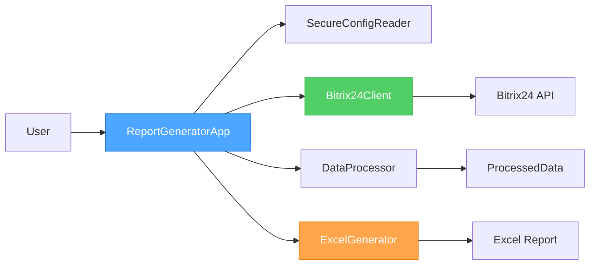

# 📊 ReportB24

<div align="center">

[](https://www.python.org/downloads/)
[](tests/)
[](htmlcov/)
[](LICENSE)
[](CHANGELOG.md)
[](SECURITY.md)
[](https://github.com/psf/black)

**Безопасный генератор профессиональных Excel отчетов для Bitrix24 Smart Invoices**

[🚀 Quick Start](#-быстрый-старт) • 
[📚 Documentation](docs/) • 
[💬 Discussions](https://github.com/bivlked/ReportB24/discussions) • 
[🐛 Issues](https://github.com/bivlked/ReportB24/issues) • 
[🔒 Security](SECURITY.md)

</div>

---

## 📋 О проекте

ReportB24 - система генерации Excel отчетов для Bitrix24 с фокусом на:

| Аспект | Реализация |
|--------|------------|
| 🔒 **Безопасность** | Гибридная `.env` + `config.ini`, маскировка webhook |
| ⚡ **Производительность** | Batch API (5-10x ускорение), 49,884 товаров/сек |
| 📊 **Отчетность** | Двухлистовые Excel с детализацией товаров |
| 🧪 **Качество** | 530+ тестов, 77% покрытие кода |

## ⚡ Быстрый старт

<details>
<summary>📦 Установка (развернуть для инструкций)</summary>

```bash
# Клонирование репозитория
git clone https://github.com/bivlked/ReportB24.git
cd ReportB24

# Создание виртуального окружения
python -m venv .venv

# Активация (Windows)
.venv\Scripts\activate

# Активация (Linux/Mac)
source .venv/bin/activate

# Установка зависимостей
pip install -r requirements.txt
```

</details>

### ⚙️ Настройка

```bash
# Копирование примеров конфигурации
copy .env-example .env
copy config.ini.example config.ini

# Отредактируйте .env - добавьте webhook URL
# BITRIX24_WEBHOOK_URL=https://your-portal.bitrix24.ru/rest/12/your-key/
```

### 🎯 Первый отчет

```bash
# Базовый отчет
```bash
# Генерация комплексного отчёта (краткий + детальный листы)
python scripts/run_report.py
```

**Результат**: ✅ Excel файл создаётся в `reports/` с двумя листами:
- **Краткий**: сводка по счетам без детализации товаров
- **Полный**: детальная разбивка всех товаров с микро-группировкой

> 💡 **Примечание**: Начиная с v3.1.0, `run_report.py` всегда генерирует comprehensive отчёт (dual-sheet)

## 🎯 Ключевые возможности

<table>
<tr>
<td width="33%">

**🔗 Bitrix24 Integration**
- REST API клиент
- Smart Invoices API
- Rate limiting (≤2 req/sec)
- Batch optimization
- Automatic pagination

</td>
<td width="33%">

**📊 Data Processing**
- ИНН validation (ФНС)
- Date formatting
- VAT calculations
- Russian localization
- Zebra-effect grouping

</td>
<td width="33%">

**📈 Excel Generation**
- Dual-sheet design
- Product breakdown
- Auto-width columns
- Summary tables
- Professional formatting

</td>
</tr>
</table>

## 📚 Документация

> 💡 **Tip**: Начните с [Quick Start Guide](docs/user/quick-start.md) для быстрого знакомства (5 минут)

<table>
<tr>
<td width="50%">

### 👥 Для пользователей
- [🚀 Quick Start](docs/user/quick-start.md) — 5 минут до первого отчета
- [⚙️ Installation](docs/user/installation.md) — Подробная установка
- [🔧 Configuration](docs/user/configuration.md) — Настройка системы
- [📖 User Guide](docs/user/) — Полное руководство
- [❓ FAQ](docs/user/faq.md) — Частые вопросы

</td>
<td width="50%">

### 🔧 Для разработчиков
- [🏗️ Architecture](docs/technical/architecture.md) — Архитектура системы
- [📋 API Reference](docs/technical/api-reference.md) — API документация
- [💻 Development](docs/technical/development.md) — Dev guide
- [🤝 Contributing](CONTRIBUTING.md) — Как контрибьютить
- [📊 Performance](docs/technical/performance.md) — Оптимизация

</td>
</tr>
</table>

**Примеры**: [Basic Report](docs/examples/basic-report.md) · [Batch Processing](docs/examples/batch-processing.md) · [Custom Formatting](docs/examples/custom-formatting.md)

## 🏗️ Архитектура



**Слои системы**:
- **Application Layer**: `ReportGeneratorApp` - оркестрация workflow
- **Business Logic**: `DataProcessor` - валидация, обработка, группировка
- **Integration Layer**: `Bitrix24Client` - REST API клиент с batch-оптимизацией
- **Presentation Layer**: `ExcelGenerator` - генерация отчетов с форматированием
- **Configuration Layer**: `SecureConfigReader` - безопасное управление конфигурацией

[→ Подробная архитектура](docs/technical/architecture.md)

## 🧪 Качество и тестирование

```
✅ 530/530 тестов пройдено (100% success rate)
📊 77% покрытие кода (3816/4957 строк)
⚡ 49,884 товаров/сек обработка
🔒 Security audit пройден
```

**Типы тестов**:
- Unit tests (компонентное тестирование)
- Integration tests (взаимодействие компонентов)
- Security tests (валидация безопасности)
- Performance tests (нагрузочное тестирование)

[→ Testing Guide](docs/technical/testing.md)

## 🔒 Безопасность

**Ключевые меры**:
- **Secure Configuration**: `.env` для секретов, `config.ini` для настроек
- **URL Masking**: Webhook URLs маскируются в логах (`***`)
- **Input Validation**: Комплексная валидация всех параметров
- **Dependency Management**: Регулярные security audits
- **Security Policy**: [SECURITY.md](SECURITY.md)

**Гибридная система конфигурации**:
```python
# Приоритеты (от высокого к низкому)
1. os.environ (переменные окружения)
2. .env (секреты)
3. config.ini (настройки)
```

[→ Security Deep Dive](docs/technical/security-deep-dive.md)

## 📊 Производительность

**Оптимизации v2.4.0**:
- **Batch API**: До 5-10x ускорение для множества счетов
- **Кэширование**: Кэш товаров и компаний для снижения API запросов
- **Lazy Loading**: Загрузка данных только при необходимости
- **Zebra Grouping**: Эффективная группировка без дублирования

**Метрики**:
- Обработка: 49,884 товаров/сек
- API calls: ≤2 запроса/сек (rate limiting)
- Memory: Эффективное использование памяти через lazy loading

[→ Performance Tuning](docs/technical/performance.md)

## 📦 Примеры использования

### Генерация отчёта

```python
from src.core.app import AppFactory

# Создание приложения
with AppFactory.create_app('config.ini') as app:
    # Генерация комплексного отчёта (dual-sheet)
    success = app.generate_report()
    if success:
        print("Отчёт успешно создан!")
```

> 💡 **Примечание**: Начиная с v3.1.0, `generate_report()` всегда создаёт comprehensive отчёт с двумя листами

[📖 Больше примеров](docs/examples/)

## 🤝 Вклад в проект

Contributions welcome! Пожалуйста, прочитайте:
- [CONTRIBUTING.md](CONTRIBUTING.md) — Руководство для контрибьюторов
- [CODE_OF_CONDUCT.md](CODE_OF_CONDUCT.md) — Правила поведения
- [docs/contributing/](docs/contributing/) — Детальные инструкции

**Процесс контрибьюции**:
1. Fork репозитория
2. Создайте feature branch (`git checkout -b feature/amazing-feature`)
3. Commit изменений (`git commit -m 'feat: add amazing feature'`)
4. Push в branch (`git push origin feature/amazing-feature`)
5. Создайте Pull Request

## 📄 Лицензия

MIT License — см. [LICENSE](LICENSE)

Вы можете свободно использовать, изменять и распространять этот проект.

## 🙏 Благодарности

См. [CONTRIBUTORS.md](CONTRIBUTORS.md) для полного списка контрибьюторов.

Спасибо всем, кто внес вклад в развитие ReportB24!


## 📖 Глоссарий технических терминов

Для удобства работы с документацией, ниже приведены русские эквиваленты ключевых технических терминов:

| Английский термин | Русский эквивалент | Пояснение |
|-------------------|-------------------|-----------|
| **Quick Start** | Быстрый старт | Руководство для быстрого начала работы |
| **Documentation** | Документация | Техническая и пользовательская документация |
| **Discussions** | Обсуждения | Форум для вопросов и обсуждений |
| **Issues** | Проблемы / Задачи | Система отслеживания ошибок и запросов функций |
| **Smart Invoices API** | API умных счетов | Специальный API Bitrix24 для работы со счетами |
| **REST API** | REST API | Интерфейс программирования приложений на основе HTTP |
| **Rate limiting** | Ограничение частоты запросов | Механизм контроля количества запросов к API |
| **Batch API** | Пакетный API | Метод отправки нескольких запросов одновременно |
| **webhook** | вебхук | URL для получения уведомлений и данных от Bitrix24 |
| **cache** | кеш | Временное хранилище данных для ускорения работы |
| **Dual-sheet design** | Дизайн с двумя листами | Структура Excel отчёта с кратким и детальным листами |
| **CLI** | Интерфейс командной строки | Текстовый интерфейс для работы с программой |
| **Workflow** | Рабочий процесс | Последовательность операций при генерации отчёта |

> 💡 **Примечание**: В документации могут использоваться как английские термины, так и их русские эквиваленты.

## 📞 Поддержка

**Нужна помощь?**

1. Проверьте [FAQ](docs/user/faq.md) — возможно, ответ уже есть
2. Изучите [Troubleshooting](docs/user/troubleshooting.md) — решение типичных проблем
3. Создайте [Issue](https://github.com/bivlked/ReportB24/issues) — для сообщений об ошибках
4. Используйте [Discussions](https://github.com/bivlked/ReportB24/discussions) — для вопросов

## 📈 Версионирование

Проект следует [Semantic Versioning](https://semver.org/):
- **Major** (X.0.0): Breaking changes
- **Minor** (0.X.0): Новые features (обратно совместимые)
- **Patch** (0.0.X): Bug fixes

См. [CHANGELOG.md](CHANGELOG.md) для истории изменений.

## 🗺️ Roadmap

- [ ] Web интерфейс для генерации отчетов
- [ ] Дополнительные форматы экспорта (PDF, CSV)
- [ ] Scheduled reports (автоматическая генерация)
- [ ] Extended analytics и dashboard
- [ ] Multi-tenant support

---

<div align="center">

**📊 [Создать отчет сейчас](https://github.com/bivlked/ReportB24/archive/refs/heads/main.zip)** • 
**📚 [Documentation](docs/)** • 
**💬 [Support](https://github.com/bivlked/ReportB24/discussions)**

*Создано с ❤️ для безопасной работы с Bitrix24*

[🇷🇺 Русский](README.md) • [🇬🇧 English](README_EN.md)

</div>
