# 🏛️ Архитектура системы

Подробная многоуровневая архитектура ReportB24 с компонентами, слоями и взаимодействиями.

---

## 🏗️ Слоистая архитектура

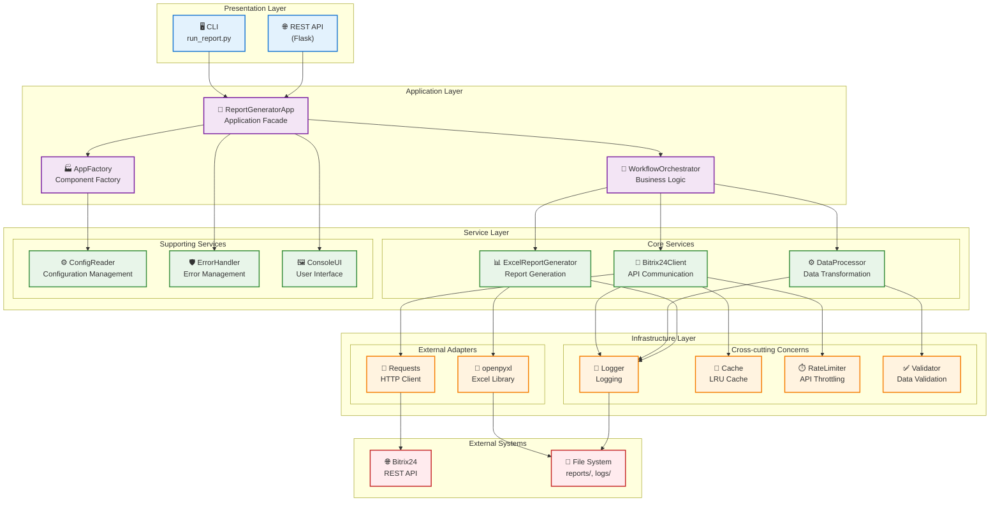

---

## 🎯 Компоненты по слоям

### 1. Presentation Layer (Представление)

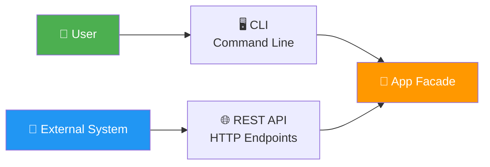

**Ответственность**:
- Взаимодействие с пользователем
- Парсинг команд и параметров
- Форматирование вывода

**Компоненты**:
- `run_report.py` - CLI точка входа
- Flask API routes - HTTP endpoints
- `ConsoleUI` - форматированный вывод

---

### 2. Application Layer (Приложение)

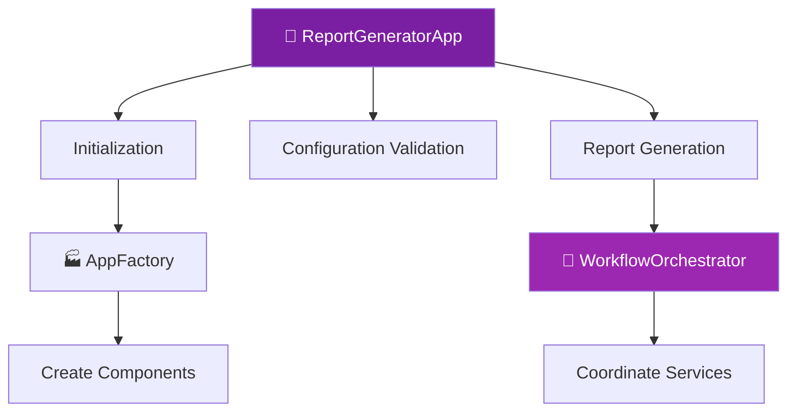

**Ответственность**:
- Координация бизнес-логики
- Управление жизненным циклом
- Транзакционные границы

**Компоненты**:
- `ReportGeneratorApp` - главный фасад
- `AppFactory` - фабрика компонентов
- `WorkflowOrchestrator` - оркестратор процесса

---

### 3. Service Layer (Сервисы)

#### Core Services

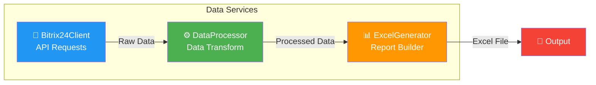

**Ответственность**:
- Бизнес-логика предметной области
- Трансформация данных
- Генерация отчётов

---

#### Supporting Services

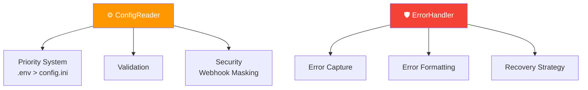

**Ответственность**:
- Конфигурация приложения
- Обработка ошибок
- UI взаимодействие

---

### 4. Infrastructure Layer (Инфраструктура)

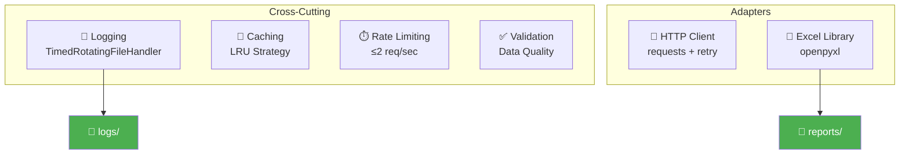

**Ответственность**:
- Логирование (с ротацией)
- Кэширование (LRU)
- Rate limiting (Bitrix24)
- Валидация данных
- Внешние адаптеры

---

## 🔄 Dependency Flow

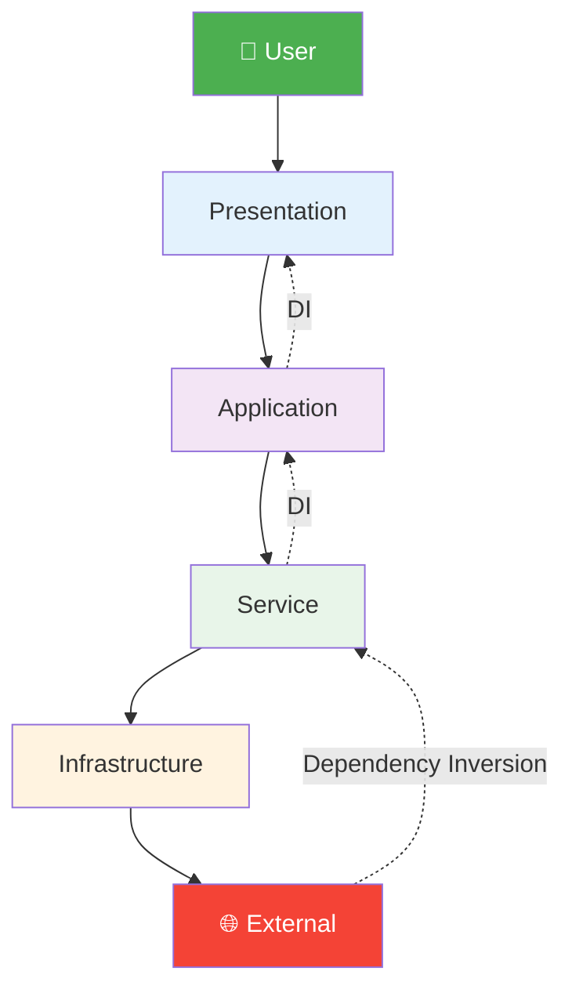

**Принцип**: Зависимости направлены **вниз** по слоям

---

## 📦 Module Structure

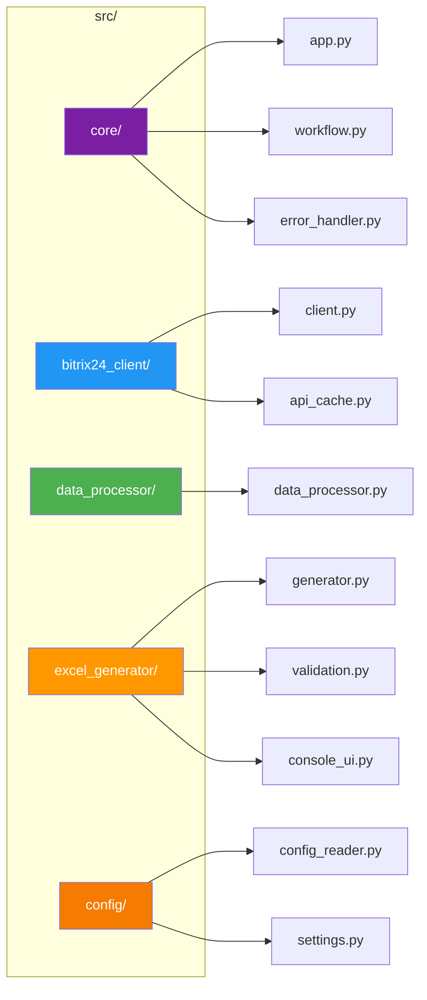

---

## 🔗 Component Relationships

### High Coupling Components

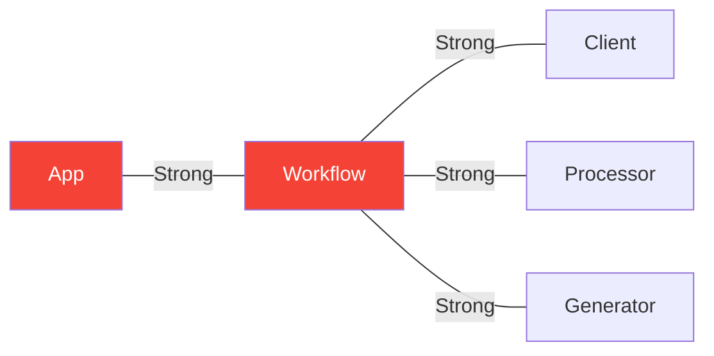

### Low Coupling Components

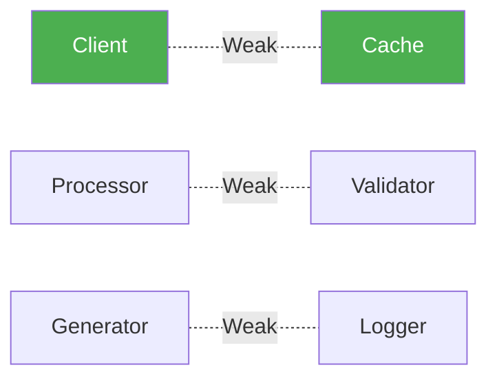

---

## 🎨 Design Patterns

### 1. Factory Pattern

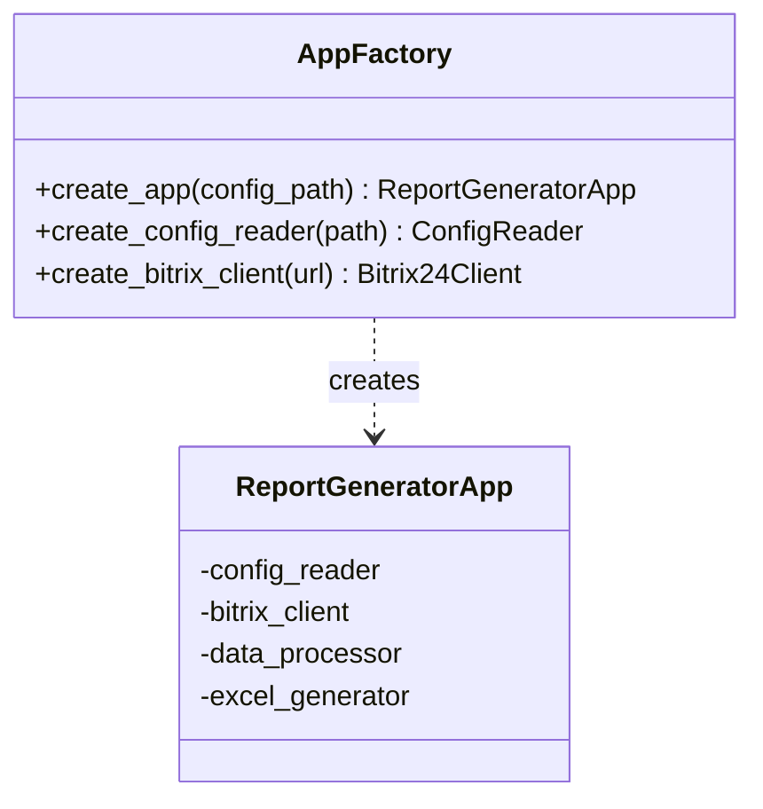

**Применение**: Создание и инициализация компонентов

---

### 2. Facade Pattern

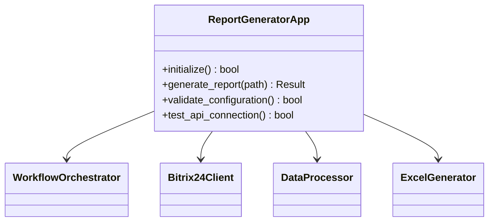

**Применение**: Упрощённый интерфейс для сложной подсистемы

---

### 3. Strategy Pattern

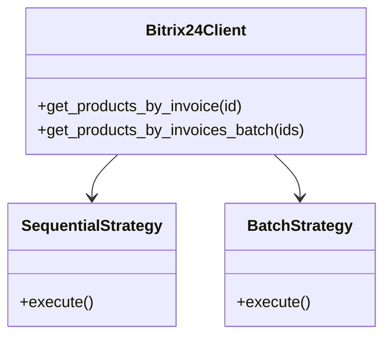

**Применение**: Выбор стратегии загрузки (sequential vs batch)

---

### 4. Context Manager Pattern

```python
# Правильное управление ресурсами
with AppFactory.create_app() as app:
    result = app.generate_report()
# Автоматическая очистка ресурсов
```

**Применение**: Управление жизненным циклом приложения

---

## 🔒 Security Architecture

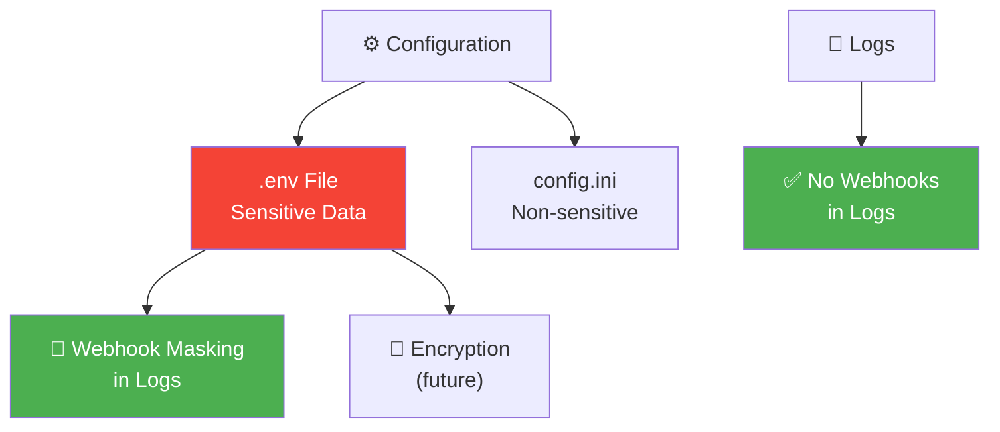

**Security Measures**:
1. ✅ `.env` для sensitive данных
2. ✅ Маскирование webhook в логах
3. ✅ `.env` в `.gitignore`
4. ✅ Валидация входных данных
5. ⚠️ Шифрование (планируется)

---

## 📊 Performance Optimizations

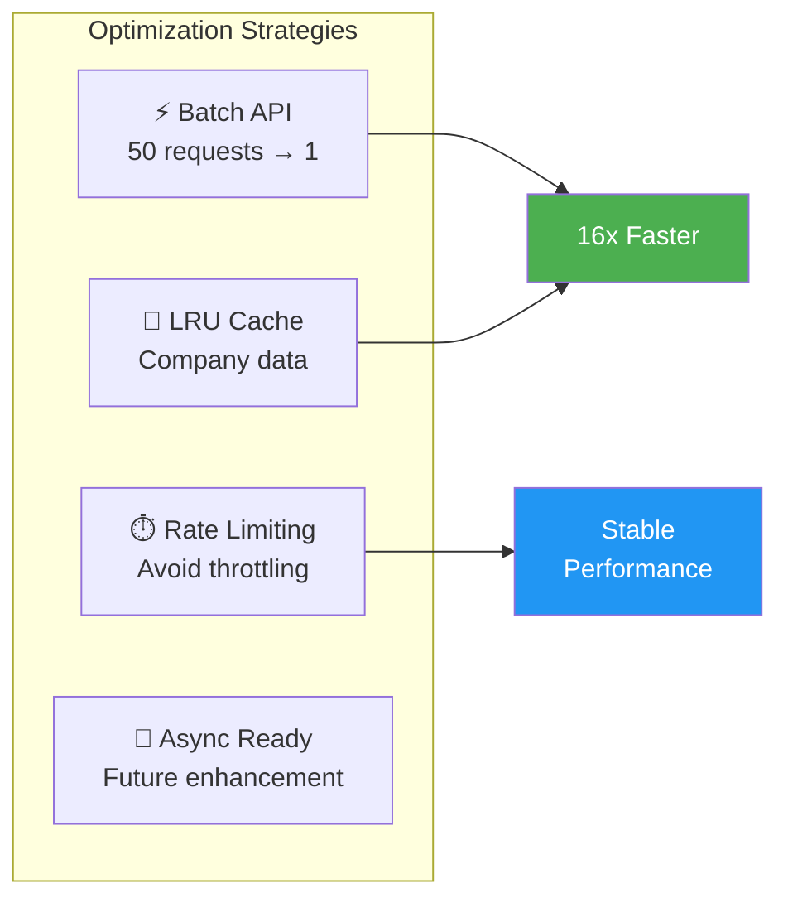

---

## 🔗 External Dependencies

| Layer | Dependencies | Purpose |
|-------|-------------|---------|
| **HTTP** | `requests` | API communication |
| **Excel** | `openpyxl` | Excel generation |
| **Config** | `python-dotenv` | .env loading |
| **CLI** | `sys`, `argparse` | Command line |
| **Logging** | `logging` | Application logs |

**Total**: 5 core dependencies (minimal footprint)

---

## 📈 Scalability Strategy

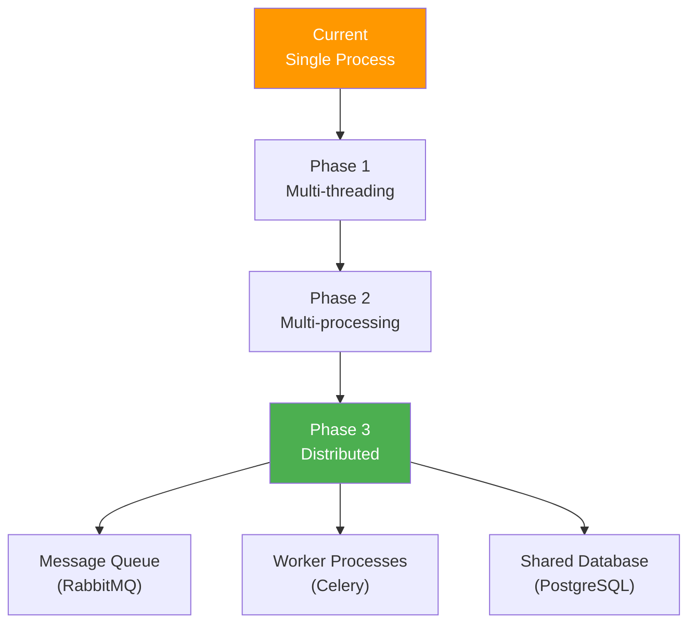

---

## 🔗 Связанные диаграммы

- **[System Overview](system-overview.md)** - Общая схема
- **[Workflow](workflow.md)** - Процесс генерации
- **[Data Flow](data-flow.md)** - Поток данных

---

[← Назад к диаграммам](index.md) | [System Overview →](system-overview.md)
