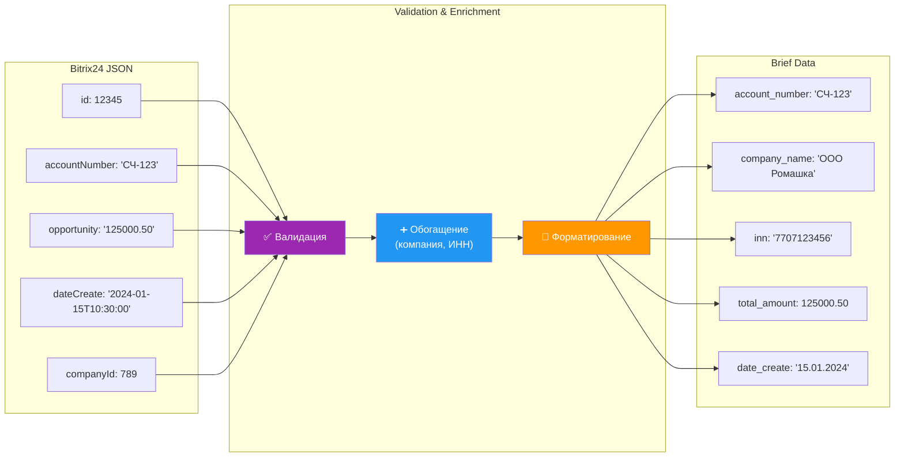
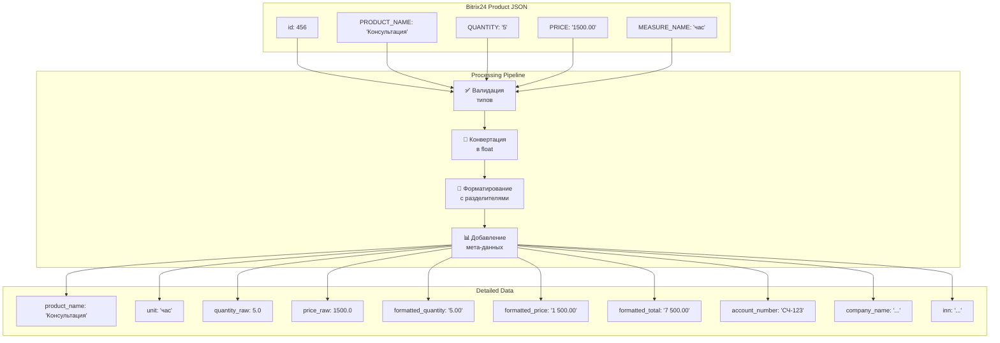
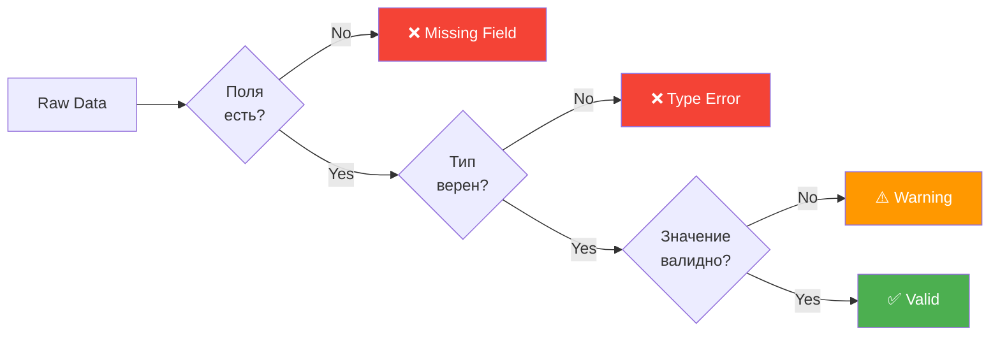
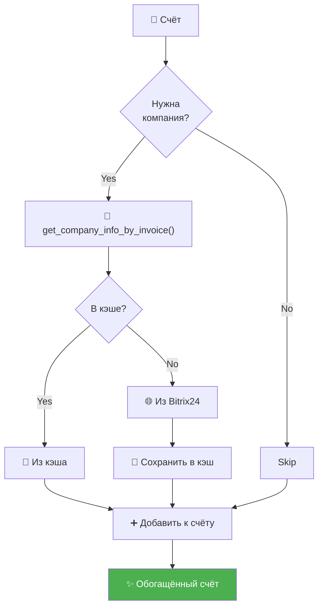
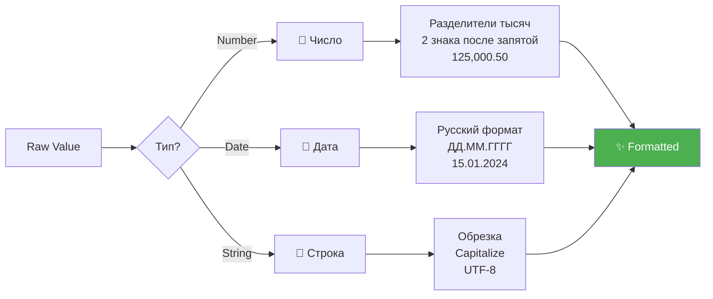
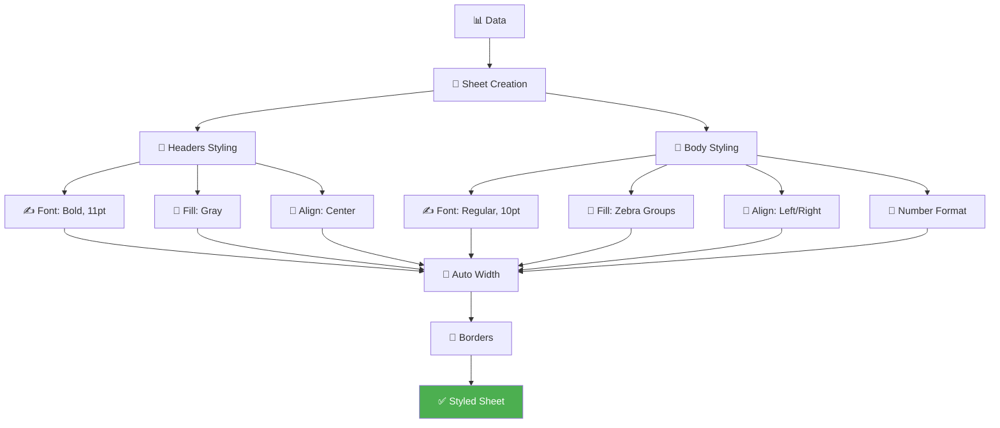
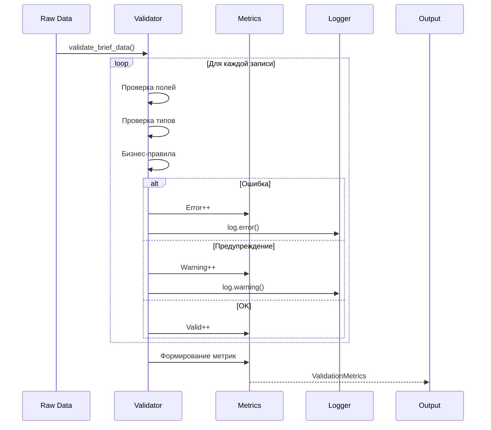

# 📊 Data Flow - Поток данных

Визуализация потока данных от Bitrix24 API через систему до финального Excel отчёта.

---

## 🌊 Полный поток данных

```mermaid
graph LR
    subgraph "Bitrix24 Cloud"
        B24_SI[("Smart Invoices<br/>crm.item.list")]
        B24_PR[("Products<br/>crm.product.list")]
        B24_CO[("Companies<br/>crm.company.get")]
    end
    
    subgraph "Bitrix24Client"
        API["REST API Client"]
        Cache[("💾 Cache<br/>LRU")]
        RateLimit["⏱️ Rate Limiter<br/>2 req/sec"]
    end
    
    subgraph "Raw Data"
        RawInvoices["📑 Raw Invoices<br/>JSON"]
        RawProducts["🛍️ Raw Products<br/>JSON"]
        RawCompanies["🏢 Raw Companies<br/>JSON"]
    end
    
    subgraph "DataProcessor"
        Validator["✅ Validator"]
        Enricher["➕ Enricher"]
        Formatter["🎨 Formatter"]
    end
    
    subgraph "Processed Data"
        BriefData["📋 Brief Data<br/>List[Dict]"]
        DetailedData["📊 Detailed Data<br/>List[Dict]"]
    end
    
    subgraph "ExcelGenerator"
        BriefSheet["📄 Краткий лист"]
        DetailedSheet["📄 Детальный лист"]
        Styler["🎨 Styler"]
    end
    
    subgraph "Output"
        Excel[("📗 Excel Report<br/>.xlsx")]
    end
    
    %% Data Flow
    B24_SI -->|JSON| API
    B24_PR -->|JSON| API
    B24_CO -->|JSON| API
    
    API --> RateLimit
    RateLimit --> Cache
    
    Cache --> RawInvoices
    Cache --> RawProducts
    Cache --> RawCompanies
    
    RawInvoices --> Validator
    RawProducts --> Validator
    RawCompanies --> Validator
    
    Validator --> Enricher
    Enricher --> Formatter
    
    Formatter --> BriefData
    Formatter --> DetailedData
    
    BriefData --> BriefSheet
    DetailedData --> DetailedSheet
    
    BriefSheet --> Styler
    DetailedSheet --> Styler
    
    Styler --> Excel
    
    %% Styling
    classDef source fill:#e1f5ff,stroke:#0288d1,stroke-width:2px
    classDef client fill:#fff3e0,stroke:#f57c00,stroke-width:2px
    classDef raw fill:#f3e5f5,stroke:#7b1fa2,stroke-width:2px
    classDef process fill:#e8f5e9,stroke:#388e3c,stroke-width:2px
    classDef data fill:#fce4ec,stroke:#c2185b,stroke-width:2px
    classDef output fill:#4caf50,stroke:#2e7d32,stroke-width:3px
    
    class B24_SI,B24_PR,B24_CO source
    class API,Cache,RateLimit client
    class RawInvoices,RawProducts,RawCompanies raw
    class Validator,Enricher,Formatter process
    class BriefData,DetailedData data
    class Excel output
```



---

## 📋 Детальное преобразование данных

### 1. Raw Invoice → Brief Data



---

### 2. Raw Products → Detailed Data



---

## 🔄 Трансформации данных

### Валидация



**Проверки**:
- Обязательные поля
- Типы данных (str, int, float)
- Бизнес-правила (сумма > 0)
- Форматы (даты, ИНН)

---

### Обогащение (Enrichment)



**Добавляется**:
- Название компании
- ИНН компании
- Дополнительные поля

---

### Форматирование



---

## 📊 Структуры данных

### Brief Data Structure

```python
{
    "account_number": str,        # "СЧ-00123"
    "company_name": str,          # "ООО Ромашка"
    "inn": str,                   # "7707123456"
    "total_amount": float,        # 125000.50
    "date_create": str,           # "15.01.2024"
    "date_create_raw": datetime,  # datetime(2024, 1, 15)
    "invoice_id": int,            # 12345
    "currency": str               # "RUB"
}
```

### Detailed Data Structure

```python
{
    "account_number": str,        # "СЧ-00123"
    "company_name": str,          # "ООО Ромашка"
    "inn": str,                   # "7707123456"
    "product_name": str,          # "Консультация юриста"
    "unit": str,                  # "час"
    "quantity_raw": float,        # 5.0
    "price_raw": float,           # 1500.0
    "formatted_quantity": str,    # "5.00"
    "formatted_price": str,       # "1 500.00"
    "formatted_total": str,       # "7 500.00"
    "invoice_id": int             # 12345
}
```

---

## 🎨 Excel Styling Pipeline



---

## 🔗 Data Validation Flow



---

## 📈 Data Volume Analysis

| Этап | Input | Output | Коэффициент |
|------|-------|--------|-------------|
| Raw Invoices | 100 записей | 100 записей | 1:1 |
| With Products | 100 счетов | ~500 товаров | 1:5 |
| After Validation | 500 товаров | 495 валидных | 0.99:1 |
| Excel Rows | 495 товаров | 495 строк + headers | 1:1 |

**Средний коэффициент**: 1 счёт = 5 товаров

---

## 🔗 Связанные диаграммы

- **[System Overview](system-overview.md)** - Общая архитектура
- **[Workflow](workflow.md)** - Процесс генерации
- **[Architecture](architecture.md)** - Детальная архитектура

---

[← Назад к диаграммам](index.md) | [Architecture →](architecture.md)
