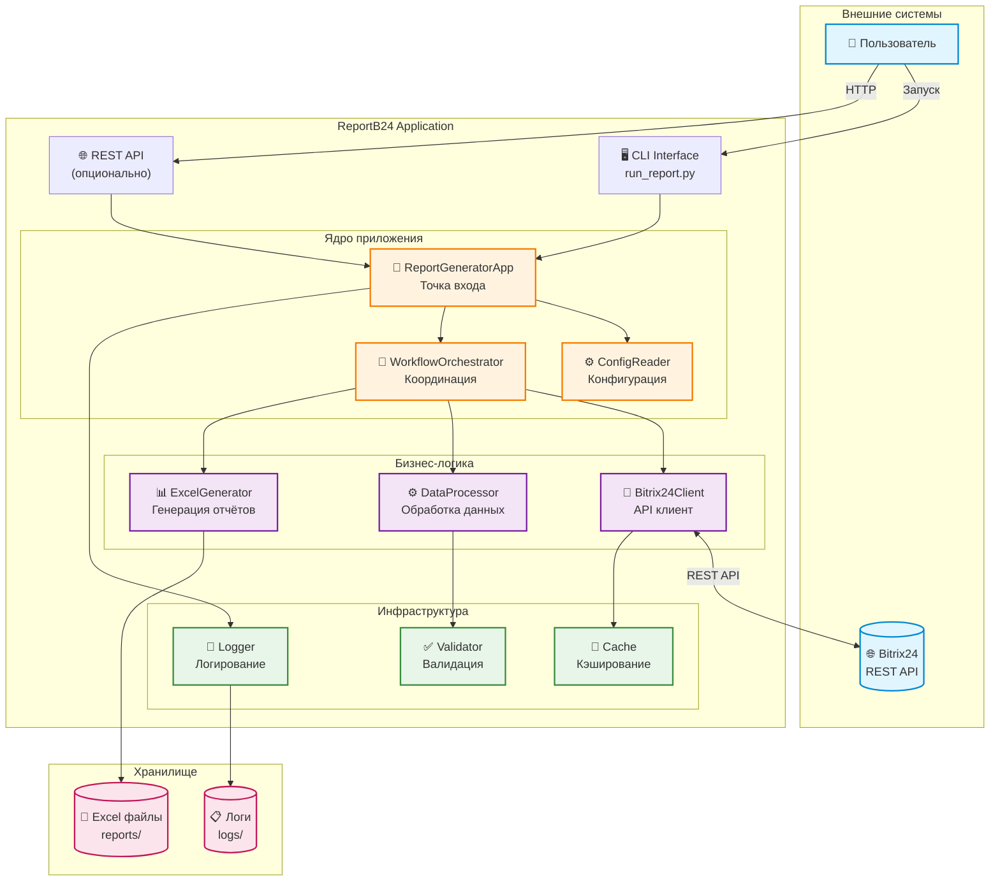
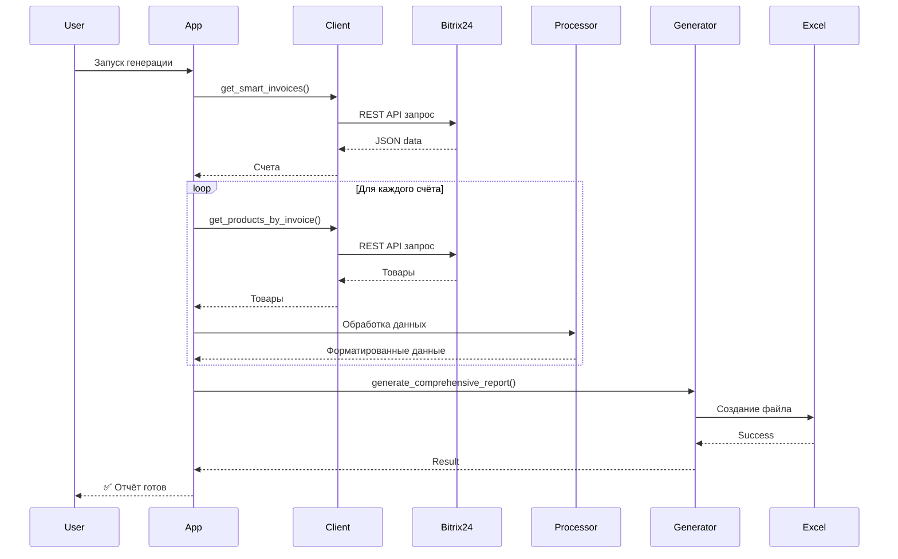

# 🏗️ Общая схема системы

Высокоуровневая архитектура ReportB24 - интеграция с Bitrix24 для генерации Excel отчётов.

---

## 📊 Общая схема

---

## 🔑 Ключевые компоненты

### 1. **Точки входа**

| Компонент | Назначение | Использование |
|-----------|-----------|---------------|
| **CLI** | Командная строка | Ручной запуск, скрипты |
| **REST API** | HTTP интерфейс | Интеграция, автоматизация |

### 2. **Ядро приложения**

| Компонент | Назначение | Ответственность |
|-----------|-----------|-----------------|
| **ReportGeneratorApp** | Главный класс | Инициализация, координация |
| **ConfigReader** | Конфигурация | Чтение settings из config.ini и .env |
| **WorkflowOrchestrator** | Оркестратор | Координация процесса генерации |

### 3. **Бизнес-логика**

| Компонент | Назначение | Функции |
|-----------|-----------|---------|
| **Bitrix24Client** | API клиент | Получение данных из Bitrix24 |
| **DataProcessor** | Обработчик | Валидация, обогащение, форматирование |
| **ExcelGenerator** | Генератор | Создание Excel с форматированием |

### 4. **Инфраструктура**

| Компонент | Назначение | Роль |
|-----------|-----------|------|
| **Cache** | Кэш | Ускорение повторных запросов |
| **Logger** | Логирование | Отладка, аудит |
| **Validator** | Валидация | Проверка качества данных |

---

## 🔄 Основной поток данных

---

## 📈 Метрики производительности

| Операция | Среднее время | Оптимизация |
|----------|--------------|-------------|
| Загрузка 100 счетов | ~3 сек | Batch API |
| Обработка данных | ~1 сек | Валидация |
| Генерация Excel | ~2 сек | openpyxl |
| **Итого** | **~6 сек** | v2.4.0+ |

---

## 🎯 Основные особенности

### ⚡ Производительность
- **Batch API** для загрузки товаров (до 50x быстрее)
- **Кэширование** компаний и продуктов
- **Параллельная обработка** (опционально)

### 🛡️ Надёжность
- **Автоматический retry** при временных ошибках
- **Rate limiting** (≤2 req/sec) для Bitrix24 API
- **Graceful degradation** при частичных ошибках

### ✅ Качество
- **Валидация данных** на всех этапах
- **Подробное логирование** для отладки
- **Метрики качества** в результате

---

## 🔗 Связанные диаграммы

- **[Workflow](workflow.md)** - Детальный процесс генерации
- **[Data Flow](data-flow.md)** - Поток данных через систему
- **[Architecture](architecture.md)** - Подробная архитектура

---

[← Назад к диаграммам](index.md) | [Workflow →](workflow.md)
