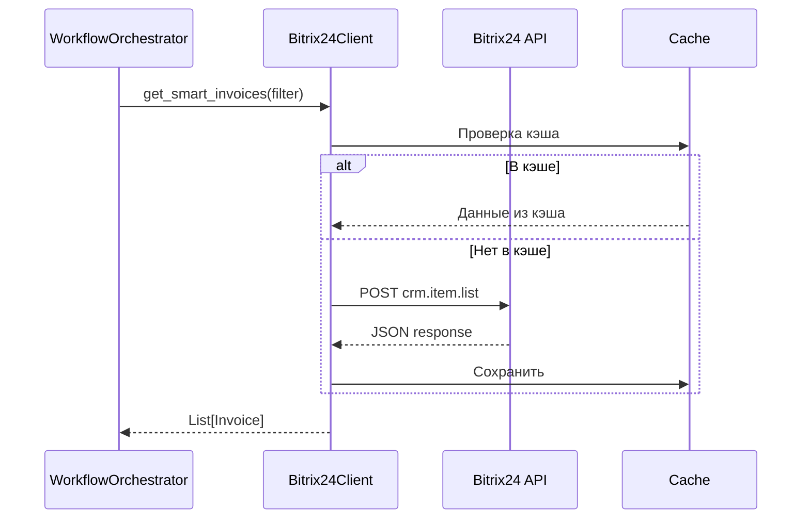
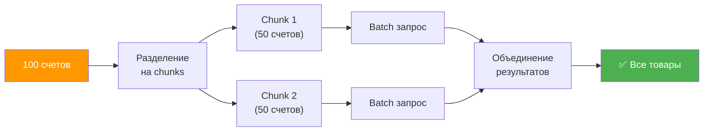
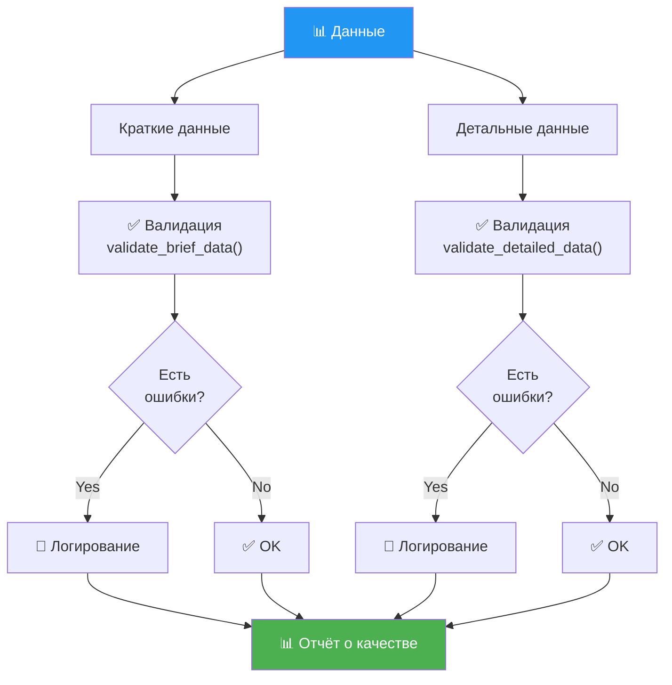
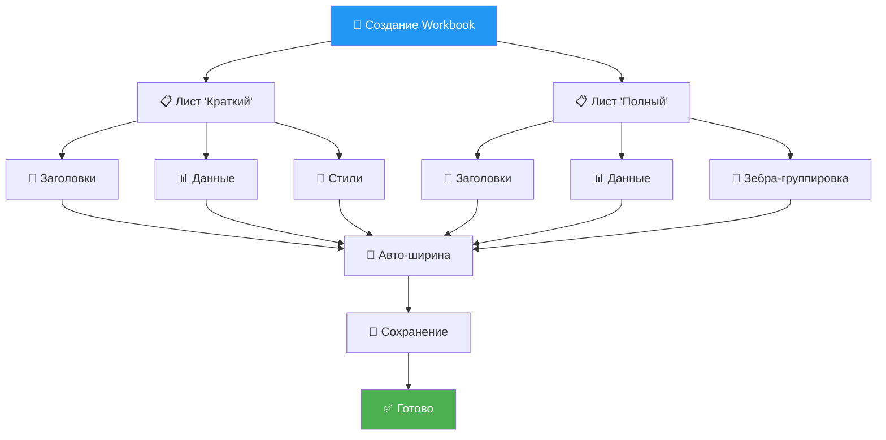

# 🔄 Workflow - Процесс генерации отчёта

Детальная схема процесса генерации comprehensive отчёта с двумя листами (краткий + детальный).

---

## 📊 Основной Workflow

```mermaid
graph TB
    Start(["🚀 Начало<br/>generate_report()"])
    
    subgraph "Инициализация"
        Init["⚙️ Загрузка конфигурации"]
        Validate["✅ Валидация настроек"]
        TestAPI["🔌 Тест подключения к API"]
    end
    
    subgraph "Загрузка счетов"
        FetchInvoices["📥 get_smart_invoices()<br/>Фильтр по периоду"]
        CheckCount{"Есть<br/>счета?"}
    end
    
    subgraph "Обработка счетов"
        LoopStart{{"🔄 Для каждого счёта"}}
        ProcessInvoice["📊 Обработка счёта<br/>process_invoice_record()"]
        FetchProducts["🛍️ get_products_by_invoice()<br/>Batch if >10"]
        CheckProducts{"Есть<br/>товары?"}
        ProcessProducts["⚙️ Форматирование товаров<br/>format_detailed_products_for_excel()"]
        AddToBrief["➕ Добавить в brief_data"]
        AddToDetailed["➕ Добавить в detailed_data"]
        LoopEnd{{"↩️ Следующий счёт"}}
    end
    
    subgraph "Валидация данных"
        ValidateBrief["✅ validate_brief_data()"]
        ValidateDetailed["✅ validate_detailed_data()"]
        CheckQuality{"Качество<br/>приемлемо?"}
    end
    
    subgraph "Генерация Excel"
        CreateWorkbook["📄 Создание workbook"]
        GenerateBrief["📋 Лист 'Краткий'<br/>create_brief_sheet()"]
        GenerateDetailed["📋 Лист 'Полный'<br/>create_detailed_sheet()"]
        ApplyFormatting["🎨 Применение стилей"]
        SaveExcel["💾 Сохранение файла"]
    end
    
    End(["✅ Завершение<br/>Return Result"])
    Error(["❌ Ошибка"])
    
    %% Поток выполнения
    Start --> Init
    Init --> Validate
    Validate --> TestAPI
    TestAPI -->|Success| FetchInvoices
    TestAPI -->|Failure| Error
    
    FetchInvoices --> CheckCount
    CheckCount -->|No| Error
    CheckCount -->|Yes| LoopStart
    
    LoopStart --> ProcessInvoice
    ProcessInvoice --> FetchProducts
    FetchProducts --> CheckProducts
    
    CheckProducts -->|Yes| ProcessProducts
    CheckProducts -->|No| AddToBrief
    
    ProcessProducts --> AddToDetailed
    AddToDetailed --> AddToBrief
    AddToBrief --> LoopEnd
    
    LoopEnd -->|More| LoopStart
    LoopEnd -->|Done| ValidateBrief
    
    ValidateBrief --> ValidateDetailed
    ValidateDetailed --> CheckQuality
    
    CheckQuality -->|Yes| CreateWorkbook
    CheckQuality -->|No - но продолжаем| CreateWorkbook
    
    CreateWorkbook --> GenerateBrief
    GenerateBrief --> GenerateDetailed
    GenerateDetailed --> ApplyFormatting
    ApplyFormatting --> SaveExcel
    SaveExcel --> End
    
    %% Стили
    classDef startEnd fill:#4caf50,stroke:#2e7d32,stroke-width:3px,color:white
    classDef process fill:#2196f3,stroke:#1565c0,stroke-width:2px,color:white
    classDef decision fill:#ff9800,stroke:#e65100,stroke-width:2px,color:white
    classDef validation fill:#9c27b0,stroke:#6a1b9a,stroke-width:2px,color:white
    classDef error fill:#f44336,stroke:#c62828,stroke-width:3px,color:white
    
    class Start,End startEnd
    class Init,Validate,TestAPI,FetchInvoices,ProcessInvoice,FetchProducts,ProcessProducts,AddToBrief,AddToDetailed,CreateWorkbook,GenerateBrief,GenerateDetailed,ApplyFormatting,SaveExcel process
    class CheckCount,CheckProducts,CheckQuality,LoopStart,LoopEnd decision
    class ValidateBrief,ValidateDetailed validation
    class Error error
```



---

## ⚙️ Детали этапов

### 1. Инициализация (5-10 сек)


**Компоненты**:
- `ConfigReader` - загрузка настроек
- `Bitrix24Client` - API клиент
- `DataProcessor` - обработчик данных
- `ExcelReportGenerator` - генератор Excel

---

### 2. Загрузка счетов (1-5 сек)



**Фильтр**:
```python
{
    ">=dateCreate": "2024-01-01",
    "<=dateCreate": "2024-12-31"
}
```

---

### 3. Обработка счетов (зависит от количества)

#### Batch режим (>10 счетов)



**Производительность**:
- Последовательно: 100 счетов × 0.5 сек = 50 сек
- Batch: 2 запроса × 1.5 сек = 3 сек
- **Ускорение**: ~16x

#### Последовательный режим (≤10 счетов)


---

### 4. Валидация данных (1-2 сек)



**Проверки**:
- Обязательные поля
- Форматы данных (числа, даты)
- Бизнес-логика (отрицательные суммы)
- Дубликаты

---

### 5. Генерация Excel (2-5 сек)



---

## 🎯 Оптимизации v2.4.0

### До v2.4.0


### После v2.4.0


**Ключевые улучшения**:
1. ✅ Batch API для товаров (50 за запрос)
2. ✅ Кэширование компаний
3. ✅ Параллельная валидация
4. ✅ Оптимизированное форматирование

---

## 📊 Временная диаграмма

```mermaid
gantt
    title Время выполнения этапов (100 счетов)
    dateFormat ss
    axisFormat %S сек
    
    section Инициализация
    Загрузка конфигурации  :a1, 00, 2s
    Создание компонентов    :a2, after a1, 1s
    
    section Загрузка
    Получение счетов        :b1, after a2, 2s
    Batch загрузка товаров  :b2, after b1, 3s
    
    section Обработка
    Валидация данных        :c1, after b2, 1s
    Форматирование          :c2, after c1, 1s
    
    section Excel
    Создание workbook       :d1, after c2, 1s
    Генерация листов        :d2, after d1, 2s
    Применение стилей       :d3, after d2, 1s
    Сохранение              :d4, after d3, 1s
```



**Итого**: ~15 секунд для 100 счетов (v2.4.0+)

---

## 🔗 Связанные диаграммы

- **[System Overview](system-overview.md)** - Общая архитектура
- **[Data Flow](data-flow.md)** - Поток данных
- **[Architecture](architecture.md)** - Детальная архитектура

---

[← Назад к диаграммам](index.md) | [Data Flow →](data-flow.md)
