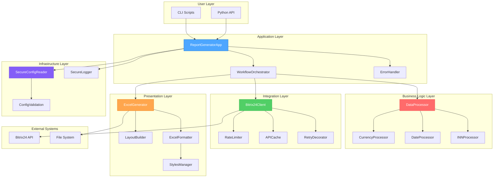
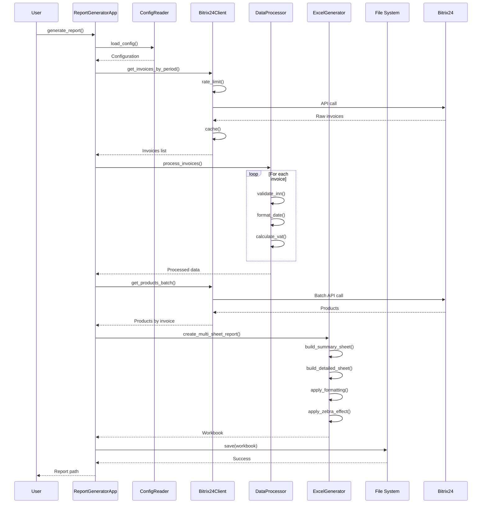
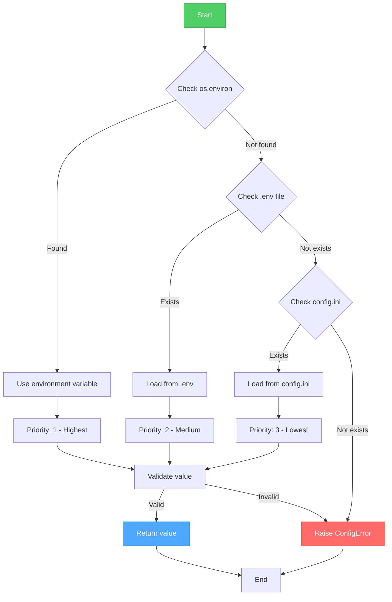

# 🏗️ Architecture

Архитектура ReportB24 - многослойная система генерации Excel отчетов для Bitrix24.

---

## 📋 Содержание

1. [Обзор архитектуры](#-обзор-архитектуры)
2. [Слои системы](#-слои-системы)
3. [Компоненты](#-компоненты)
4. [Потоки данных](#-потоки-данных)
5. [Архитектурные принципы](#-архитектурные-принципы)
6. [Паттерны проектирования](#-паттерны-проектирования)
7. [Масштабирование](#-масштабирование)

---

## 🎯 Обзор архитектуры

### High-Level Architecture



---

## 📚 Слои системы

### 1. Application Layer (Приложение)

**Назначение**: Оркестрация бизнес-логики и координация между слоями

**Компоненты**:
- `ReportGeneratorApp` - главная точка входа
- `WorkflowOrchestrator` - управление workflow генерации отчета
- `ErrorHandler` - централизованная обработка ошибок

**Ответственность**:
- ✅ Инициализация всех компонентов
- ✅ Координация workflow
- ✅ Обработка lifecycle приложения
- ✅ Graceful shutdown

---

### 2. Business Logic Layer (Бизнес-логика)

**Назначение**: Обработка и валидация бизнес-данных

**Компоненты**:
- `DataProcessor` - главный процессор данных
- `CurrencyProcessor` - обработка валют и НДС
- `DateProcessor` - форматирование дат
- `INNProcessor` - валидация ИНН по алгоритму ФНС

**Ответственность**:
- ✅ Валидация данных
- ✅ Бизнес-правила
- ✅ Трансформация данных
- ✅ Расчеты (НДС, суммы)

---

### 3. Integration Layer (Интеграция)

**Назначение**: Взаимодействие с внешними системами

**Компоненты**:
- `Bitrix24Client` - REST API клиент
- `RateLimiter` - ограничение скорости запросов
- `APICache` - кэширование ответов API
- `RetryDecorator` - автоматические повторы

**Ответственность**:
- ✅ HTTP коммуникация
- ✅ Rate limiting (≤2 req/sec)
- ✅ Batch optimization
- ✅ Error recovery

---

### 4. Presentation Layer (Представление)

**Назначение**: Генерация Excel отчетов

**Компоненты**:
- `ExcelGenerator` - главный генератор
- `LayoutBuilder` - построение структуры листов
- `ExcelFormatter` - форматирование ячеек
- `StylesManager` - управление стилями

**Ответственность**:
- ✅ Создание Excel workbooks
- ✅ Форматирование (цвета, границы, шрифты)
- ✅ Зебра-эффект
- ✅ Автоширина колонок

---

### 5. Infrastructure Layer (Инфраструктура)

**Назначение**: Базовые сервисы и утилиты

**Компоненты**:
- `SecureConfigReader` - безопасная конфигурация
- `SecureLogger` - безопасное логирование
- `ConfigValidation` - валидация конфигурации

**Ответственность**:
- ✅ Загрузка конфигурации (hybrid .env + config.ini)
- ✅ Логирование без утечек
- ✅ Валидация параметров
- ✅ Маскировка секретов

---

## 🔧 Компоненты

### ReportGeneratorApp

**Файл**: `src/core/app.py`

**Назначение**: Главная точка входа приложения

```python
class ReportGeneratorApp:
    """
    Главное приложение для генерации отчетов
    
    Coordinates:
    - Configuration loading
    - Component initialization
    - Workflow execution
    - Error handling
    """
    
    def __init__(self, config_path: str):
        self.config_reader = SecureConfigReader(config_path)
        self.bitrix_client = None
        self.data_processor = None
        self.excel_generator = None
        self.initialized = False
    
    def initialize(self) -> bool:
        """Initialize all components"""
        
    def generate_report(self, filename: str) -> bool:
        """Generate Excel report"""
    
    def shutdown(self):
        """Graceful shutdown"""
```

**Lifecycle**:
1. `__init__()` - Создание instance
2. `initialize()` - Инициализация компонентов
3. `generate_report()` - Генерация отчета
4. `shutdown()` - Очистка ресурсов

---

### Bitrix24Client

**Файл**: `src/bitrix24_client/client.py`

**Назначение**: REST API клиент для Bitrix24

```python
class Bitrix24Client:
    """
    Bitrix24 REST API Client
    
    Features:
    - Rate limiting (≤2 req/sec)
    - Automatic pagination
    - Batch optimization
    - Retry logic
    - Response caching
    """
    
    def __init__(self, webhook_url: str):
        self.webhook_url = webhook_url
        self.rate_limiter = RateLimiter(max_rate=2.0)
        self.cache = APICache()
    
    def call(self, method: str, params: dict = None) -> dict:
        """Call Bitrix24 API method"""
    
    def get_invoices_by_period(self, start_date: str, end_date: str) -> List[dict]:
        """Get Smart Invoices for period"""
    
    def get_products_by_invoices_batch(self, invoice_ids: List[str]) -> Dict[str, List]:
        """Get products for multiple invoices (batch optimization)"""
```

**Key Features**:
- **Rate Limiting**: Автоматическое ограничение до 2 req/sec
- **Pagination**: Автоматическая обработка больших результатов
- **Batch API**: До 5-10x ускорение для множества запросов
- **Caching**: Кэширование данных компаний

---

### DataProcessor

**Файл**: `src/data_processor/data_processor.py`

**Назначение**: Обработка и валидация бизнес-данных

```python
class DataProcessor:
    """
    Data processing and validation
    
    Responsibilities:
    - Invoice data processing
    - Product data processing
    - VAT calculations
    - INN validation
    - Date formatting
    """
    
    def process_invoice_record(self, raw_data: dict) -> dict:
        """Process single invoice record"""
    
    def process_product_data(self, raw_products: List[dict]) -> List[ProductData]:
        """Process product rows"""
    
    def calculate_vat(self, amount: Decimal, vat_rate: str) -> Decimal:
        """Calculate VAT amount"""
```

**Processing Pipeline**:
1. Raw data validation
2. Type conversion (str → Decimal, datetime)
3. Business rules application
4. INN validation (ФНС algorithm)
5. VAT calculations (20%, 10%, 0%)
6. Date formatting (dd.mm.yyyy)

---

### ExcelGenerator

**Файл**: `src/excel_generator/generator.py`

**Назначение**: Генерация Excel отчетов

```python
class ExcelReportGenerator:
    """
    Excel report generation
    
    Features:
    - Dual-sheet reports
    - Zebra-effect grouping
    - Auto-width columns
    - Professional formatting
    - Summary tables
    """
    
    def create_summary_report(self, invoices: List[dict]) -> Workbook:
        """Create single-sheet summary report"""
    
    def create_multi_sheet_report(
        self, 
        invoices: List[dict], 
        client: Bitrix24Client, 
        processor: DataProcessor
    ) -> Workbook:
        """Create dual-sheet detailed report"""
    
    def apply_zebra_effect(self, worksheet, start_row: int, groups: dict):
        """Apply zebra-effect to grouped data"""
```

**Report Structure**:
- **Лист "Краткий"**: Обзор счетов (5-7 колонок)
- **Лист "Полный"**: Детализация товаров (8 колонок)
- **Formatting**: Профессиональные стили, borders, colors
- **Optimization**: Auto-width, freeze panes

---

## 🔄 Потоки данных

### Report Generation Flow



---

### Configuration Loading Flow



---

## 🎯 Архитектурные принципы

### 1. Separation of Concerns

**Принцип**: Каждый компонент имеет одну четкую ответственность

**Примеры**:
- `Bitrix24Client` - только API коммуникация
- `DataProcessor` - только обработка данных
- `ExcelGenerator` - только генерация Excel

**Преимущества**:
- ✅ Легко тестировать
- ✅ Легко поддерживать
- ✅ Легко заменять компоненты

---

### 2. Dependency Injection

**Принцип**: Зависимости передаются через конструктор

```python
# ❌ Плохо: Жесткая зависимость
class ReportGeneratorApp:
    def __init__(self):
        self.client = Bitrix24Client("hardcoded_url")

# ✅ Хорошо: Dependency Injection
class ReportGeneratorApp:
    def __init__(self, config_reader: ConfigReader):
        self.config_reader = config_reader
        self.client = Bitrix24Client(config_reader.get_webhook_url())
```

**Преимущества**:
- ✅ Легко тестировать (можно использовать mocks)
- ✅ Гибкость (можно менять реализацию)
- ✅ Явные зависимости

---

### 3. Fail Fast

**Принцип**: Быстро обнаруживать и сообщать об ошибках

```python
def process_invoice(invoice: dict) -> dict:
    # Validate early
    if not invoice:
        raise ValueError("Invoice cannot be empty")
    
    if 'id' not in invoice:
        raise ValueError("Invoice must have 'id' field")
    
    # Continue processing...
```

**Преимущества**:
- ✅ Раннее обнаружение проблем
- ✅ Понятные error messages
- ✅ Легче отладка

---

### 4. Security by Default

**Принцип**: Безопасность встроена по умолчанию

**Реализация**:
- ✅ Секреты только в `.env` (не в config.ini)
- ✅ Автоматическая маскировка webhook URLs в логах
- ✅ Валидация всех входных данных
- ✅ HTTPS только для API calls

---

### 5. Progressive Enhancement

**Принцип**: Система работает с минимальной конфигурацией, расширенные features опциональны

**Примеры**:
```ini
# Минимальная конфигурация
[AppSettings]
defaultsavefolder = reports

# Расширенная конфигурация (опционально)
[Performance]
batch_size = 50
max_concurrent_requests = 3
use_multiprocessing = true
```

---

## 🎨 Паттерны проектирования

### 1. Factory Pattern

**Использование**: Создание компонентов

```python
def create_app(config_path: str) -> ReportGeneratorApp:
    """Factory function for creating app instance"""
    return ReportGeneratorApp(config_path)
```

---

### 2. Strategy Pattern

**Использование**: Разные стратегии обработки данных

```python
class VATCalculationStrategy(ABC):
    @abstractmethod
    def calculate(self, amount: Decimal) -> Decimal:
        pass

class VAT20Strategy(VATCalculationStrategy):
    def calculate(self, amount: Decimal) -> Decimal:
        return amount * Decimal('0.20')

class VAT10Strategy(VATCalculationStrategy):
    def calculate(self, amount: Decimal) -> Decimal:
        return amount * Decimal('0.10')
```

---

### 3. Decorator Pattern

**Использование**: Retry logic, rate limiting

```python
@retry_on_failure(max_attempts=3, backoff=2.0)
@rate_limit(max_rate=2.0)
def call_api(method: str, params: dict) -> dict:
    """API call with retry and rate limiting"""
    # Implementation...
```

---

### 4. Builder Pattern

**Использование**: Построение сложных Excel структур

```python
class ReportBuilder:
    def __init__(self):
        self.workbook = Workbook()
    
    def add_summary_sheet(self, data: List[dict]) -> 'ReportBuilder':
        # Add summary sheet
        return self
    
    def add_detailed_sheet(self, data: List[dict]) -> 'ReportBuilder':
        # Add detailed sheet
        return self
    
    def build(self) -> Workbook:
        return self.workbook

# Usage
report = (ReportBuilder()
    .add_summary_sheet(invoices)
    .add_detailed_sheet(products)
    .build())
```

---

### 5. Singleton Pattern

**Использование**: Configuration, Logger

```python
class ConfigReader:
    _instance = None
    
    def __new__(cls, *args, **kwargs):
        if cls._instance is None:
            cls._instance = super().__new__(cls)
        return cls._instance
```

---

## 📈 Масштабирование

### Horizontal Scaling

**Подход**: Распараллеливание на уровне периодов

```python
from concurrent.futures import ProcessPoolExecutor

def generate_reports_parallel(periods: List[tuple]):
    """Generate multiple reports in parallel"""
    with ProcessPoolExecutor(max_workers=4) as executor:
        futures = [
            executor.submit(generate_report, start, end)
            for start, end in periods
        ]
        results = [f.result() for f in futures]
    return results

# Usage: Generate quarterly reports in parallel
periods = [
    ('01.01.2024', '31.03.2024'),  # Q1
    ('01.04.2024', '30.06.2024'),  # Q2
    ('01.07.2024', '30.09.2024'),  # Q3
    ('01.10.2024', '31.12.2024'),  # Q4
]
generate_reports_parallel(periods)
```

---

### Vertical Scaling

**Подход**: Оптимизация использования ресурсов

```ini
[Performance]
# Для мощных серверов
batch_size = 100
max_concurrent_requests = 10
use_multiprocessing = true
max_workers = 16
company_cache_size = 10000
```

---

### Caching Strategy

**Уровни кэширования**:

1. **L1 Cache**: In-memory (Python dict)
   ```python
   self._company_cache = {}  # Fast access
   ```

2. **L2 Cache**: Disk-based (опционально)
   ```python
   import shelve
   cache = shelve.open('cache.db')
   ```

---

## 🔒 Security Architecture

### Defense in Depth

**Слои безопасности**:

1. **Configuration Layer**:
   - Secrets в `.env` (не в Git)
   - Config validation
   - Secure defaults

2. **Application Layer**:
   - Input validation
   - Error sanitization
   - Secure logging (URL masking)

3. **Integration Layer**:
   - HTTPS only
   - Rate limiting
   - Circuit breaker

4. **Infrastructure Layer**:
   - File permissions
   - Environment isolation
   - Dependency auditing

---

## 📚 Дополнительно

- 📖 [API Reference](api-reference.md) - Полная API документация
- 💻 [Development Guide](development.md) - Development workflow
- 🧪 [Testing Guide](testing.md) - Testing strategy
- ⚡ [Performance Guide](performance.md) - Optimization techniques
- 🔒 [Security Deep Dive](security-deep-dive.md) - Security implementation

---

<div align="center">

[← Technical Docs](index.md) • [API Reference →](api-reference.md)

**Questions about architecture?** [Create Discussion](https://github.com/bivlked/ReportB24/discussions)

</div>
