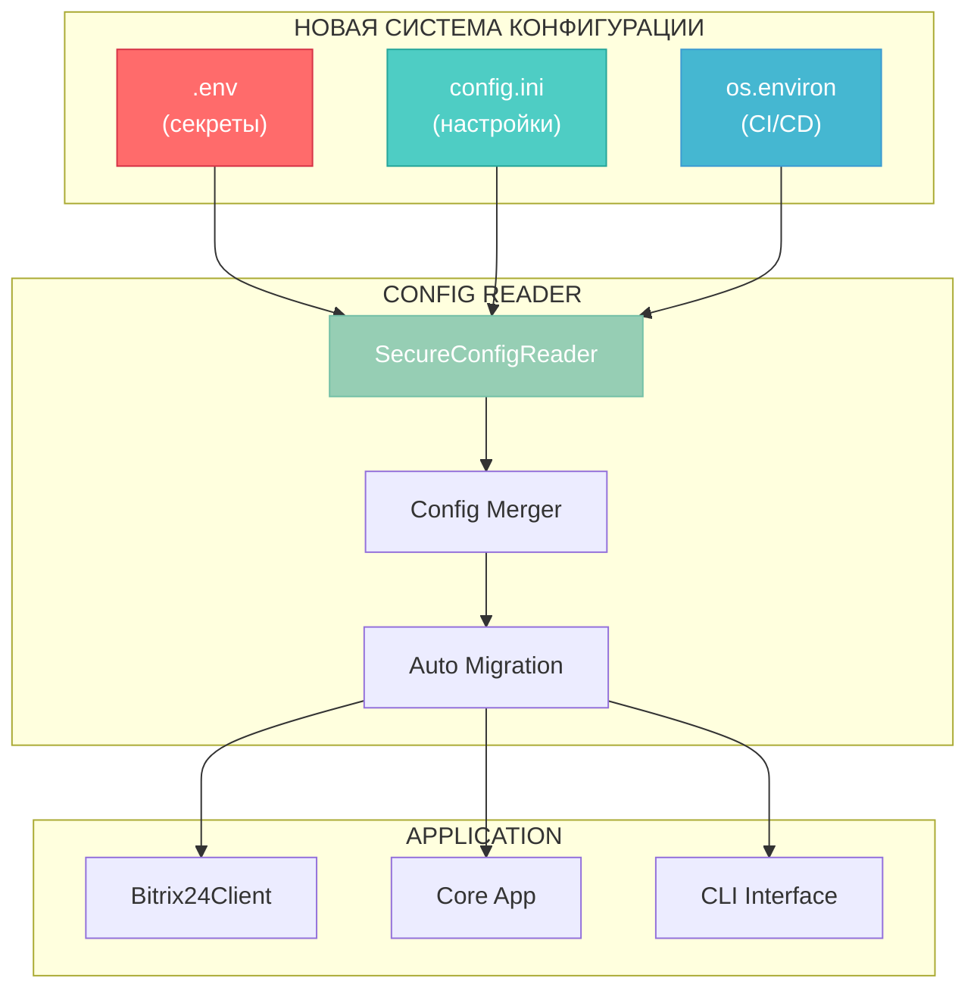

# 🎨🎨🎨 ENTERING CREATIVE PHASE: ARCHITECTURE DESIGN 🎨🎨🎨

**Компонент**: Система конфигурации и секретов  
**Дата**: 2025-07-01 17:57:48  
**Задача**: security-refactor-2025-07-01  
**Источник**: Анализ рекомендаций + Context7 документация python-dotenv

## 📋 ПРОБЛЕМА И КОНТЕКСТ

### 🚨 КРИТИЧЕСКАЯ ПРОБЛЕМА:
```ini
# config.ini - В ОТКРЫТОМ ДОСТУПЕ В РЕПОЗИТОРИИ! ❌
[BitrixAPI]
webhookurl = https://softway.bitrix24.ru/rest/12/kt17hzrauafyfem0/
```

### 📊 СИСТЕМНЫЕ ТРЕБОВАНИЯ:
1. **Безопасность**: Убрать все секреты из Git репозитория
2. **Публичность**: Подготовить к возможной публикации репозитория
3. **Backward Compatibility**: Существующие config.ini должны работать
4. **Простота использования**: Минимальные изменения для пользователей
5. **Кроссплатформенность**: Работа на Windows/Linux/macOS

### 🔍 ТЕКУЩАЯ АРХИТЕКТУРА:
```python
# src/config/config_reader.py
def read_config(config_path: str = "config.ini") -> dict:
    config = configparser.ConfigParser()
    config.read(config_path)
    return {
        'webhook_url': config['BitrixAPI']['webhookurl'],  # ❌ Секрет!
        'save_folder': config['AppSettings']['defaultsavefolder']
    }
```

### 🎯 КОМПОНЕНТЫ ДЛЯ ИНТЕГРАЦИИ:
- **src/config/config_reader.py** - основная система конфигурации
- **src/bitrix24_client/client.py** - использует webhook URL
- **run_report.py** - точка входа приложения
- **config.ini** - текущий файл конфигурации

## 🔄 АНАЛИЗ АРХИТЕКТУРНЫХ ОПЦИЙ

### 🎨 CREATIVE CHECKPOINT: Options Analysis 

Исследую 4 архитектурных подхода на основе документации Context7 и best practices:

### ОПЦИЯ 1: ПРОСТАЯ .ENV СИСТЕМА

**Описание**: Базовый переход на python-dotenv с сохранением совместимости

```python
# Новая архитектура:
from dotenv import load_dotenv
import os

load_dotenv()  # Загружает .env в os.environ
webhook_url = os.getenv('BITRIX_WEBHOOK_URL')
```

**Файловая структура**:
```
ReportB24/
├── .env                 # Локальные секреты (в .gitignore)
├── .env.example         # Пример для пользователей (в Git)
├── config.ini           # Остается для несекретных настроек
└── config.ini.example   # Пример конфигурации (в Git)
```

**✅ ПЛЮСЫ**:
- Простая миграция из Context7 примеров
- Стандартный подход python-dotenv: `load_dotenv()`
- Минимальные изменения в коде
- Автоматическая загрузка в os.environ

**❌ МИНУСЫ**:
- Модифицирует глобальное окружение (os.environ)
- Нет контроля над приоритетами конфигурации
- Сложно тестировать изолированно
- Потенциальные конфликты с системными переменными

**📊 ОЦЕНКИ**:
- **Техническое соответствие**: Среднее
- **Сложность реализации**: Низкая
- **Масштабируемость**: Средняя

---

### ОПЦИЯ 2: МНОГОУРОВНЕВАЯ .ENV СИСТЕМА

**Описание**: Продвинутая система с несколькими файлами .env согласно Context7 best practices

```python
# Архитектура из Context7 документации:
import os
from dotenv import dotenv_values

config = {
    **dotenv_values(".env.shared"),   # Общие переменные для команды
    **dotenv_values(".env.secret"),   # Секретные данные
    **os.environ,                     # Переменные окружения (высший приоритет)
}
```

**Файловая структура**:
```
ReportB24/
├── .env.shared          # Общие настройки разработки (в Git)
├── .env.secret          # Секреты (в .gitignore)
├── .env.local           # Локальные переопределения (в .gitignore)
├── config.ini           # Остается для структурированных настроек
└── examples/
    ├── .env.shared.example
    ├── .env.secret.example
    └── config.ini.example
```

**✅ ПЛЮСЫ**:
- Четкое разделение секретов и общих настроек
- Гибкая система приоритетов (env > secret > shared)
- Поддержка команд разработки
- Dictionary подход без модификации os.environ
- Соответствует Context7 best practices

**❌ МИНУСЫ**:
- Более сложная настройка для пользователей
- Много файлов конфигурации
- Потенциальная путаница в приоритетах
- Больше изменений в существующем коде

**📊 ОЦЕНКИ**:
- **Техническое соответствие**: Высокое
- **Сложность реализации**: Высокая
- **Масштабируемость**: Высокая

---

### ОПЦИЯ 3: ГИБРИДНАЯ СИСТЕМА (РЕКОМЕНДУЕМАЯ)

**Описание**: Компромисс между простотой и мощностью, оптимизированный для нашего случая

```python
# Новая архитектура config_reader.py:
import os
from pathlib import Path
from dotenv import dotenv_values
import configparser

class SecureConfigReader:
    def __init__(self, config_path: str = "config.ini"):
        self.config_path = Path(config_path)
        self.base_dir = self.config_path.parent
        
    def read_config(self) -> dict:
        # 1. Загружаем .env секреты (если есть)
        env_path = self.base_dir / ".env"
        env_config = dotenv_values(env_path) if env_path.exists() else {}
        
        # 2. Загружаем config.ini (несекретные настройки)
        ini_config = self._read_ini_config()
        
        # 3. Переменные окружения имеют высший приоритет
        merged_config = {**ini_config, **env_config, **os.environ}
        
        return self._normalize_config(merged_config)
```

**Файловая структура**:
```
ReportB24/
├── .env                 # Секреты (в .gitignore)
├── .env.example         # Пример секретов (в Git)
├── config.ini           # Несекретные настройки (в Git, но без секретов)
├── config.ini.example   # Полный пример (в Git)
└── docs/
    └── SETUP.md         # Инструкции по настройке
```

**Migration Strategy**:
```python
# Автоматическая миграция существующих config.ini:
def migrate_config(self):
    """Переносит секреты из config.ini в .env"""
    if self.config_path.exists() and not (self.base_dir / ".env").exists():
        secrets = self._extract_secrets_from_ini()
        self._create_env_file(secrets)
        self._clean_ini_file()
```

**✅ ПЛЮСЫ**:
- Плавная миграция от config.ini к .env
- Dictionary подход без модификации os.environ
- Четкое разделение: секреты в .env, настройки в config.ini
- Backward compatibility с существующими config.ini
- Автоматическая миграция секретов
- Простота для новых пользователей

**❌ МИНУСЫ**:
- Среднее увеличение сложности кода
- Требует документирования новой системы
- Необходимы unit тесты для миграции

**📊 ОЦЕНКИ**:
- **Техническое соответствие**: Высокое
- **Сложность реализации**: Средняя
- **Масштабируемость**: Высокая

---

### ОПЦИЯ 4: ПОЛНАЯ ЗАМЕНА НА .ENV

**Описание**: Радикальный переход полностью на .env систему без config.ini

```python
# Полный переход на .env:
from dotenv import load_dotenv
import os

load_dotenv()

# Все конфигурации через переменные окружения:
BITRIX_WEBHOOK_URL = os.getenv('BITRIX_WEBHOOK_URL')
DEFAULT_SAVE_FOLDER = os.getenv('DEFAULT_SAVE_FOLDER', 'C:\\Отчёты\\')
START_DATE = os.getenv('REPORT_START_DATE', '01.05.2025')
END_DATE = os.getenv('REPORT_END_DATE', '31.05.2025')
```

**Файловая структура**:
```
ReportB24/
├── .env                 # Все настройки (в .gitignore)
├── .env.example         # Полный пример всех настроек (в Git)
└── docs/
    └── CONFIGURATION.md # Документация по всем переменным
```

**✅ ПЛЮСЫ**:
- Максимальная простота архитектуры
- Единый источник конфигурации
- Полное соответствие 12-factor app принципам
- Легко тестировать через переменные окружения

**❌ МИНУСЫ**:
- **BREAKING CHANGE** - нарушает совместимость
- Потеря структурированности конфигурации (секции)
- Все настройки как строки (нет типизации)
- Сложнее для пользователей с множественными настройками

**📊 ОЦЕНКИ**:
- **Техническое соответствие**: Среднее
- **Сложность реализации**: Средняя  
- **Масштабируемость**: Средняя

## 🎯 РЕКОМЕНДУЕМОЕ РЕШЕНИЕ

### ✅ ВЫБРАНА ОПЦИЯ 3: ГИБРИДНАЯ СИСТЕМА

**Обоснование выбора**:
1. **Безопасность**: Секреты полностью убираются из Git
2. **Совместимость**: Минимальные breaking changes
3. **Простота**: Автоматическая миграция для существующих пользователей
4. **Гибкость**: Поддержка переменных окружения для CI/CD
5. **Best Practices**: Соответствует рекомендациям Context7 и Firecrawl статей

### 🏗️ АРХИТЕКТУРНАЯ ДИАГРАММА



### 📝 РЕАЛИЗАЦИОННЫЙ ПЛАН

#### 🔧 ФАЗА 1: CORE INFRASTRUCTURE
```python
# 1. Обновить requirements.txt
python-dotenv>=1.0.0

# 2. Создать SecureConfigReader
class SecureConfigReader:
    def read_config(self) -> dict
    def migrate_config(self) -> None
    def _extract_secrets(self) -> dict
    def _normalize_config(self) -> dict

# 3. Обновить config_reader.py с новым API
```

#### 🔧 ФАЗА 2: SECURITY IMPLEMENTATION  
```python
# 4. Добавить маскировку логов
def mask_sensitive_data(data: str) -> str:
    """Маскирует webhook URLs в логах"""
    return re.sub(r'(https://\w+\.bitrix24\.\w+/rest/\d+/)[^/]+(/)', r'\1***\2', data)

# 5. Создать .env.example и config.ini.example
# 6. Обновить .gitignore для исключения .env
```

#### 🔧 ФАЗА 3: INTEGRATION & TESTING
```python
# 7. Обновить все модули для использования нового API
# 8. Создать migration тесты
# 9. Добавить security audit тесты
```

### 🧪 ПЛАН ТЕСТИРОВАНИЯ

#### ✅ UNIT ТЕСТЫ:
```python
def test_config_migration():
    """Тест автоматической миграции секретов"""
    
def test_priority_hierarchy():
    """Тест приоритетов: os.environ > .env > config.ini"""
    
def test_sensitive_data_masking():
    """Тест маскировки webhook URL в логах"""
```

#### ✅ INTEGRATION ТЕСТЫ:
```python
def test_backward_compatibility():
    """Тест работы со старыми config.ini"""
    
def test_new_user_setup():
    """Тест setup процесса для новых пользователей"""
```

### 📚 ДОКУМЕНТАЦИЯ

#### ✅ ФАЙЛЫ ДЛЯ СОЗДАНИЯ:
```
.env.example:
# Bitrix24 API Configuration
BITRIX_WEBHOOK_URL=https://your-portal.bitrix24.ru/rest/USER_ID/ACCESS_TOKEN/

config.ini.example:
[AppSettings]
defaultsavefolder = /path/to/reports/
defaultfilename = Short.xlsx
```

#### ✅ MIGRATION GUIDE:
1. Создать `.env` файл из `config.ini`
2. Перенести webhook URL в `BITRIX_WEBHOOK_URL`
3. Убрать секреты из `config.ini`
4. Добавить `.env` в `.gitignore`

## 🔍 ВЕРИФИКАЦИЯ РЕШЕНИЯ

### ✅ ТРЕБОВАНИЯ ВЫПОЛНЕНЫ:
- [x] **Безопасность**: Секреты убраны из Git репозитория
- [x] **Публичность**: Репозиторий готов к публикации
- [x] **Backward Compatibility**: Автоматическая миграция
- [x] **Простота**: Минимальные изменения для пользователей
- [x] **Кроссплатформенность**: pathlib + python-dotenv

### ✅ АРХИТЕКТУРНАЯ ГОТОВНОСТЬ:
- [x] **Components**: SecureConfigReader определен
- [x] **Interfaces**: API config_reader.py остается стабильным
- [x] **Data Flow**: env > ini > defaults приоритеты ясны
- [x] **Security**: Маскировка чувствительных данных
- [x] **Migration**: Автоматический перенос существующих конфигураций

### ✅ ТЕХНИЧЕСКАЯ ОЦЕНКА:
- **Performance Impact**: Минимальный (только при startup)
- **Resource Requirements**: +1 зависимость (python-dotenv)
- **Timeline**: 2-3 дня разработки + тестирование
- **Risk Level**: Низкий (поддержка backward compatibility)

## 🎨 CREATIVE CHECKPOINT: Implementation Guidelines

### 📋 CRITICAL IMPLEMENTATION STEPS:

1. **Install Dependencies**:
   ```bash
   pip install python-dotenv>=1.0.0
   ```

2. **Create SecureConfigReader**:
   ```python
   # Реализовать полную архитектуру из OpTion 3
   ```

3. **Security Measures**:
   ```python
   # Маскировка webhook URLs
   # Validation переменных окружения
   # .gitignore правила
   ```

4. **Migration Support**:
   ```python
   # Автоматический перенос секретов
   # Backup существующих config.ini
   # User-friendly инструкции
   ```

5. **Testing Strategy**:
   ```python
   # Unit tests для всех сценариев
   # Integration tests для migration
   # Security audit tests
   ```

🎨🎨🎨 EXITING CREATIVE PHASE - DECISION MADE 🎨🎨🎨

**АРХИТЕКТУРНОЕ РЕШЕНИЕ**: Гибридная система (.env + config.ini)  
**ОБОСНОВАНИЕ**: Оптимальный баланс безопасности и совместимости  
**ГОТОВНОСТЬ К РЕАЛИЗАЦИИ**: ✅ Готов к переходу в IMPLEMENT MODE 