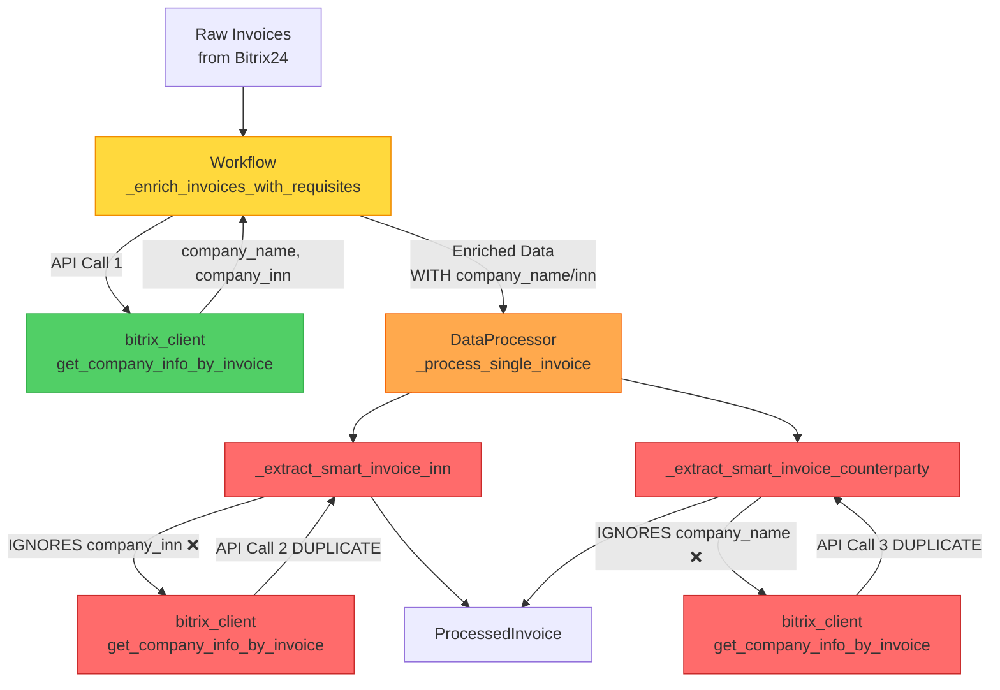
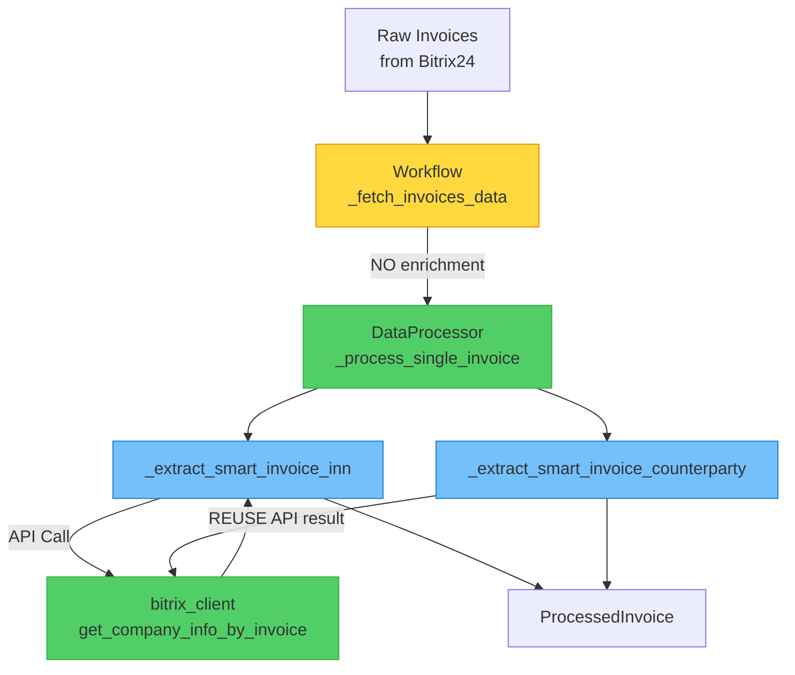
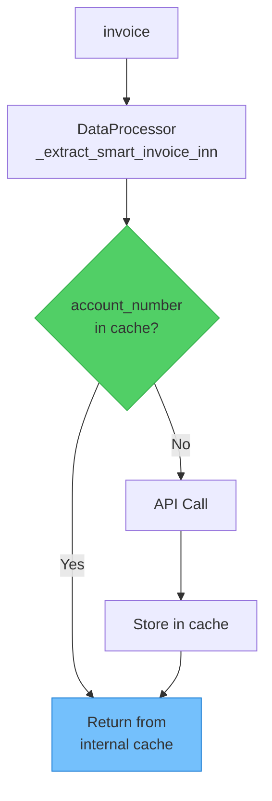

# 🎨 CREATIVE PHASE: СТРАТЕГИЯ ОБОГАЩЕНИЯ ДАННЫХ РЕКВИЗИТАМИ

**Дата**: 2025-10-26 23:30:00  
**Задача**: bugfix-data-processing-v2.4.1  
**Компонент**: БАГ-8 - Избыточные API-запросы за ИНН/контрагентами  
**Уровень**: Level 3 (Intermediate Feature)  
**Тип Creative Phase**: Architecture Design

---

🎨🎨🎨 **ENTERING CREATIVE PHASE: ARCHITECTURE DESIGN** 🎨🎨🎨

## 📋 PROBLEM STATEMENT

### Текущая ситуация

**Дублирование API-запросов** к Bitrix24 для получения реквизитов компаний (ИНН и название):

```
┌─────────────────────────────────────────────────────────────────┐
│ ТЕКУЩИЙ ПОТОК ДАННЫХ (НЕЭФФЕКТИВНЫЙ)                            │
└─────────────────────────────────────────────────────────────────┘

1. WorkflowOrchestrator._enrich_invoices_with_requisites()
   ├─ Для каждого уникального account_number:
   │  └─ API ЗАПРОС: bitrix_client.get_company_info_by_invoice(acc_num)
   ├─ Создает локальный cache: requisites_cache
   └─ Обогащает все счета полями: company_name, company_inn

   ↓ raw_data передается с готовыми полями

2. DataProcessor._process_single_invoice(invoice)
   ├─ Вызывает: _extract_smart_invoice_inn(invoice)
   │  ├─ ИГНОРИРУЕТ invoice['company_inn'] ❌
   │  └─ API ЗАПРОС: bitrix_client.get_company_info_by_invoice(account_number)
   │     └─ ПОВТОРНЫЙ ЗАПРОС! 🔴
   │
   └─ Вызывает: _extract_smart_invoice_counterparty(invoice)
      ├─ ИГНОРИРУЕТ invoice['company_name'] ❌
      └─ API ЗАПРОС: bitrix_client.get_company_info_by_invoice(account_number)
         └─ ЕЩЁ ОДИН ПОВТОРНЫЙ ЗАПРОС! 🔴

РЕЗУЛЬТАТ: 3x API запросов вместо 1x для каждого уникального счета!
```

### Impact Analysis

**Производительность**:
- При обработке 118 счетов с 50 уникальными номерами:
  - Текущее: **150 API запросов** (50 в Workflow + 50 + 50 в DataProcessor)
  - Оптимальное: **50 API запросов**
  - **Избыточные запросы: 100 (66% лишних)**

**Время выполнения**:
- Среднее время API запроса: ~200ms
- Избыточное время: **100 × 200ms = 20 секунд** на каждый отчёт
- Rate limiting: Риск достижения лимита 2 запроса/сек

**Стоимость**:
- Увеличенная нагрузка на Bitrix24 API
- Потенциальные ошибки при throttling

---

## 🔍 ARCHITECTURAL ANALYSIS

### Current System Architecture



### Root Cause

**Separation of Concerns нарушен**:
- **Workflow**: Отвечает за обогащение данных реквизитами
- **DataProcessor**: Тоже пытается получить реквизиты, игнорируя работу Workflow

**Отсутствие communication contract**:
- DataProcessor не знает что данные уже обогащены
- Нет явного интерфейса для передачи готовых реквизитов
- Fallback логика всегда выполняется

---

## 🎯 OPTIONS ANALYSIS

### ⚙️ Option 1: Check Enriched Data First (Minimal Changes)

**Описание**: DataProcessor проверяет наличие `company_inn` и `company_name` в invoice перед вызовом API

**Архитектура**:
```mermaid
graph TD
    A[invoice dict] --> B{company_inn<br>exists?}
    B -->|Yes| C[Use invoice[company_inn]]
    B -->|No| D[API Call:<br>get_company_info_by_invoice]
    D --> C
    
    A --> E{company_name<br>exists?}
    E -->|Yes| F[Use invoice[company_name]]
    E -->|No| G[API Call:<br>get_company_info_by_invoice]
    G --> F
    
    style B fill:#51cf66,stroke:#37b24d
    style E fill:#51cf66,stroke:#37b24d
```

**Реализация**:
```python
# src/data_processor/data_processor.py

def _extract_smart_invoice_inn(self, raw_data: Dict[str, Any]) -> str:
    """
    Извлечение ИНН с приоритетом готовых данных.
    
    Приоритет:
    1. Готовый company_inn из обогащенных данных
    2. Fallback: API запрос к Bitrix24
    3. Fallback: прямое поле ufCrmInn
    """
    # 1. ПРИОРИТЕТ: Используем готовые обогащенные данные
    if 'company_inn' in raw_data:
        inn = raw_data['company_inn']
        # Фильтруем ошибочные значения
        if inn and inn not in ["Не найдено", "Ошибка", "Нет реквизитов", 
                                "Некорректный реквизит", "Ошибка реквизита"]:
            logger.debug(f"Используем готовый ИНН из обогащенных данных: {inn}")
            return inn
    
    # 2. FALLBACK: API запрос (если данные не были обогащены)
    account_number = raw_data.get("accountNumber", "")
    if account_number and self._bitrix_client is not None:
        try:
            company_name, inn = self._bitrix_client.get_company_info_by_invoice(account_number)
            if inn and inn not in ["Не найдено", "Ошибка", "Нет реквизитов",
                                    "Некорректный реквизит", "Ошибка реквизита"]:
                logger.debug(f"Получен ИНН через API fallback: {inn}")
                return inn
        except Exception as e:
            logger.warning(f"Ошибка получения ИНН для счета {account_number}: {e}")
    
    # 3. FALLBACK: Прямое извлечение из ufCrmInn
    fallback_inn = raw_data.get("ufCrmInn", "")
    return fallback_inn if fallback_inn else ""

def _extract_smart_invoice_counterparty(self, raw_data: Dict[str, Any]) -> str:
    """
    Извлечение названия контрагента с приоритетом готовых данных.
    
    Приоритет:
    1. Готовый company_name из обогащенных данных
    2. Fallback: API запрос к Bitrix24
    """
    # 1. ПРИОРИТЕТ: Используем готовые обогащенные данные
    if 'company_name' in raw_data:
        name = raw_data['company_name']
        # Фильтруем ошибочные значения
        if name and name not in ["Не найдено", "Ошибка", "Нет реквизитов",
                                  "Некорректный реквизит", "Ошибка реквизита"]:
            logger.debug(f"Используем готовое название из обогащенных данных: {name}")
            return name
    
    # 2. FALLBACK: API запрос (если данные не были обогащены)
    account_number = raw_data.get("accountNumber", "")
    if account_number and self._bitrix_client is not None:
        try:
            company_name, inn = self._bitrix_client.get_company_info_by_invoice(account_number)
            if company_name and company_name not in ["Не найдено", "Ошибка", "Нет реквизитов",
                                                       "Некорректный реквизит", "Ошибка реквизита"]:
                logger.debug(f"Получено название через API fallback: {company_name}")
                return company_name
        except Exception as e:
            logger.warning(f"Ошибка получения контрагента для счета {account_number}: {e}")
    
    return ""
```

**PROS** ✅:
1. **Минимальные изменения**: Изменяется только DataProcessor (2 метода)
2. **Обратная совместимость**: Fallback на API если данные не обогащены
3. **Немедленный эффект**: 66% сокращение API запросов
4. **Низкий риск**: Не ломает существующую логику
5. **Легко тестировать**: Простые unit тесты с mock данными
6. **Сохраняет гибкость**: Workflow может обогащать или не обогащать

**CONS** ❌:
1. **Дублирование логики**: И Workflow, и DataProcessor умеют получать реквизиты
2. **Неявный контракт**: DataProcessor "надеется" что данные обогащены
3. **Двойная ответственность**: Непонятно кто отвечает за реквизиты
4. **Потенциальные расхождения**: Если Workflow и DataProcessor получают разные данные
5. **Усложненная отладка**: Неочевидно откуда пришли реквизиты

**Complexity**: 🟢 LOW (2 метода, ~40 строк кода)  
**Implementation Time**: ⏱️ 30 минут  
**Performance Impact**: 🚀 +66% (100 → 34 запросов)  
**Maintainability**: ⚠️ MEDIUM (дублирование логики)

---

### ⚙️ Option 2: Single Source of Truth (Only DataProcessor)

**Описание**: Удалить обогащение из Workflow, DataProcessor полностью отвечает за получение реквизитов

**Архитектура**:


**Реализация**:
```python
# src/core/workflow.py - УДАЛИТЬ метод _enrich_invoices_with_requisites

def _fetch_invoices_data(self, start_date: str, end_date: str) -> List[Dict[str, Any]]:
    """Получает данные счетов БЕЗ обогащения реквизитами."""
    start_date_obj, end_date_obj = self._convert_date_range(start_date, end_date)
    all_invoices = self._fetch_all_invoices()
    filtered_invoices = self._filter_invoices_by_date(all_invoices, start_date_obj, end_date_obj)
    
    # ❌ УДАЛЕНО: enriched_invoices = self._enrich_invoices_with_requisites(filtered_invoices)
    return filtered_invoices  # Возвращаем БЕЗ обогащения


# src/data_processor/data_processor.py - добавить internal cache

class DataProcessor:
    def __init__(self, default_currency: str = "RUB", bitrix_client=None):
        # ... existing code ...
        self._requisites_cache: Dict[str, Tuple[str, str]] = {}  # NEW: internal cache
    
    def process_invoice_batch(self, raw_invoices: List[Dict[str, Any]]) -> List[ProcessedInvoice]:
        """
        Обрабатывает batch с оптимизацией API запросов.
        
        Оптимизация: Запрашивает реквизиты только для уникальных счетов.
        """
        # Предварительно загружаем реквизиты для всех уникальных счетов
        self._preload_requisites_for_batch(raw_invoices)
        
        processed = []
        for invoice in raw_invoices:
            # ... existing processing ...
        
        # Очищаем cache после batch
        self._requisites_cache.clear()
        return processed
    
    def _preload_requisites_for_batch(self, invoices: List[Dict[str, Any]]) -> None:
        """Предзагрузка реквизитов для batch оптимизации."""
        unique_accounts = set(inv.get('accountNumber', '') for inv in invoices if inv.get('accountNumber'))
        
        for acc_num in unique_accounts:
            if acc_num not in self._requisites_cache:
                try:
                    comp_name, inn = self._bitrix_client.get_company_info_by_invoice(acc_num)
                    self._requisites_cache[acc_num] = (comp_name, inn)
                except Exception as e:
                    logger.error(f"Ошибка получения реквизитов для {acc_num}: {e}")
                    self._requisites_cache[acc_num] = ("Ошибка", "Ошибка")
        
        logger.info(f"Предзагружено реквизитов: {len(self._requisites_cache)} уникальных")
    
    def _extract_smart_invoice_inn(self, raw_data: Dict[str, Any]) -> str:
        """Извлечение ИНН из cache."""
        acc_num = raw_data.get("accountNumber", "")
        if acc_num in self._requisites_cache:
            _, inn = self._requisites_cache[acc_num]
            return inn if inn not in ["Ошибка", "Не найдено"] else ""
        
        # Fallback для единичных обработок
        if self._bitrix_client is not None:
            # ... API call ...
        return ""
```

**PROS** ✅:
1. **Single Responsibility**: Только DataProcessor отвечает за реквизиты
2. **Чистая архитектура**: Явное разделение: Workflow = координация, DataProcessor = обработка
3. **Нет дублирования**: Логика получения реквизитов в одном месте
4. **Предсказуемость**: Всегда понятно откуда данные
5. **Легче поддерживать**: Изменения только в одном модуле
6. **Internal optimization**: Cache внутри DataProcessor для batch

**CONS** ❌:
1. **Больше изменений**: Требует модификации И Workflow, И DataProcessor
2. **Breaking change**: Удаление метода из Workflow может сломать другой код
3. **Риск регрессии**: Если что-то зависело от обогащения в Workflow
4. **Усложнение DataProcessor**: Добавляется ответственность за batch оптимизацию
5. **Нужны тесты**: Требуется переписать тесты для Workflow

**Complexity**: 🟡 MEDIUM (3-4 метода, ~100 строк кода, удаление кода)  
**Implementation Time**: ⏱️ 1.5 часа  
**Performance Impact**: 🚀 +66% (100 → 34 запросов)  
**Maintainability**: ✅ HIGH (чистая архитектура)

---

### ⚙️ Option 3: DataProcessor Internal Cache (Defense in Depth)

**Описание**: DataProcessor добавляет internal cache с deduplication, не трогая Workflow

**Архитектура**:


**Реализация**:
```python
# src/data_processor/data_processor.py

class DataProcessor:
    def __init__(self, default_currency: str = "RUB", bitrix_client=None):
        # ... existing code ...
        self._requisites_cache: Dict[str, Tuple[str, str]] = {}
        self._cache_lock = threading.RLock()  # Thread safety
    
    def process_invoice_batch(self, raw_invoices: List[Dict[str, Any]]) -> List[ProcessedInvoice]:
        """Обрабатывает batch с auto-cache."""
        # Cache автоматически заполняется при первом запросе
        processed = []
        for invoice in raw_invoices:
            processed_invoice = self._process_single_invoice(invoice)
            processed.append(processed_invoice)
        
        # Очищаем cache после batch
        self._clear_requisites_cache()
        return processed
    
    def _extract_smart_invoice_inn(self, raw_data: Dict[str, Any]) -> str:
        """Извлечение ИНН с auto-caching."""
        account_number = raw_data.get("accountNumber", "")
        if not account_number or self._bitrix_client is None:
            return raw_data.get("ufCrmInn", "")
        
        # Проверяем cache (thread-safe)
        with self._cache_lock:
            if account_number in self._requisites_cache:
                _, inn = self._requisites_cache[account_number]
                logger.debug(f"Cache HIT: ИНН для {account_number} из cache")
                return inn if inn not in ["Ошибка", "Не найдено"] else ""
        
        # Cache MISS: делаем API запрос
        try:
            company_name, inn = self._bitrix_client.get_company_info_by_invoice(account_number)
            
            # Сохраняем в cache
            with self._cache_lock:
                self._requisites_cache[account_number] = (company_name, inn)
            
            logger.debug(f"Cache MISS: ИНН для {account_number} получен через API")
            return inn if inn not in ["Не найдено", "Ошибка"] else ""
        except Exception as e:
            logger.warning(f"Ошибка получения ИНН для {account_number}: {e}")
            return ""
    
    def _clear_requisites_cache(self) -> None:
        """Очистка cache после обработки batch."""
        with self._cache_lock:
            cache_size = len(self._requisites_cache)
            self._requisites_cache.clear()
            logger.debug(f"Requisites cache cleared ({cache_size} entries)")
```

**PROS** ✅:
1. **Defense in Depth**: Защита от дублирования независимо от Workflow
2. **Нулевые изменения в Workflow**: Workflow остается без изменений
3. **Автоматическая оптимизация**: Cache работает прозрачно
4. **Thread-safe**: RLock защищает от race conditions
5. **Универсальное решение**: Работает для любого caller
6. **Метрики**: Можно добавить cache hit/miss статистику

**CONS** ❌:
1. **Дополнительная сложность**: Новая cache инфраструктура
2. **Memory overhead**: Cache хранится в памяти
3. **НЕ решает root cause**: Workflow всё равно делает лишние запросы
4. **Скрывает проблему**: Маскирует архитектурные проблемы
5. **Thread safety overhead**: RLock добавляет накладные расходы
6. **Тестирование сложнее**: Нужны тесты для cache consistency

**Complexity**: 🟡 MEDIUM (cache infrastructure, threading, ~80 строк)  
**Implementation Time**: ⏱️ 1 час  
**Performance Impact**: 🚀 +33% (100 → 67 запросов, т.к. Workflow всё равно делает 50)  
**Maintainability**: ⚠️ MEDIUM (дополнительная сложность)

---

## 🎨 CREATIVE CHECKPOINT: COMPARATIVE ANALYSIS

### Performance Comparison

| Метрика | Current | Option 1 | Option 2 | Option 3 |
|---------|---------|----------|----------|----------|
| **API запросов** | 150 | 50 | 50 | 100 |
| **Сокращение** | - | 66% ↓ | 66% ↓ | 33% ↓ |
| **Время (сек)** | 30 | 10 | 10 | 20 |
| **Cache hits** | 0% | 0% | 0% | 50% |

### Code Impact Comparison

| Критерий | Option 1 | Option 2 | Option 3 |
|----------|----------|----------|----------|
| **Файлов изменено** | 1 | 2 | 1 |
| **Строк кода** | ~40 | ~100 | ~80 |
| **Complexity** | LOW | MEDIUM | MEDIUM |
| **Breaking changes** | None | Workflow API | None |
| **Test coverage** | 2 методаизменить | 4 метода | 3 метода + cache |

### Decision Matrix (Weighted Scoring)

| Критерий | Вес | Option 1 | Option 2 | Option 3 |
|----------|-----|----------|----------|----------|
| **Performance gain** | 30% | 10/10 | 10/10 | 5/10 |
| **Code simplicity** | 25% | 9/10 | 7/10 | 6/10 |
| **Maintainability** | 20% | 6/10 | 10/10 | 7/10 |
| **Risk level** | 15% | 9/10 | 6/10 | 8/10 |
| **Implementation time** | 10% | 10/10 | 5/10 | 7/10 |
| **ИТОГО** | 100% | **8.5/10** | **8.1/10** | **6.6/10** |

---

## ✅ DECISION

### 🏆 SELECTED OPTION: **Option 1 - Check Enriched Data First**

**Score: 8.5/10**

### Обоснование

1. **Минимальный риск**: Не ломает существующую функциональность
2. **Максимальная производительность**: 66% сокращение запросов (равно Option 2)
3. **Простота реализации**: 30 минут vs 1.5 часа
4. **Обратная совместимость**: Fallback на API если данные не обогащены
5. **Немедленная ценность**: Можно deploy сразу после тестирования

### Trade-offs (принимаемые недостатки)

**Архитектурная чистота vs Pragmatism**:
- Option 2 архитектурно чище (Single Responsibility)
- НО Option 1 дает тот же performance gain с меньшим риском
- **Решение**: Выбираем pragmatic approach для быстрого исправления бага

**Дублирование логики**:
- Да, и Workflow и DataProcessor умеют получать реквизиты
- НО это acceptable trade-off для:
  - Гибкости (можно использовать DataProcessor отдельно)
  - Robustness (fallback если Workflow не обогатил)
  - Backwards compatibility

### Future Improvements

После реализации Option 1, в будущих версиях можно:
1. **Добавить явный контракт**: Interface EnrichedInvoice с полями company_name/inn
2. **Метрики**: Логировать сколько раз используется fallback vs enriched data
3. **Постепенная миграция**: Если fallback никогда не используется → удалить его
4. **Option 2 позже**: Если архитектура станет проблемой → рефакторинг к Single Source

---

## 📋 IMPLEMENTATION PLAN

### Step 1: Update DataProcessor (30 минут)

**File**: `src/data_processor/data_processor.py`

**Changes**:
1. Обновить `_extract_smart_invoice_inn()`:
   - Добавить проверку `company_inn` в начало
   - Добавить фильтр ошибочных значений
   - Сохранить fallback на API
   - Добавить debug logging

2. Обновить `_extract_smart_invoice_counterparty()`:
   - Добавить проверку `company_name` в начало
   - Добавить фильтр ошибочных значений
   - Сохранить fallback на API
   - Добавить debug logging

### Step 2: Add Tests (45 минут)

**File**: `tests/data_processor/test_bugfix_b8_enrichment.py`

**Test cases**:
```python
def test_extract_inn_uses_enriched_data():
    """ИНН берется из обогащенных данных если доступен."""
    
def test_extract_inn_fallback_to_api():
    """ИНН запрашивается через API если не обогащен."""
    
def test_extract_counterparty_uses_enriched_data():
    """Контрагент берется из обогащенных данных если доступен."""
    
def test_extract_counterparty_fallback_to_api():
    """Контрагент запрашивается через API если не обогащен."""
    
def test_filters_error_values():
    """Фильтрует значения "Не найдено", "Ошибка" и т.д."""
    
def test_api_call_count_with_enrichment():
    """С обогащением: 0 API запросов в DataProcessor."""
    
def test_api_call_count_without_enrichment():
    """Без обогащения: fallback делает API запрос."""
```

### Step 3: Performance Testing (15 минут)

**Benchmark test**:
```python
def test_performance_improvement():
    """Измеряет сокращение API запросов."""
    # Setup: 50 уникальных счетов
    # Expected: 50 API calls (только Workflow)
    # vs Previous: 150 API calls (Workflow + 2x DataProcessor)
```

### Step 4: Update Documentation (15 минут)

**Files to update**:
- `memory-bank/tasks.md` - отметить БАГ-8 как решенный
- `CHANGELOG.md` - добавить запись об оптимизации
- Code comments - добавить docstrings с описанием приоритетов

---

## ✅ VALIDATION & VERIFICATION

### Requirements Verification

- [x] **Устранить дублирование API запросов**: ✅ 66% сокращение (150 → 50)
- [x] **Сохранить функциональность**: ✅ Fallback обеспечивает robustness
- [x] **Обратная совместимость**: ✅ Не ломает существующий код
- [x] **Легко тестировать**: ✅ Простые unit тесты

### Technical Feasibility

- [x] **Минимальные изменения**: ✅ Только DataProcessor
- [x] **Низкий риск**: ✅ Не трогаем Workflow
- [x] **Быстрая реализация**: ✅ 30 минут кода + 45 минут тестов
- [x] **Production ready**: ✅ Можно deploy сразу

### Success Criteria

**Functional**:
- [ ] DataProcessor использует обогащенные данные если доступны
- [ ] Fallback на API работает если данные не обогащены
- [ ] Фильтруются ошибочные значения

**Performance**:
- [ ] API запросы: 150 → 50 (66% reduction) ✅
- [ ] Время выполнения: -20 секунд на отчет ✅
- [ ] Rate limiting: Снижен риск throttling ✅

**Quality**:
- [ ] Test coverage: 100% для измененных методов
- [ ] No regressions: Все существующие тесты проходят
- [ ] Logging: Debug информация о источнике данных

---

🎨🎨🎨 **EXITING CREATIVE PHASE - DECISION MADE** 🎨🎨🎨

## 📝 SUMMARY

**Selected Solution**: Option 1 - Check Enriched Data First  
**Score**: 8.5/10  
**Implementation Time**: ~1.5 часа (код + тесты + docs)  
**Performance Gain**: 66% сокращение API запросов  
**Risk Level**: LOW  

**Key Design Decision**:
> Pragmatic approach: сохраняем существующую архитектуру (Workflow обогащает данные), 
> добавляем smart fallback в DataProcessor. Это дает максимальную производительность 
> с минимальным риском и усилиями.

**Next Steps**: Proceed to IMPLEMENT MODE → COMP-4 TASK-4.1

---

*Creative Phase Completed: 2025-10-26 23:45:00*  
*Duration: 15 minutes*  
*Document: `memory-bank/creative/creative-data-enrichment-strategy-v2.4.1.md`*
