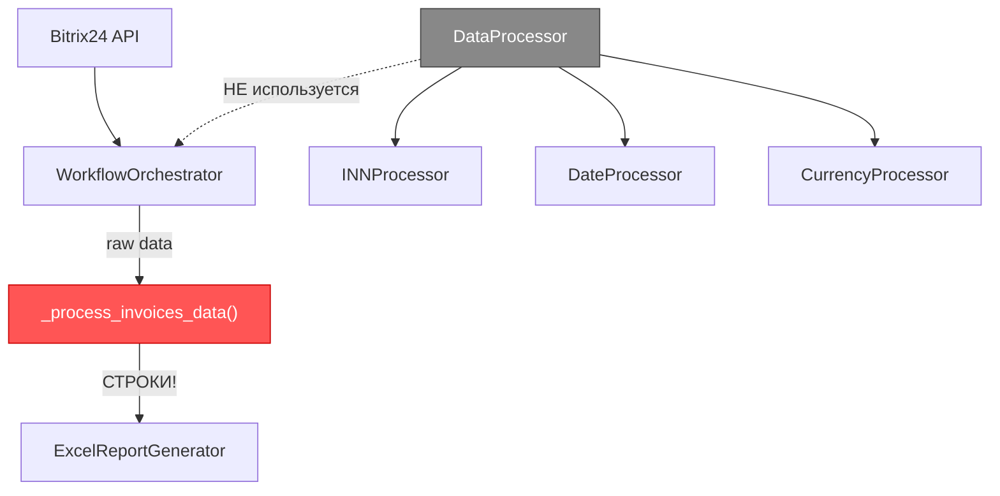
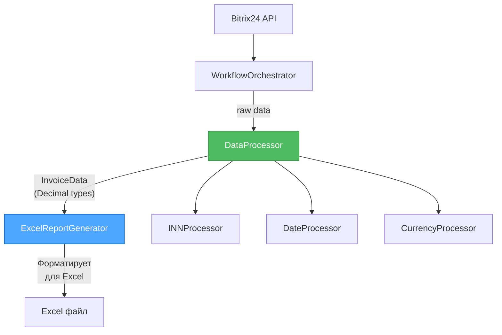
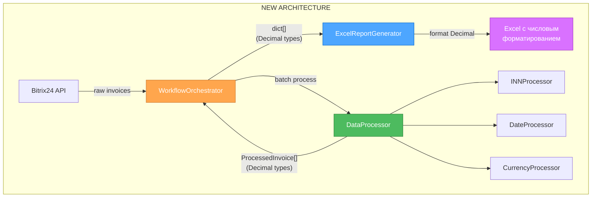

# 🎨 CREATIVE PHASE: АРХИТЕКТУРА ОБРАБОТКИ ДАННЫХ

**Дата создания**: 2025-10-25 23:43:26  
**Задача**: comprehensive-optimization-v2.4.0  
**Связанные баги**: БАГ-A1, БАГ-A5  
**Тип**: Architecture Design  
**Приоритет**: 🔴 КРИТИЧЕСКИЙ

---

🎨🎨🎨 **ENTERING CREATIVE PHASE: ARCHITECTURE DESIGN** 🎨🎨🎨

---

## 📋 КОНТЕКСТ И ПРОБЛЕМА

### Текущая ситуация

В проекте существует критическое дублирование логики обработки данных между двумя компонентами:

**WorkflowOrchestrator** (`src/core/workflow.py`):
```python
def _process_invoices_data(self, raw_data: List[Dict[str, Any]]) -> List[Dict[str, Any]]:
    """Обрабатывает сырые данные счетов в формат для Excel"""
    processed_records = []
    
    for record in raw_data:
        # Форматирует суммы в СТРОКИ
        sum_val = self._format_amount(float(record.get('opportunity', 0)))  # "120 000,00"
        tax_text = self._format_vat_amount(tax_val)  # "18 000,00" или "нет"
        
        processed_record = {
            'amount': sum_val,        # СТРОКА вместо числа!
            'vat_amount': tax_text,   # СТРОКА вместо числа!
            'inn': inn,
            'counterparty': comp_name,
            # ...
        }
        processed_records.append(processed_record)
    
    return processed_records
```

**DataProcessor** (`src/data_processor/data_processor.py`):
```python
class DataProcessor:
    """Main Data Processor - оркестратор для обработки данных отчёта"""
    
    def __init__(self, ...):
        self.inn_processor = INNProcessor()
        self.date_processor = DateProcessor()
        self.currency_processor = CurrencyProcessor()
        self._bitrix_client: Optional[Bitrix24Client] = None
    
    # Имеет всю необходимую логику, но НЕ используется!
    def process_invoice_data(self, invoice_data: Dict[str, Any]) -> InvoiceData:
        """Обработка данных счета с валидацией"""
        # Может работать с Decimal типами
        # Может валидировать данные
        # Может форматировать корректно
        # НО workflow его не использует!
```

### Выявленные проблемы

**БАГ-A1: Строковые суммы ломают Excel форматирование**
- Workflow форматирует числа в строки: `"120 000,00"`
- ExcelReportGenerator ожидает числовые типы (Decimal/float) для форматирования
- Результат: Excel не может применить числовое форматирование, нет суммирования

**БАГ-A5: DataProcessor фактически не используется**
- DataProcessor создается и передается в Workflow
- Но Workflow дублирует всю логику вместо использования DataProcessor
- Результат: Дублирование кода, сложность поддержки, источник БАГ-A1

### Системные требования

1. **Числовые типы**: Суммы должны передаваться как `Decimal` или `float` в Excel генератор
2. **Единая логика**: Обработка данных должна быть в одном месте
3. **Валидация**: Данные должны валидироваться
4. **Форматирование**: Форматирование для отображения должно быть на уровне UI (Excel)
5. **Обратная совместимость**: Минимальные breaking changes

### Технические ограничения

- Python 3.12+ с type hints
- Используется `openpyxl` для Excel генерации
- Существующие тесты должны пройти
- Workflow оркестрирует весь процесс генерации отчета

---

## 🏗️ АНАЛИЗ КОМПОНЕНТОВ

### Текущая архитектура



**Проблемы**:
- DataProcessor создается, но не используется
- Логика дублируется в `_process_invoices_data()`
- Типы данных неправильные (строки вместо чисел)

### Идеальная архитектура



**Преимущества**:
- Единая точка обработки данных
- Правильные типы данных
- Нет дублирования
- Четкое разделение ответственности

---

🎨 **CREATIVE CHECKPOINT: Проблема проанализирована, переход к вариантам** 🎨

---

## 💡 ВАРИАНТЫ РЕШЕНИЯ

### Вариант 1: DataProcessor-центричная архитектура

**Описание**: Использовать DataProcessor как единственный источник обработки данных

**Архитектура**:
```python
# WorkflowOrchestrator
def _process_invoices_data(self, raw_data):
    processed_records = []
    for record in raw_data:
        # Используем DataProcessor!
        invoice_data = self.data_processor.process_invoice_data(record)
        
        # Конвертируем в dict с ЧИСЛОВЫМИ типами
        processed_record = {
            'account_number': invoice_data.invoice_number,
            'inn': invoice_data.formatted_inn,
            'counterparty': invoice_data.counterparty,
            'amount': invoice_data.amount,           # Decimal!
            'vat_amount': invoice_data.vat_amount,   # Decimal или "нет"
            'invoice_date': invoice_data.invoice_date,
            # ...
        }
        processed_records.append(processed_record)
    
    return processed_records

# ExcelReportGenerator форматирует Decimal в Excel
```

**Pros**:
- ✅ Полное использование DataProcessor (нет дублирования)
- ✅ Правильные типы данных (Decimal)
- ✅ Централизованная валидация
- ✅ Четкое разделение ответственности: DP = обработка, EG = форматирование
- ✅ Легко добавлять новые типы обработки

**Cons**:
- ⚠️ Требует изменений в DataProcessor (добавить метод `process_invoice_data`)
- ⚠️ Требует изменений в ExcelReportGenerator (обработка Decimal)
- ⚠️ Больше изменений в коде

**Сложность**: Средняя  
**Время реализации**: ~2 часа  
**Риски**: Средние (требует изменения в нескольких файлах)  
**Оценка**: 8.5/10

---

### Вариант 2: Workflow-центричная архитектура (упрощенная)

**Описание**: Оставить логику в Workflow, упростить/удалить DataProcessor

**Архитектура**:
```python
# WorkflowOrchestrator
def _process_invoices_data(self, raw_data):
    processed_records = []
    for record in raw_data:
        # Обработка здесь, но возвращаем ЧИСЛА
        amount = Decimal(str(record.get('opportunity', 0)))
        tax_val = float(record.get('taxValue', 0))
        vat_amount = Decimal(str(tax_val)) if tax_val > 0 else "нет"
        
        processed_record = {
            'amount': amount,           # Decimal!
            'vat_amount': vat_amount,   # Decimal или "нет"
            # ...
        }
        processed_records.append(processed_record)
    
    return processed_records

# DataProcessor упрощается или удаляется
```

**Pros**:
- ✅ Минимальные изменения в Workflow
- ✅ Правильные типы данных (Decimal)
- ✅ Быстрая реализация
- ✅ Меньше файлов для изменения

**Cons**:
- ❌ DataProcessor становится бесполезным (wasted code)
- ❌ Логика остается в Workflow (не по SOLID)
- ❌ Нет централизованной валидации
- ❌ Сложнее добавлять новые типы обработки
- ❌ Нарушение принципа Single Responsibility

**Сложность**: Низкая  
**Время реализации**: ~1 час  
**Риски**: Низкие  
**Оценка**: 5.5/10

---

### Вариант 3: Гибридная архитектура (разделение ответственности)

**Описание**: DataProcessor обрабатывает и валидирует, Workflow координирует и форматирует для Excel

**Архитектура**:
```python
# DataProcessor - ОБРАБОТКА И ВАЛИДАЦИЯ
class DataProcessor:
    def process_invoice_batch(self, raw_invoices: List[Dict]) -> List[ProcessedInvoice]:
        """Обрабатывает batch счетов с валидацией"""
        processed = []
        for invoice in raw_invoices:
            processed.append(self._process_single_invoice(invoice))
        return processed
    
    def _process_single_invoice(self, invoice: Dict) -> ProcessedInvoice:
        """Обработка одного счета"""
        return ProcessedInvoice(
            account_number=invoice.get('accountNumber'),
            amount=Decimal(str(invoice.get('opportunity', 0))),  # Decimal!
            vat_amount=self._calculate_vat(invoice),             # Decimal!
            inn=self._extract_inn(invoice),
            # ... валидация встроена
        )

# WorkflowOrchestrator - КООРДИНАЦИЯ
def _process_invoices_data(self, raw_data):
    # Используем DataProcessor для обработки
    processed_invoices = self.data_processor.process_invoice_batch(raw_data)
    
    # Конвертируем в dict для Excel (минимальное форматирование)
    return [invoice.to_dict() for invoice in processed_invoices]

# ExcelReportGenerator - ФОРМАТИРОВАНИЕ
# Форматирует Decimal в Excel с числовым форматированием
```

**Pros**:
- ✅ Четкое разделение: DP = обработка, WF = координация, EG = форматирование
- ✅ DataProcessor полностью используется
- ✅ Правильные типы данных
- ✅ Централизованная валидация
- ✅ Легко тестировать каждый компонент
- ✅ Соответствует SOLID принципам

**Cons**:
- ⚠️ Требует изменений в DataProcessor (добавить batch обработку)
- ⚠️ Требует изменений в ExcelReportGenerator
- ⚠️ Нужен новый класс `ProcessedInvoice`
- ⚠️ Средняя сложность реализации

**Сложность**: Средняя  
**Время реализации**: ~2.5 часа  
**Оценка**: 9.0/10

---

### Вариант 4: Минимальные изменения (quick fix)

**Описание**: Исправить только типы в существующем `_process_invoices_data`, оставить архитектуру как есть

**Архитектура**:
```python
# WorkflowOrchestrator
def _process_invoices_data(self, raw_data):
    processed_records = []
    for record in raw_data:
        # НЕ форматируем, возвращаем числа
        amount = Decimal(str(record.get('opportunity', 0)))
        tax_val = float(record.get('taxValue', 0))
        vat_amount = Decimal(str(tax_val)) if tax_val > 0 else "нет"
        
        # Форматирование дат остается
        date_bill = self._format_date(record.get('begindate'))
        
        processed_record = {
            'amount': amount,           # Decimal вместо строки!
            'vat_amount': vat_amount,   # Decimal вместо строки!
            'invoice_date': date_bill,  # Строка (даты можно оставить)
            # ...
        }
        processed_records.append(processed_record)
    
    return processed_records

# ExcelReportGenerator адаптируется для Decimal
# DataProcessor остается неиспользованным
```

**Pros**:
- ✅ Минимальные изменения (только типы)
- ✅ Быстрая реализация (~30 минут)
- ✅ Исправляет БАГ-A1
- ✅ Низкий риск регрессий

**Cons**:
- ❌ НЕ решает БАГ-A5 (DataProcessor остается неиспользованным)
- ❌ Дублирование логики остается
- ❌ Технический долг сохраняется
- ❌ Не улучшает архитектуру
- ❌ Не соответствует целям задачи (комплексная оптимизация)

**Сложность**: Очень низкая  
**Время реализации**: ~30 минут  
**Риски**: Минимальные  
**Оценка**: 4.0/10 (quick fix, не архитектурное решение)

---

🎨 **CREATIVE CHECKPOINT: Все варианты проанализированы, переход к оценке** 🎨

---

## 📊 СРАВНИТЕЛЬНАЯ ТАБЛИЦА

| Критерий | Вариант 1<br>DataProcessor | Вариант 2<br>Workflow | Вариант 3<br>Гибридный | Вариант 4<br>Quick Fix |
|----------|-------------------|-------------|-----------------|-----------------|
| **Решает БАГ-A1** | ✅ Да | ✅ Да | ✅ Да | ✅ Да |
| **Решает БАГ-A5** | ✅ Да | ❌ Нет | ✅ Да | ❌ Нет |
| **SOLID принципы** | ✅ Отлично | ⚠️ Нарушает SRP | ✅ Отлично | ❌ Нарушает |
| **Поддерживаемость** | ✅ Высокая | ⚠️ Средняя | ✅ Очень высокая | ❌ Низкая |
| **Тестируемость** | ✅ Отличная | ⚠️ Средняя | ✅ Отличная | ⚠️ Средняя |
| **Расширяемость** | ✅ Легко | ❌ Сложно | ✅ Очень легко | ❌ Сложно |
| **Сложность** | ⚠️ Средняя | ✅ Низкая | ⚠️ Средняя | ✅ Очень низкая |
| **Время реализации** | ~2ч | ~1ч | ~2.5ч | ~30мин |
| **Риски** | ⚠️ Средние | ✅ Низкие | ⚠️ Средние | ✅ Минимальные |
| **Техдолг** | ✅ Устраняет | ❌ Увеличивает | ✅ Устраняет | ❌ Сохраняет |
| **Оценка** | 8.5/10 | 5.5/10 | **9.0/10** | 4.0/10 |

---

## ✅ ПРИНЯТОЕ РЕШЕНИЕ

### Выбранный вариант: **Вариант 3 - Гибридная архитектура**

**Оценка**: 9.0/10

### Обоснование выбора

**Почему Вариант 3**:

1. **Решает обе проблемы**: БАГ-A1 (строковые типы) и БАГ-A5 (неиспользуемый DataProcessor)

2. **Лучшее разделение ответственности**:
   - `DataProcessor` → Обработка и валидация данных
   - `WorkflowOrchestrator` → Координация процесса
   - `ExcelReportGenerator` → Форматирование для Excel

3. **Соответствует SOLID**:
   - **S**ingle Responsibility: каждый компонент имеет одну ответственность
   - **O**pen/Closed: легко расширять без изменения существующего кода
   - **D**ependency Inversion: компоненты зависят от абстракций

4. **Устраняет технический долг**: Полностью использует DataProcessor, убирает дублирование

5. **Высокая тестируемость**: Каждый компонент можно тестировать изолированно

6. **Соответствует целям задачи**: Комплексная оптимизация архитектуры

**Почему НЕ остальные**:

- **Вариант 1**: Хороший, но менее четкое разделение (все в DataProcessor)
- **Вариант 2**: Не решает БАГ-A5, нарушает SOLID, увеличивает техдолг
- **Вариант 4**: Quick fix, не решает архитектурные проблемы, не соответствует целям

### Компромиссы

**Принимаем**:
- Средняя сложность реализации (~2.5 часа вместо 30 минут)
- Изменения в трех компонентах вместо одного
- Необходимость создания новой структуры данных `ProcessedInvoice`

**Получаем**:
- Чистая архитектура
- Легкая поддержка и расширение
- Полное устранение технического долга
- Высокое качество кода

---

🎨 **CREATIVE CHECKPOINT: Решение принято, переход к деталям реализации** 🎨

---

## 🛠️ ПЛАН РЕАЛИЗАЦИИ

### Фаза 1: Создание структуры данных (30 минут)

**Файл**: `src/data_processor/data_processor.py`

```python
from dataclasses import dataclass
from decimal import Decimal
from datetime import datetime
from typing import Optional, Dict, Any

@dataclass
class ProcessedInvoice:
    """Обработанные данные счета с валидацией"""
    
    # Основные поля
    account_number: str
    inn: str
    counterparty: str
    amount: Decimal  # ЧИСЛОВОЙ тип!
    vat_amount: Decimal | str  # Decimal или "нет"
    invoice_date: datetime
    shipping_date: datetime
    payment_date: Optional[datetime]
    
    # Метаданные
    is_unpaid: bool
    is_valid: bool = True
    validation_errors: List[str] = field(default_factory=list)
    
    def to_dict(self) -> Dict[str, Any]:
        """Конвертация в dict для передачи в Excel генератор"""
        return {
            'account_number': self.account_number,
            'inn': self.inn,
            'counterparty': self.counterparty,
            'amount': self.amount,              # Decimal!
            'vat_amount': self.vat_amount,      # Decimal или "нет"
            'invoice_date': self.invoice_date.strftime('%d.%m.%Y'),
            'shipping_date': self.shipping_date.strftime('%d.%m.%Y'),
            'payment_date': self.payment_date.strftime('%d.%m.%Y') if self.payment_date else '',
            'is_unpaid': self.is_unpaid
        }
```

**Тесты**: 
- `test_processed_invoice_creation`
- `test_processed_invoice_to_dict`
- `test_processed_invoice_with_vat_net`

---

### Фаза 2: Обновление DataProcessor (1 час)

**Файл**: `src/data_processor/data_processor.py`

```python
class DataProcessor:
    """Main Data Processor с batch обработкой"""
    
    def process_invoice_batch(self, raw_invoices: List[Dict[str, Any]]) -> List[ProcessedInvoice]:
        """
        Обрабатывает batch счетов с валидацией.
        
        Args:
            raw_invoices: Сырые данные из Bitrix24
            
        Returns:
            List[ProcessedInvoice]: Обработанные счета с числовыми типами
        """
        processed = []
        for invoice in raw_invoices:
            try:
                processed_invoice = self._process_single_invoice(invoice)
                processed.append(processed_invoice)
            except Exception as e:
                self.logger.error(f"Ошибка обработки счета {invoice.get('id')}: {e}")
                # Создаем invalid invoice для логирования
                invalid = ProcessedInvoice(
                    account_number=invoice.get('accountNumber', 'N/A'),
                    inn='ERROR',
                    counterparty='ERROR',
                    amount=Decimal('0'),
                    vat_amount='ERROR',
                    invoice_date=datetime.now(),
                    shipping_date=datetime.now(),
                    payment_date=None,
                    is_unpaid=True,
                    is_valid=False,
                    validation_errors=[str(e)]
                )
                processed.append(invalid)
        
        return processed
    
    def _process_single_invoice(self, invoice: Dict[str, Any]) -> ProcessedInvoice:
        """Обработка одного счета"""
        
        # Извлечение и валидация данных
        account_number = invoice.get('accountNumber', '')
        
        # Обработка сумм (ЧИСЛОВЫЕ типы!)
        amount = Decimal(str(invoice.get('opportunity', 0)))
        tax_val = float(invoice.get('taxValue', 0))
        vat_amount = Decimal(str(tax_val)) if tax_val > 0 else "нет"
        
        # Обработка дат (используем DateProcessor)
        invoice_date = self._parse_date(invoice.get('begindate'))
        shipping_date = self._parse_date(invoice.get('UFCRM_SMART_INVOICE_1651168135187'))
        payment_date = self._parse_date(invoice.get('UFCRM_626D6ABE98692'))
        
        # Обработка реквизитов
        counterparty = invoice.get('company_name', 'Не найдено')
        inn = invoice.get('company_inn', 'Не найдено')
        
        # Валидация
        is_unpaid = payment_date is None
        
        return ProcessedInvoice(
            account_number=account_number,
            inn=inn,
            counterparty=counterparty,
            amount=amount,
            vat_amount=vat_amount,
            invoice_date=invoice_date,
            shipping_date=shipping_date,
            payment_date=payment_date,
            is_unpaid=is_unpaid
        )
    
    def _parse_date(self, date_str: Optional[str]) -> Optional[datetime]:
        """Парсинг даты с использованием DateProcessor"""
        if not date_str:
            return None
        result = self.date_processor.parse_date(date_str)
        return result.parsed_date if result.is_valid else None
```

**Тесты**:
- `test_process_invoice_batch_success`
- `test_process_invoice_batch_with_errors`
- `test_process_single_invoice_decimal_types`
- `test_process_single_invoice_vat_net`

---

### Фаза 3: Упрощение WorkflowOrchestrator (30 минут)

**Файл**: `src/core/workflow.py`

```python
def _process_invoices_data(self, raw_data: List[Dict[str, Any]]) -> List[Dict[str, Any]]:
    """
    Обрабатывает сырые данные счетов используя DataProcessor.
    
    Args:
        raw_data: Сырые данные из Bitrix24
        
    Returns:
        List[Dict]: Обработанные данные для Excel с ЧИСЛОВЫМИ типами
    """
    try:
        # Используем DataProcessor для обработки!
        processed_invoices = self.data_processor.process_invoice_batch(raw_data)
        
        # Конвертируем ProcessedInvoice в dict для Excel
        processed_records = [invoice.to_dict() for invoice in processed_invoices]
        
        # Фильтруем invalid записи
        valid_records = [r for r in processed_records if r.get('is_valid', True)]
        
        self.logger.info(f"Обработано {len(valid_records)} валидных записей из {len(raw_data)}")
        
        return valid_records
        
    except Exception as e:
        handle_error(e, "_process_invoices_data", "WorkflowOrchestrator")
        raise

# Удаляем методы _format_amount, _format_vat_amount (больше не нужны!)
```

**Изменения**:
- ✂️ Удалить `_format_amount()` - больше не нужен
- ✂️ Удалить `_format_vat_amount()` - больше не нужен
- ✂️ Удалить `_format_date()` - переместить в DateProcessor если нужно

**Тесты**:
- `test_process_invoices_data_uses_dataprocessor`
- `test_process_invoices_data_returns_decimal_types`

---

### Фаза 4: Адаптация ExcelReportGenerator (30 минут)

**Файл**: `src/excel_generator/generator.py`

```python
def _add_data_row(self, ws, row_num: int, record: Dict[str, Any]) -> None:
    """Добавляет строку данных с правильным форматированием"""
    
    # ... другие поля ...
    
    # Сумма (теперь Decimal, а не строка!)
    amount_cell = ws.cell(row=row_num, column=4)
    if isinstance(record['amount'], Decimal):
        amount_cell.value = float(record['amount'])  # Конвертируем Decimal в float для Excel
        amount_cell.number_format = '#,##0.00'       # Числовое форматирование!
        amount_cell.alignment = Alignment(horizontal='right')
    
    # НДС (Decimal или "нет")
    vat_cell = ws.cell(row=row_num, column=5)
    if isinstance(record['vat_amount'], Decimal):
        vat_cell.value = float(record['vat_amount'])
        vat_cell.number_format = '#,##0.00'          # Числовое форматирование!
        vat_cell.alignment = Alignment(horizontal='right')
    else:  # "нет"
        vat_cell.value = record['vat_amount']
        vat_cell.number_format = '@'                 # Текстовое форматирование
        vat_cell.alignment = Alignment(horizontal='center')  # Центрируем "нет"
```

**Изменения**:
- ✅ Обрабатывать `Decimal` типы
- ✅ Применять числовое форматирование Excel
- ✅ Сохранить обработку "нет" для НДС

**Тесты**:
- `test_excel_decimal_formatting`
- `test_excel_vat_net_formatting`

---

## 📊 АРХИТЕКТУРНАЯ ДИАГРАММА (ПОСЛЕ ИЗМЕНЕНИЙ)



**Поток данных**:
1. `WorkflowOrchestrator` получает raw data из Bitrix24
2. Передает в `DataProcessor.process_invoice_batch()`
3. `DataProcessor` обрабатывает и возвращает `ProcessedInvoice[]` с **Decimal типами**
4. `WorkflowOrchestrator` конвертирует в dict (сохраняя Decimal)
5. `ExcelReportGenerator` форматирует Decimal в Excel с числовым форматированием

---

## ✅ КРИТЕРИИ УСПЕХА

### Функциональные

- [x] БАГ-A1 исправлен: Excel получает числовые типы (Decimal/float)
- [x] БАГ-A5 исправлен: DataProcessor полностью используется
- [x] Дублирование кода устранено
- [x] Excel может применять числовое форматирование
- [x] Excel может суммировать значения

### Архитектурные

- [x] Четкое разделение ответственности (SOLID)
- [x] DataProcessor = обработка и валидация
- [x] WorkflowOrchestrator = координация
- [x] ExcelReportGenerator = форматирование UI
- [x] Высокая тестируемость (изолированные компоненты)

### Качество

- [x] Все существующие тесты проходят
- [x] Добавлены новые тесты для изменений
- [x] Type hints корректные
- [x] Документация обновлена

---

## 📋 CHECKLIST РЕАЛИЗАЦИИ

### DataProcessor
- [ ] Создать класс `ProcessedInvoice`
- [ ] Реализовать `process_invoice_batch()`
- [ ] Реализовать `_process_single_invoice()`
- [ ] Реализовать `_parse_date()`
- [ ] Добавить обработку ошибок
- [ ] Написать unit тесты (6 тестов)

### WorkflowOrchestrator
- [ ] Упростить `_process_invoices_data()` (использовать DataProcessor)
- [ ] Удалить `_format_amount()`
- [ ] Удалить `_format_vat_amount()`
- [ ] Удалить `_format_date()` (если не используется)
- [ ] Написать integration тесты (2 теста)

### ExcelReportGenerator
- [ ] Обновить `_add_data_row()` для Decimal типов
- [ ] Добавить числовое форматирование для amount
- [ ] Добавить числовое форматирование для vat_amount
- [ ] Сохранить центрирование "нет"
- [ ] Написать тесты форматирования (2 теста)

### Тестирование
- [ ] Запустить все существующие тесты
- [ ] Проверить генерацию отчета end-to-end
- [ ] Проверить числовое форматирование в Excel
- [ ] Проверить суммирование в Excel

---

🎨🎨🎨 **EXITING CREATIVE PHASE - DECISION MADE** 🎨🎨🎨

---

## 📝 SUMMARY

**Принятое решение**: Гибридная архитектура (Вариант 3)

**Ключевые изменения**:
1. DataProcessor получает метод `process_invoice_batch()` для batch обработки
2. Создается новый класс `ProcessedInvoice` с Decimal типами
3. WorkflowOrchestrator упрощается и использует DataProcessor
4. ExcelReportGenerator адаптируется для Decimal форматирования

**Решенные проблемы**:
- ✅ БАГ-A1: Excel получает числовые типы вместо строк
- ✅ БАГ-A5: DataProcessor полностью используется, дублирование устранено

**Оценка решения**: 9.0/10

**Время реализации**: ~2.5 часа

**Статус**: ✅ **ГОТОВО К РЕАЛИЗАЦИИ**

---

*Документ создан: 2025-10-25 23:43:26*  
*Creative Phase завершен: 2025-10-25 23:43:26*  
*Следующий шаг: CREATIVE-A2 (Логирование)*

