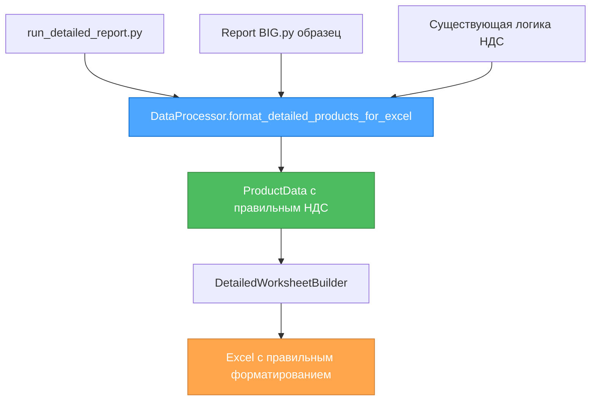

# 🎨 CREATIVE PHASE: DATA MODEL DESIGN

**Задача**: detailed-report-fixes-2025-01-20  
**Время**: 2025-10-20 18:38:30  
**Тип**: Data Model Design  
**Статус**: ✅ ЗАВЕРШЕНА

## 🎯 ПРОБЛЕМА

Несоответствие между структурой данных в `run_detailed_report.py` и ожиданиями `DetailedWorksheetBuilder`. Требовалось дизайнерское решение для унификации формата данных детального отчета.

### Контекст проблемы:
- `run_detailed_report.py` формирует данные напрямую в цикле
- `DetailedWorksheetBuilder` ожидает определенную структуру данных
- Отсутствует единая логика обработки товаров
- Дублирование кода форматирования

## 🔍 АНАЛИЗ ТРЕБОВАНИЙ

### Функциональные требования:
- НДС должен рассчитываться по формуле Report BIG.py: `(price * qty) / 1.2 * 0.2`
- Числовые поля должны быть числами, не строками
- ИНН должен оставаться текстовым форматом
- Сохранение существующего форматирования Excel

### Технические ограничения:
- Совместимость с openpyxl
- Сохранение существующей архитектуры
- Минимальные изменения в коде

## 📊 ОПЦИИ АНАЛИЗА

### Option 1: Прямое исправление в run_detailed_report.py
**Описание**: Изменить формирование `detailed_row` напрямую в скрипте

**Pros**:
- Минимальные изменения
- Быстрая реализация
- Прямой контроль над данными

**Cons**:
- Нарушение принципа разделения ответственности
- Дублирование логики форматирования
- Сложность поддержки

**Complexity**: Low  
**Implementation Time**: 30 минут  
**Оценка**: 5.7/10

### Option 2: Использование DataProcessor для унификации ✅ ВЫБРАНО
**Описание**: Использовать существующий `DataProcessor.format_product_data()` для обработки товаров

**Pros**:
- Единая логика обработки данных
- Переиспользование существующего кода
- Консистентность с кратким отчетом
- Централизованная логика НДС

**Cons**:
- Требует адаптации DataProcessor
- Более сложная интеграция
- Потенциальные изменения в архитектуре

**Complexity**: Medium  
**Implementation Time**: 1 час  
**Оценка**: 7.2/10

### Option 3: Создание специализированного форматтера
**Описание**: Создать новый класс `DetailedDataFormatter` для обработки данных детального отчета

**Pros**:
- Четкое разделение ответственности
- Специализированная логика для детального отчета
- Легкость тестирования
- Расширяемость

**Cons**:
- Дополнительная сложность
- Больше кода для поддержки
- Потенциальное дублирование логики

**Complexity**: High  
**Implementation Time**: 2 часа  
**Оценка**: 6.2/10

## 🎯 КРИТЕРИИ ОЦЕНКИ

**Критерии оценки** (веса):
1. **Простота реализации** (40%)
2. **Поддержка существующей архитектуры** (30%)
3. **Переиспользование кода** (20%)
4. **Расширяемость** (10%)

**Итоговые оценки**:
- Option 1: 5.7/10
- Option 2: 7.2/10 ✅
- Option 3: 6.2/10

## ✅ ПРИНЯТОЕ РЕШЕНИЕ

**Option 2: Использование DataProcessor для унификации**

### Обоснование выбора:
- Наивысший общий балл (7.2/10)
- Оптимальный баланс простоты и архитектурной чистоты
- Максимальное переиспользование существующего кода
- Соответствие принципам DRY (Don't Repeat Yourself)

### Техническая реализация:

#### 1. Новый метод в DataProcessor:
```python
def format_detailed_products_for_excel(
    self, 
    products: List[Dict[str, Any]], 
    invoice_info: Dict[str, Any]
) -> List[Dict[str, Any]]:
    """
    Форматирование товаров для детального Excel отчета.
    
    Использует существующую логику расчета НДС и форматирования
    для обеспечения консистентности с кратким отчетом.
    """
    excel_rows = []
    
    for product in products:
        # Используем существующий метод format_product_data
        product_data = self.format_product_data(product)
        
        if product_data.is_valid:
            excel_row = {
                'invoice_number': invoice_info.get('account_number', ''),
                'company_name': invoice_info.get('company_name', 'Не найдено'),
                'inn': invoice_info.get('inn', 'Не найдено'),
                'product_name': product_data.product_name,
                'quantity': int(float(product_data.quantity)),  # Число
                'unit_measure': product_data.unit_measure,
                'price': float(product_data.price),  # Число
                'total_amount': float(product_data.total_amount),  # Число
                'vat_amount': product_data.vat_amount if product_data.vat_amount > 0 else "нет",  # Число или текст
                'invoice_id': invoice_info.get('invoice_id')
            }
            excel_rows.append(excel_row)
    
    return excel_rows
```

#### 2. Модификация run_detailed_report.py:
- Заменить прямое формирование `detailed_row` на вызов DataProcessor
- Убрать дублирование логики форматирования
- Сохранить существующую структуру данных

## 📋 ПЛАН РЕАЛИЗАЦИИ

1. **Адаптация DataProcessor**:
   - Добавить метод `format_detailed_products_for_excel()`
   - Использовать существующую логику расчета НДС
   - Обеспечить совместимость с `DetailedWorksheetBuilder`

2. **Модификация run_detailed_report.py**:
   - Заменить прямое формирование `detailed_row` на вызов DataProcessor
   - Убрать дублирование логики форматирования
   - Сохранить существующую структуру данных

3. **Тестирование интеграции**:
   - Проверить совместимость с существующим кодом
   - Убедиться в правильности расчета НДС
   - Валидировать форматирование Excel

## 🎨 ВИЗУАЛИЗАЦИЯ РЕШЕНИЯ



## ✅ РЕЗУЛЬТАТ CREATIVE PHASE

**Принятое решение**: Использование DataProcessor для унификации структуры данных детального отчета.

**Ключевые преимущества**:
- ✅ Единая логика обработки данных
- ✅ Переиспользование существующего кода
- ✅ Консистентность с кратким отчетом
- ✅ Централизованная логика НДС

**Готовность к Implementation**:
- ✅ Дизайнерское решение принято
- ✅ Техническая спецификация создана
- ✅ План реализации обновлен
- ✅ Критерии оценки задокументированы

---

**Следующий этап**: IMPLEMENT MODE для реализации принятого решения
