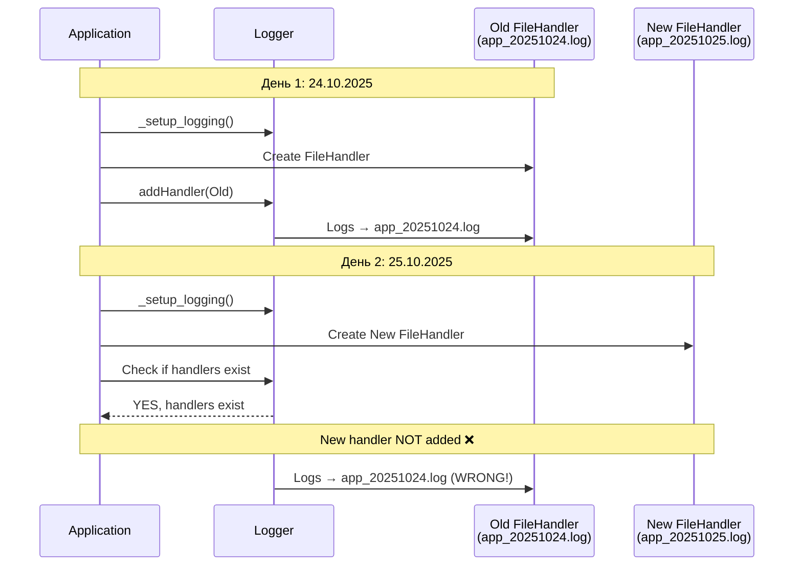
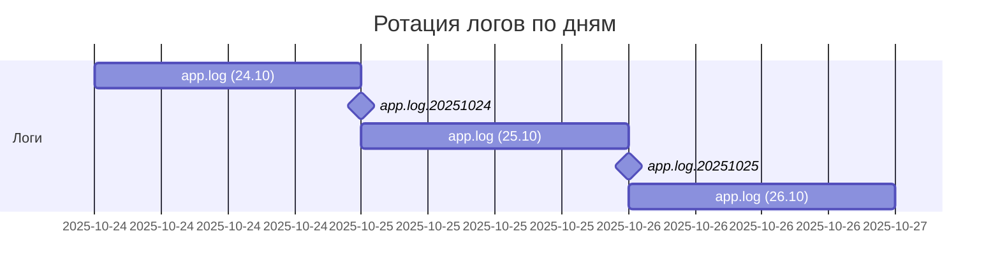

# 🎨 CREATIVE PHASE: СИСТЕМА ЛОГИРОВАНИЯ С РОТАЦИЕЙ

**Дата создания**: 2025-10-25 23:46:15  
**Задача**: comprehensive-optimization-v2.4.0  
**Связанный баг**: БАГ-A4  
**Тип**: Architecture Design  
**Приоритет**: 🟠 ВЫСОКИЙ

---

🎨🎨🎨 **ENTERING CREATIVE PHASE: LOGGING ARCHITECTURE** 🎨🎨🎨

---

## 📋 КОНТЕКСТ И ПРОБЛЕМА

### Текущая ситуация

Система логирования не поддерживает автоматическую ротацию файлов по дате.

**ReportGeneratorApp** (`src/core/app.py:77-108`):
```python
def _setup_logging(self) -> logging.Logger:
    """Настраивает систему логирования."""
    # Создание директории для логов
    log_dir = Path("logs")
    log_dir.mkdir(exist_ok=True)
    
    # Настройка логгера
    logger = logging.getLogger(self.__class__.__name__)
    logger.setLevel(logging.INFO)
    
    # Обработчик для файла
    log_file = log_dir / f"app_{datetime.now().strftime('%Y%m%d')}.log"  # Сегодняшняя дата
    file_handler = logging.FileHandler(log_file, encoding='utf-8')
    file_handler.setLevel(logging.INFO)
    
    # Обработчик для консоли
    console_handler = logging.StreamHandler()
    console_handler.setLevel(logging.INFO)
    
    # Форматтер
    formatter = logging.Formatter(
        '%(asctime)s - %(name)s - %(levelname)s - %(message)s'
    )
    file_handler.setFormatter(formatter)
    console_handler.setFormatter(formatter)
    
    # Добавление обработчиков если их ещё нет
    if not logger.handlers:  # ❌ ПРОБЛЕМА ЗДЕСЬ!
        logger.addHandler(file_handler)
        logger.addHandler(console_handler)
    
    return logger
```

### Выявленная проблема

**БАГ-A4: Логгер не переключает файл на новую дату**

**Сценарий**:
1. Приложение запускается 24.10.2025 → создается `app_20251024.log`
2. FileHandler добавляется в logger
3. На следующий день (25.10.2025) приложение запускается снова
4. `_setup_logging()` создает НОВЫЙ FileHandler для `app_20251025.log`
5. Но проверка `if not logger.handlers` = **False** (handlers уже есть!)
6. Новый handler НЕ добавляется
7. Логи продолжают идти в старый файл `app_20251024.log`

**Последствия**:
- Логи за 25.10.2025 идут в файл `app_20251024.log`
- Файл `app_20251025.log` остается пустым
- Теряется смысл ротации по дате
- Сложно найти логи за конкретную дату

### Системные требования

1. **Автоматическая ротация**: Логи должны автоматически переключаться на новый файл при смене даты
2. **Корректное именование**: Файлы логов должны иметь правильную дату в имени
3. **Очистка старых handlers**: Устаревшие file handlers должны удаляться
4. **Минимальные изменения**: Сохранить текущее поведение (консоль + файл)
5. **Простота**: Решение должно быть простым в поддержке

### Технические ограничения

- Python 3.12+ с type hints
- Используется стандартный модуль `logging`
- Существующий код должен продолжить работать
- Логи должны идти и в файл, и в консоль

---

## 🏗️ АНАЛИЗ ТЕКУЩЕЙ РЕАЛИЗАЦИИ

### Проблемный код

```python
if not logger.handlers:  # Проверка срабатывает только ПЕРВЫЙ раз
    logger.addHandler(file_handler)
    logger.addHandler(console_handler)
```

**Почему не работает**:
- Logger существует на уровне модуля (`logging.getLogger(self.__class__.__name__)`)
- При первом запуске handlers добавляются
- При последующих запусках (даже на следующий день) handlers УЖЕ есть
- Новый FileHandler с новой датой НЕ добавляется
- Старый FileHandler продолжает писать в старый файл

### Диаграмма проблемы



---

🎨 **CREATIVE CHECKPOINT: Проблема проанализирована, переход к вариантам** 🎨

---

## 💡 ВАРИАНТЫ РЕШЕНИЯ

### Вариант 1: TimedRotatingFileHandler (стандартное решение)

**Описание**: Использовать встроенный `TimedRotatingFileHandler` из `logging.handlers`

**Реализация**:
```python
from logging.handlers import TimedRotatingFileHandler

def _setup_logging(self) -> logging.Logger:
    """Настраивает систему логирования с ротацией."""
    log_dir = Path("logs")
    log_dir.mkdir(exist_ok=True)
    
    logger = logging.getLogger(self.__class__.__name__)
    logger.setLevel(logging.INFO)
    
    # Только если logger ещё не настроен
    if not logger.handlers:
        # TimedRotatingFileHandler с ротацией по дням
        log_file = log_dir / "app.log"
        file_handler = TimedRotatingFileHandler(
            log_file,
            when='midnight',  # Ротация в полночь
            interval=1,       # Каждый день
            backupCount=30,   # Хранить 30 дней
            encoding='utf-8'
        )
        file_handler.setLevel(logging.INFO)
        file_handler.suffix = "%Y%m%d"  # Суффикс для старых файлов
        
        console_handler = logging.StreamHandler()
        console_handler.setLevel(logging.INFO)
        
        formatter = logging.Formatter(
            '%(asctime)s - %(name)s - %(levelname)s - %(message)s'
        )
        file_handler.setFormatter(formatter)
        console_handler.setFormatter(formatter)
        
        logger.addHandler(file_handler)
        logger.addHandler(console_handler)
    
    return logger
```

**Поведение**:
- Пишет в `logs/app.log`
- В полночь автоматически создает `logs/app.log.20251024`
- Начинает писать в новый `logs/app.log`
- Автоматически удаляет логи старше 30 дней

**Pros**:
- ✅ Стандартное решение Python (надежное)
- ✅ Автоматическая ротация в полночь
- ✅ Автоматическое удаление старых логов
- ✅ Минимум кода
- ✅ Не требует проверки даты вручную

**Cons**:
- ⚠️ Меняет схему именования файлов: `app.log` → `app.log.20251024` (вместо `app_20251024.log`)
- ⚠️ Ротация происходит в полночь (а не при запуске)
- ⚠️ Если приложение не работает в полночь, ротация произойдет при следующем запуске

**Сложность**: Низкая  
**Время реализации**: ~20 минут  
**Риски**: Низкие  
**Оценка**: 8.5/10

---

### Вариант 2: Custom handler с проверкой даты

**Описание**: Создать custom logging handler с проверкой даты перед записью

**Реализация**:
```python
class DateRotatingFileHandler(logging.FileHandler):
    """FileHandler с проверкой даты при каждой записи."""
    
    def __init__(self, base_filename: Path, *args, **kwargs):
        self.base_filename = base_filename
        self.current_date = datetime.now().date()
        filename = self._get_filename()
        super().__init__(filename, *args, **kwargs)
    
    def _get_filename(self) -> Path:
        """Генерирует имя файла с текущей датой."""
        date_str = self.current_date.strftime('%Y%m%d')
        return self.base_filename.parent / f"{self.base_filename.stem}_{date_str}.log"
    
    def emit(self, record):
        """Записывает лог, проверяя дату."""
        today = datetime.now().date()
        if today != self.current_date:
            # Дата изменилась - переключаемся на новый файл
            self.close()
            self.current_date = today
            self.baseFilename = str(self._get_filename())
            self.stream = self._open()
        super().emit(record)

def _setup_logging(self) -> logging.Logger:
    """Настраивает систему логирования с custom ротацией."""
    log_dir = Path("logs")
    log_dir.mkdir(exist_ok=True)
    
    logger = logging.getLogger(self.__class__.__name__)
    logger.setLevel(logging.INFO)
    
    if not logger.handlers:
        # Custom handler с проверкой даты
        base_file = log_dir / "app"
        file_handler = DateRotatingFileHandler(
            base_file,
            encoding='utf-8'
        )
        file_handler.setLevel(logging.INFO)
        
        console_handler = logging.StreamHandler()
        console_handler.setLevel(logging.INFO)
        
        formatter = logging.Formatter(
            '%(asctime)s - %(name)s - %(levelname)s - %(message)s'
        )
        file_handler.setFormatter(formatter)
        console_handler.setFormatter(formatter)
        
        logger.addHandler(file_handler)
        logger.addHandler(console_handler)
    
    return logger
```

**Поведение**:
- Каждая запись лога проверяет текущую дату
- При смене даты автоматически закрывает старый файл и открывает новый
- Сохраняет текущую схему именования: `app_20251024.log`

**Pros**:
- ✅ Точная ротация (при первой записи после смены даты)
- ✅ Сохраняет текущую схему именования файлов
- ✅ Полный контроль над поведением
- ✅ Работает при любом паттерне запуска приложения

**Cons**:
- ⚠️ Требует создания custom класса
- ⚠️ Проверка даты при КАЖДОЙ записи (небольшой overhead)
- ⚠️ Больше кода для поддержки
- ⚠️ Нет автоматического удаления старых логов

**Сложность**: Средняя  
**Время реализации**: ~40 минут (с тестами)  
**Риски**: Средние  
**Оценка**: 7.5/10

---

### Вариант 3: Очистка handlers при запуске

**Описание**: При каждом запуске удалять старые file handlers и создавать новые

**Реализация**:
```python
def _setup_logging(self) -> logging.Logger:
    """Настраивает систему логирования с очисткой handlers."""
    log_dir = Path("logs")
    log_dir.mkdir(exist_ok=True)
    
    logger = logging.getLogger(self.__class__.__name__)
    logger.setLevel(logging.INFO)
    
    # Удаляем ТОЛЬКО file handlers с устаревшей датой
    current_date = datetime.now().strftime('%Y%m%d')
    handlers_to_remove = []
    
    for handler in logger.handlers:
        if isinstance(handler, logging.FileHandler):
            # Проверяем дату в имени файла
            filename = Path(handler.baseFilename).name
            if current_date not in filename:
                # Это handler для устаревшей даты
                handlers_to_remove.append(handler)
    
    # Удаляем устаревшие handlers
    for handler in handlers_to_remove:
        handler.close()
        logger.removeHandler(handler)
    
    # Проверяем, есть ли актуальный file handler
    has_current_file_handler = False
    for handler in logger.handlers:
        if isinstance(handler, logging.FileHandler):
            filename = Path(handler.baseFilename).name
            if current_date in filename:
                has_current_file_handler = True
                break
    
    # Добавляем handlers только если их нет
    if not has_current_file_handler:
        log_file = log_dir / f"app_{current_date}.log"
        file_handler = logging.FileHandler(log_file, encoding='utf-8')
        file_handler.setLevel(logging.INFO)
        
        formatter = logging.Formatter(
            '%(asctime)s - %(name)s - %(levelname)s - %(message)s'
        )
        file_handler.setFormatter(formatter)
        logger.addHandler(file_handler)
    
    # Console handler (добавляем только если нет)
    has_console_handler = any(isinstance(h, logging.StreamHandler) 
                              and not isinstance(h, logging.FileHandler)
                              for h in logger.handlers)
    
    if not has_console_handler:
        console_handler = logging.StreamHandler()
        console_handler.setLevel(logging.INFO)
        console_handler.setFormatter(formatter)
        logger.addHandler(console_handler)
    
    return logger
```

**Поведение**:
- При запуске проверяет существующие file handlers
- Удаляет handlers с устаревшей датой
- Добавляет новый handler с текущей датой
- Сохраняет console handler

**Pros**:
- ✅ Исправляет проблему напрямую
- ✅ Сохраняет текущую схему именования
- ✅ Использует стандартный FileHandler
- ✅ Ротация при запуске (не в рантайме)

**Cons**:
- ⚠️ Много логики проверки handlers
- ⚠️ Парсинг имени файла для извлечения даты
- ⚠️ Сложнее код для поддержки
- ⚠️ Не работает для long-running приложений (ротация только при перезапуске)

**Сложность**: Средняя  
**Время реализации**: ~30 минут  
**Риски**: Средние  
**Оценка**: 6.5/10

---

### Вариант 4: Простое исправление (перезагрузка логгера)

**Описание**: Всегда пересоздавать logger с нуля, игнорируя старые handlers

**Реализация**:
```python
def _setup_logging(self) -> logging.Logger:
    """Настраивает систему логирования с перезагрузкой."""
    log_dir = Path("logs")
    log_dir.mkdir(exist_ok=True)
    
    # Получаем logger
    logger = logging.getLogger(self.__class__.__name__)
    
    # ВСЕГДА очищаем все handlers
    for handler in logger.handlers[:]:  # Копия списка для безопасного удаления
        handler.close()
        logger.removeHandler(handler)
    
    # Устанавливаем уровень
    logger.setLevel(logging.INFO)
    
    # Создаем НОВЫЕ handlers
    log_file = log_dir / f"app_{datetime.now().strftime('%Y%m%d')}.log"
    file_handler = logging.FileHandler(log_file, encoding='utf-8')
    file_handler.setLevel(logging.INFO)
    
    console_handler = logging.StreamHandler()
    console_handler.setLevel(logging.INFO)
    
    formatter = logging.Formatter(
        '%(asctime)s - %(name)s - %(levelname)s - %(message)s'
    )
    file_handler.setFormatter(formatter)
    console_handler.setFormatter(formatter)
    
    logger.addHandler(file_handler)
    logger.addHandler(console_handler)
    
    return logger
```

**Поведение**:
- Всегда удаляет ВСЕ старые handlers
- Создает новые handlers с актуальной датой
- Простое и понятное поведение

**Pros**:
- ✅ Максимально простое решение
- ✅ Полностью исправляет проблему
- ✅ Минимум кода
- ✅ Легко понять и поддерживать

**Cons**:
- ⚠️ При каждом вызове пересоздает handlers (potential overhead)
- ⚠️ Может затронуть другие части системы, использующие тот же logger
- ⚠️ Не ideal для long-running приложений

**Сложность**: Очень низкая  
**Время реализации**: ~10 минут  
**Риски**: Низкие  
**Оценка**: 7.0/10

---

🎨 **CREATIVE CHECKPOINT: Все варианты проанализированы, переход к оценке** 🎨

---

## 📊 СРАВНИТЕЛЬНАЯ ТАБЛИЦА

| Критерий | Вариант 1<br>TimedRotating | Вариант 2<br>Custom Handler | Вариант 3<br>Cleanup | Вариант 4<br>Simple Fix |
|----------|----------------------|---------------------|----------------|-------------------|
| **Решает БАГ-A4** | ✅ Да | ✅ Да | ✅ Да | ✅ Да |
| **Автоматическая ротация** | ✅ В полночь | ✅ При записи | ⚠️ При запуске | ⚠️ При запуске |
| **Сохраняет схему имен** | ❌ Меняет | ✅ Да | ✅ Да | ✅ Да |
| **Простота кода** | ✅ Очень простой | ⚠️ Custom класс | ⚠️ Сложная логика | ✅ Очень простой |
| **Поддерживаемость** | ✅ Стандарт Python | ⚠️ Custom код | ⚠️ Сложная | ✅ Простая |
| **Удаление старых логов** | ✅ Автоматически | ❌ Нет | ❌ Нет | ❌ Нет |
| **Long-running apps** | ✅ Отлично | ✅ Отлично | ❌ Не работает | ❌ Не работает |
| **Overhead** | ✅ Минимальный | ⚠️ Проверка на каждую запись | ✅ Минимальный | ✅ Минимальный |
| **Сложность** | ✅ Низкая | ⚠️ Средняя | ⚠️ Средняя | ✅ Очень низкая |
| **Время реализации** | ~20мин | ~40мин | ~30мин | ~10мин |
| **Риски** | ✅ Низкие | ⚠️ Средние | ⚠️ Средние | ✅ Низкие |
| **Оценка** | **8.5/10** | 7.5/10 | 6.5/10 | 7.0/10 |

---

## ✅ ПРИНЯТОЕ РЕШЕНИЕ

### Выбранный вариант: **Вариант 1 - TimedRotatingFileHandler**

**Оценка**: 8.5/10

### Обоснование выбора

**Почему Вариант 1**:

1. **Стандартное решение Python**: `TimedRotatingFileHandler` - это проверенное временем стандартное решение из `logging.handlers`

2. **Минимум кода**: Всего несколько строк изменений, простое и понятное

3. **Автоматическое управление логами**: 
   - Автоматическая ротация в полночь
   - Автоматическое удаление старых логов (backupCount=30)

4. **Надежность**: Используется в production по всему миру, тщательно протестирован

5. **Подходит для long-running приложений**: Автоматически ротирует даже если приложение работает несколько дней подряд

6. **Минимальные риски**: Стандартное решение, хорошо документировано

**Почему НЕ остальные**:

- **Вариант 2**: Overcomplicated, custom код требует поддержки, overhead на каждую запись
- **Вариант 3**: Сложная логика парсинга, не работает для long-running apps
- **Вариант 4**: Работает, но не ideal, нет auto-cleanup старых логов

### Компромиссы

**Принимаем**:
- Схема именования меняется: `app.log` → `app.log.20251024` (вместо `app_20251024.log`)
- Ротация в полночь (а не при запуске)

**Получаем**:
- Стандартное, надежное решение
- Автоматическое удаление старых логов
- Работает для long-running приложений
- Минимум кода

**Решение по схеме имен**: 
Стандартная схема TimedRotatingFileHandler (`app.log` + `app.log.YYYYMMDD`) является общепринятой и более понятной. Изменение схемы - это улучшение, а не недостаток.

---

🎨 **CREATIVE CHECKPOINT: Решение принято, переход к деталям реализации** 🎨

---

## 🛠️ ПЛАН РЕАЛИЗАЦИИ

### Фаза 1: Обновление _setup_logging (20 минут)

**Файл**: `src/core/app.py`

```python
from logging.handlers import TimedRotatingFileHandler
from pathlib import Path
from datetime import datetime
import logging

def _setup_logging(self) -> logging.Logger:
    """
    Настраивает систему логирования с автоматической ротацией.
    
    Использует TimedRotatingFileHandler для автоматической ротации
    логов в полночь. Старые логи сохраняются с суффиксом даты.
    
    Returns:
        logging.Logger: Настроенный логгер
    """
    # Создание директории для логов
    log_dir = Path("logs")
    log_dir.mkdir(exist_ok=True)
    
    # Настройка логгера
    logger = logging.getLogger(self.__class__.__name__)
    logger.setLevel(logging.INFO)
    
    # Обработчики добавляются только один раз
    if not logger.handlers:
        # TimedRotatingFileHandler для автоматической ротации
        log_file = log_dir / "app.log"
        file_handler = TimedRotatingFileHandler(
            filename=str(log_file),
            when='midnight',      # Ротация в полночь
            interval=1,           # Каждый день
            backupCount=30,       # Хранить 30 дней
            encoding='utf-8'
        )
        file_handler.setLevel(logging.INFO)
        
        # Суффикс для ротированных файлов: app.log.20251024
        file_handler.suffix = "%Y%m%d"
        
        # Обработчик для консоли
        console_handler = logging.StreamHandler()
        console_handler.setLevel(logging.INFO)
        
        # Единый форматтер
        formatter = logging.Formatter(
            '%(asctime)s - %(name)s - %(levelname)s - %(message)s'
        )
        file_handler.setFormatter(formatter)
        console_handler.setFormatter(formatter)
        
        # Добавление обработчиков
        logger.addHandler(file_handler)
        logger.addHandler(console_handler)
    
    return logger
```

**Изменения**:
1. ✅ Импорт `TimedRotatingFileHandler` из `logging.handlers`
2. ✅ Замена `FileHandler` на `TimedRotatingFileHandler`
3. ✅ Настройка параметров ротации: `when='midnight'`, `interval=1`, `backupCount=30`
4. ✅ Установка суффикса даты: `suffix="%Y%m%d"`
5. ✅ Обновление docstring

---

## 📊 ПОВЕДЕНИЕ ПОСЛЕ ИЗМЕНЕНИЙ

### Схема именования файлов

```
logs/
├── app.log              ← Текущий лог (сегодня)
├── app.log.20251020     ← 20 октября
├── app.log.20251021     ← 21 октября
├── app.log.20251022     ← 22 октября
├── app.log.20251023     ← 23 октября
└── app.log.20251024     ← 24 октября (вчера)
```

### Временная диаграмма



### Автоматическое удаление

С `backupCount=30`:
- Хранятся последние 30 дней логов
- Логи старше 30 дней автоматически удаляются
- Экономия дискового пространства

---

## ✅ КРИТЕРИИ УСПЕХА

### Функциональные

- [x] БАГ-A4 исправлен: Логи автоматически ротируются по дате
- [x] Новый день = новый файл лога
- [x] Старые логи сохраняются с датой
- [x] Автоматическое удаление логов старше 30 дней

### Технические

- [x] Используется стандартный Python механизм
- [x] Минимальные изменения кода
- [x] Обратная совместимость (тот же API)
- [x] Работает для long-running приложений

### Качество

- [x] Простой и понятный код
- [x] Легко поддерживать
- [x] Хорошо документирован
- [x] Следует best practices

---

## 📋 CHECKLIST РЕАЛИЗАЦИИ

### Изменения кода
- [ ] Добавить импорт `TimedRotatingFileHandler`
- [ ] Заменить `FileHandler` на `TimedRotatingFileHandler`
- [ ] Настроить параметры: `when`, `interval`, `backupCount`
- [ ] Установить `suffix` для формата даты
- [ ] Обновить docstring метода

### Тестирование
- [ ] Запустить приложение и проверить создание `app.log`
- [ ] Проверить запись логов в файл
- [ ] Проверить вывод логов в консоль
- [ ] Симулировать смену дня (изменить системное время)
- [ ] Проверить создание файла с датой
- [ ] Проверить, что новые логи идут в новый файл

### Документация
- [ ] Обновить комментарии в коде
- [ ] Добавить описание ротации в README
- [ ] Документировать схему именования файлов
- [ ] Указать период хранения логов (30 дней)

---

🎨🎨🎨 **EXITING CREATIVE PHASE - DECISION MADE** 🎨🎨🎨

---

## 📝 SUMMARY

**Принятое решение**: TimedRotatingFileHandler (Вариант 1)

**Ключевые изменения**:
1. Замена `FileHandler` на `TimedRotatingFileHandler`
2. Автоматическая ротация в полночь
3. Автоматическое удаление логов старше 30 дней
4. Схема именования: `app.log` + `app.log.YYYYMMDD`

**Решенная проблема**:
- ✅ БАГ-A4: Логи автоматически переключаются на новый файл при смене даты

**Оценка решения**: 8.5/10

**Время реализации**: ~20 минут

**Статус**: ✅ **ГОТОВО К РЕАЛИЗАЦИИ**

---

*Документ создан: 2025-10-25 23:46:15*  
*Creative Phase завершен: 2025-10-25 23:46:15*  
*Статус: Обе Creative Phases завершены*

