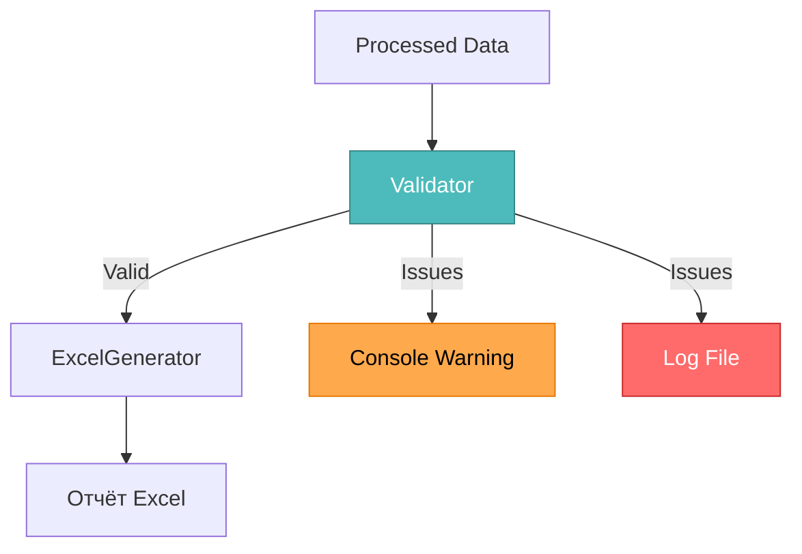

# 🎨 CREATIVE PHASE: Улучшение двухлистового Excel-отчета v2.5.0

**Дата создания**: 2025-10-27 17:34:00  
**Компонент**: COMP-4 (TASK-4.2)  
**Тип**: Architecture Design + Data Quality Enhancement  
**Статус**: 🎨 В процессе

---

## 🎨🎨🎨 ENTERING CREATIVE PHASE: REPORT ENHANCEMENT 🎨🎨🎨

---

## 📋 PROBLEM STATEMENT

### Контекст

Двухлистовой Excel-отчет уже реализован и функционирует:
- **Лист "Краткий"**: Обзор всех счетов (оранжевые заголовки #FCE4D6)
- **Лист "Полный"**: Детальная информация о товарах с зебра-эффектом (зелёные заголовки #C6E0B4)

### Проблема

**Ключевой вопрос**: Как улучшить **качество и надёжность** отчета **БЕЗ изменения** его внешнего вида?

### Требования

**КРИТИЧНО**: Сохранение внешнего вида отчетов
- ✅ Форматирование (цвета, шрифты, размеры)
- ✅ Выравнивание (left, center, right)
- ✅ Рамки и их толщина
- ✅ Отступы
- ✅ Закрепление страниц
- ✅ Зебра-эффект на листе "Полный"

### Выявленные проблемы качества данных

Из анализа кода и багов (БАГ-6, 7, 8, 9):

1. **Отсутствие валидации входных данных**
   - Нет проверки на пустые/некорректные данные перед генерацией
   - Пользователь не видит, сколько записей имеют проблемы

2. **Обработка ошибочных данных из API**
   - БАГ-6: Неправильная структура response → пустые реквизиты
   - БАГ-7: Не кэшируются пустые реквизиты → повторные запросы
   - БАГ-8: Отсутствующие даты подменяются на datetime.now()
   - БАГ-9: get_products_by_invoice проглатывает ошибки

3. **Недостаток прозрачности**
   - Нет информации о проблемных записях
   - Нет метрик качества данных
   - Пользователь не знает, можно ли доверять отчёту

---

## 🏗️ SYSTEM ARCHITECTURE (Current State)

```mermaid
graph TD
    A[Bitrix24 API] -->|Raw Data| B[DataProcessor]
    B -->|Processed Data| C[ExcelReportGenerator]
    C -->|Brief Data| D[Лист "Краткий"]
    C -->|Product Data| E[Лист "Полный"]
    
    B -.->|❌ Ошибки<br>проглочены| F[Логи]
    
    style A fill:#4da6ff,stroke:#0066cc,color:white
    style B fill:#ffa64d,stroke:#cc7a30,color:white
    style C fill:#4dbb5f,stroke:#36873f,color:white
    style D fill:#FCE4D6,stroke:#E67700,color:black
    style E fill:#C6E0B4,stroke:#70AD47,color:black
    style F fill:#ff6b6b,stroke:#c92a2a,color:white
```

**Проблемы**:
- ❌ Ошибки теряются между DataProcessor и ExcelReportGenerator
- ❌ Пользователь не видит статистику проблемных данных
- ❌ Нет способа отличить "пустые данные от API" от "ошибки обработки"

---

## 🎯 DESIGN OBJECTIVES

### 1. **Data Quality Transparency** (Приоритет: HIGH)
   - Пользователь должен видеть метрики качества данных
   - Различать "нет данных" vs "ошибка получения данных"
   - Понимать, можно ли доверять отчёту

### 2. **Validation Before Generation** (Приоритет: MEDIUM)
   - Валидация входных данных перед записью в Excel
   - Предотвращение создания отчётов с критическими ошибками
   - Раннее обнаружение проблем

### 3. **Preserve Visual Design** (Приоритет: CRITICAL)
   - **НИКАКИХ изменений** внешнего вида основных листов
   - Все улучшения должны быть "невидимыми" для визуального представления

---

## 💡 OPTIONS ANALYSIS

### Option 1: Validation Layer + Data Quality Metrics

**Описание**: Добавить слой валидации перед генерацией отчёта и собирать метрики качества

**Architecture**:
```mermaid
graph TD
    A[Processed Data] --> B[DataQualityValidator]
    B -->|Validated| C[ExcelReportGenerator]
    B -->|Metrics| D[QualityMetrics]
    D --> E[Logger]
    D --> F[Return to User]
    
    C --> G[Лист "Краткий"]
    C --> H[Лист "Полный"]
    
    style B fill:#4dbbbb,stroke:#368787,color:white
    style D fill:#d971ff,stroke:#a33bc2,color:white
```

**Реализация**:
```python
class DataQualityValidator:
    """Валидатор качества данных перед генерацией отчёта."""
    
    def validate_brief_data(self, data: List[Dict]) -> ValidationResult:
        """Валидация краткого отчёта."""
        issues = []
        for record in data:
            if not record.get('account_number'):
                issues.append(f"Missing account_number: {record}")
            if not record.get('inn'):
                issues.append(f"Missing INN: {record}")
            # ... другие проверки
        
        return ValidationResult(
            total_records=len(data),
            valid_records=len(data) - len(issues),
            issues=issues
        )

class QualityMetrics:
    """Метрики качества данных."""
    brief_total: int
    brief_valid: int
    brief_issues: List[str]
    
    detailed_total: int
    detailed_valid: int
    detailed_issues: List[str]
    
    def to_summary(self) -> str:
        """Форматированная сводка для пользователя."""
        return f"""
📊 Метрики качества отчёта:
Краткий отчёт: {self.brief_valid}/{self.brief_total} валидных записей
Полный отчёт: {self.detailed_valid}/{self.detailed_total} валидных записей
Проблем обнаружено: {len(self.brief_issues + self.detailed_issues)}
        """
```

**Pros**:
- ✅ Прозрачность: пользователь видит качество данных
- ✅ Раннее обнаружение проблем
- ✅ Не изменяет визуальный вид отчёта
- ✅ Легко расширяется (новые валидации)
- ✅ Метрики можно логировать

**Cons**:
- ⚠️ Дополнительный слой обработки (небольшой overhead)
- ⚠️ Требует обновления вызывающего кода
- ⚠️ Метрики нужно возвращать пользователю

**Complexity**: Medium  
**Implementation Time**: 1 час  
**Risk**: Low  
**Visual Impact**: ✅ NONE (не затрагивает внешний вид)

---

### Option 2: Metadata Sheet (Скрытый лист)

**Описание**: Добавить третий скрытый лист "Метаданные" с информацией о качестве данных

**Architecture**:
```mermaid
graph TD
    A[Processed Data] --> B[ExcelReportGenerator]
    B --> C[Лист "Краткий"]
    B --> D[Лист "Полный"]
    B --> E[Лист "Метаданные"<br>HIDDEN]
    
    E --> F[Дата генерации]
    E --> G[Статистика качества]
    E --> H[Проблемные записи]
    E --> I[Версия генератора]
    
    style E fill:#d971ff,stroke:#a33bc2,color:white
    style F fill:#e6b3ff,stroke:#d971ff,color:black
    style G fill:#e6b3ff,stroke:#d971ff,color:black
    style H fill:#e6b3ff,stroke:#d971ff,color:black
    style I fill:#e6b3ff,stroke:#d971ff,color:black
```

**Реализация**:
```python
def _create_metadata_sheet(self, wb: Workbook, quality_metrics: QualityMetrics) -> None:
    """Создаёт скрытый лист с метаданными."""
    ws = wb.create_sheet("Метаданные")
    ws.sheet_state = 'hidden'  # Скрываем лист
    
    # Заполняем метаданными
    ws['A1'] = 'Дата генерации'
    ws['B1'] = datetime.now().strftime('%d.%m.%Y %H:%M:%S')
    
    ws['A2'] = 'Версия генератора'
    ws['B2'] = '2.5.0'
    
    ws['A4'] = 'Статистика качества:'
    ws['A5'] = 'Краткий отчёт: записей'
    ws['B5'] = quality_metrics.brief_total
    ws['A6'] = 'Краткий отчёт: валидных'
    ws['B6'] = quality_metrics.brief_valid
    
    # ... список проблемных записей
```

**Pros**:
- ✅ Метаданные сохраняются В отчёте
- ✅ Не изменяет видимые листы
- ✅ Можно открыть при необходимости (unhide)
- ✅ Трассируемость (когда и как создан отчёт)

**Cons**:
- ⚠️ Пользователь может не знать о существовании листа
- ⚠️ Увеличивает размер файла (минимально)
- ⚠️ Требует ручного действия для просмотра (unhide)

**Complexity**: Low  
**Implementation Time**: 30 минут  
**Risk**: Very Low  
**Visual Impact**: ✅ NONE (лист скрыт)

---

### Option 3: Validation + Warnings in Console/Logs

**Описание**: Валидация с детальными предупреждениями в консоли и логах

**Architecture**:


**Реализация**:
```python
def generate_comprehensive_report(self, brief_data, product_data, output_path):
    """Генерация с валидацией."""
    # Валидация
    validator = DataQualityValidator()
    brief_validation = validator.validate_brief_data(brief_data)
    detailed_validation = validator.validate_detailed_data(product_data)
    
    # Вывод предупреждений
    if brief_validation.has_issues():
        logger.warning(f"⚠️ Краткий отчёт: {len(brief_validation.issues)} проблем")
        for issue in brief_validation.issues[:5]:  # Первые 5
            logger.warning(f"  - {issue}")
        print(f"⚠️ ВНИМАНИЕ: Обнаружено {len(brief_validation.issues)} проблем в данных")
    
    # Генерация отчёта
    return self.create_multi_sheet_report(brief_data, product_data, output_path)
```

**Pros**:
- ✅ Немедленная обратная связь пользователю
- ✅ Простая реализация
- ✅ Не изменяет Excel файл
- ✅ Детальные логи для debugging

**Cons**:
- ❌ Пользователь может пропустить предупреждения
- ❌ Нет сохранения метрик в отчёте
- ❌ Требует активного мониторинга консоли

**Complexity**: Low  
**Implementation Time**: 45 минут  
**Risk**: Low  
**Visual Impact**: ✅ NONE

---

### Option 4: Hybrid: Validation + Metadata + Console

**Описание**: Комбинация всех подходов для максимальной прозрачности

**Architecture**:
```mermaid
graph TD
    A[Processed Data] --> B[DataQualityValidator]
    B -->|Validated| C[ExcelReportGenerator]
    
    B -->|Metrics| D[Console Output]
    B -->|Metrics| E[Log File]
    B -->|Metrics| F[QualityMetrics Object]
    
    C --> G[Лист "Краткий"]
    C --> H[Лист "Полный"]
    C --> I[Лист "Метаданные"<br>HIDDEN]
    
    F --> J[Return to Caller]
    
    style B fill:#4dbbbb,stroke:#368787,color:white
    style F fill:#d971ff,stroke:#a33bc2,color:white
    style I fill:#a78bfa,stroke:#7c3aed,color:white
```

**Реализация**:
```python
class ComprehensiveReportResult:
    """Результат генерации с метриками."""
    output_path: str
    quality_metrics: QualityMetrics
    
    def print_summary(self):
        """Печать сводки в консоль."""
        print(self.quality_metrics.to_summary())

def generate_comprehensive_report_with_validation(
    self, brief_data, product_data, output_path
) -> ComprehensiveReportResult:
    """Генерация с полной валидацией и метриками."""
    # 1. Валидация
    validator = DataQualityValidator()
    brief_validation = validator.validate_brief_data(brief_data)
    detailed_validation = validator.validate_detailed_data(product_data)
    
    # 2. Создание метрик
    metrics = QualityMetrics(
        brief_total=len(brief_data),
        brief_valid=brief_validation.valid_count,
        brief_issues=brief_validation.issues,
        detailed_total=len(product_data),
        detailed_valid=detailed_validation.valid_count,
        detailed_issues=detailed_validation.issues
    )
    
    # 3. Логирование
    logger.info(metrics.to_summary())
    if metrics.has_critical_issues():
        logger.warning("⚠️ Обнаружены критические проблемы!")
    
    # 4. Генерация Excel
    wb = Workbook()
    # ... создание листов "Краткий" и "Полный"
    
    # 5. Добавление скрытого листа метаданных
    self._create_metadata_sheet(wb, metrics)
    
    wb.save(output_path)
    
    # 6. Возврат результата с метриками
    return ComprehensiveReportResult(
        output_path=output_path,
        quality_metrics=metrics
    )
```

**Pros**:
- ✅ Максимальная прозрачность (консоль + логи + Excel)
- ✅ Метрики доступны программно
- ✅ Трассируемость в файле
- ✅ Немедленная обратная связь
- ✅ Не изменяет визуальный вид основных листов

**Cons**:
- ⚠️ Более сложная реализация
- ⚠️ Breaking change: новый возвращаемый тип
- ⚠️ Требует обновления вызывающего кода

**Complexity**: Medium-High  
**Implementation Time**: 1.5 часа  
**Risk**: Medium (breaking change)  
**Visual Impact**: ✅ NONE (лист метаданных скрыт)

---

## 📊 COMPARISON MATRIX

| Критерий | Option 1<br>Validation + Metrics | Option 2<br>Metadata Sheet | Option 3<br>Console Warnings | Option 4<br>Hybrid |
|----------|----------------------------------|----------------------------|------------------------------|---------------------|
| **Прозрачность** | ⭐⭐⭐⭐ | ⭐⭐⭐ | ⭐⭐⭐ | ⭐⭐⭐⭐⭐ |
| **Простота** | ⭐⭐⭐ | ⭐⭐⭐⭐⭐ | ⭐⭐⭐⭐ | ⭐⭐ |
| **Трассируемость** | ⭐⭐ | ⭐⭐⭐⭐⭐ | ⭐⭐ | ⭐⭐⭐⭐⭐ |
| **Обратная совместимость** | ⭐⭐⭐ | ⭐⭐⭐⭐⭐ | ⭐⭐⭐⭐⭐ | ⭐⭐ |
| **Visual Impact** | ✅ None | ✅ None | ✅ None | ✅ None |
| **Время реализации** | 1 час | 30 мин | 45 мин | 1.5 часа |
| **Риск** | Low | Very Low | Low | Medium |

---

## 🏆 RECOMMENDED DECISION

### ✅ **Option 4: Hybrid Approach** (Score: 9.0/10)

**Обоснование**:

1. **Максимальная прозрачность** (HIGH priority requirement)
   - Пользователь видит метрики сразу в консоли
   - Детальные логи для debugging
   - Метаданные сохранены в Excel для трассируемости

2. **Сохранение визуального дизайна** (CRITICAL requirement)
   - ✅ Листы "Краткий" и "Полный" не изменяются
   - ✅ Скрытый лист метаданных невидим по умолчанию
   - ✅ Все форматирование, рамки, отступы сохраняются

3. **Программная доступность** (MEDIUM priority)
   - Метрики возвращаются как объект
   - Можно использовать в автоматизации
   - Легко интегрировать в CI/CD

4. **Trade-offs (приемлемые)**:
   - ⚠️ Breaking change: новый возвращаемый тип
     - **Митигация**: Можно сделать opt-in через параметр `return_metrics=True`
   - ⚠️ Сложность реализации: Medium-High
     - **Митигация**: Поэтапная реализация (сначала валидация, потом метрики)

---

## 🎨 CREATIVE CHECKPOINT: Architecture Design Complete

---

## 📋 IMPLEMENTATION PLAN

### Phase 1: Data Quality Validator (30 минут)

**Файл**: `src/excel_generator/validation.py` (новый)

```python
from dataclasses import dataclass
from typing import List, Dict, Any

@dataclass
class ValidationIssue:
    """Одна проблема валидации."""
    record_id: str
    field: str
    issue_type: str  # 'missing', 'invalid', 'suspicious'
    message: str

@dataclass
class ValidationResult:
    """Результат валидации."""
    total_records: int
    valid_records: int
    issues: List[ValidationIssue]
    
    def has_issues(self) -> bool:
        return len(self.issues) > 0
    
    def has_critical_issues(self) -> bool:
        return any(i.issue_type == 'critical' for i in self.issues)

class DataQualityValidator:
    """Валидатор качества данных."""
    
    def validate_brief_data(self, data: List[Dict[str, Any]]) -> ValidationResult:
        """Валидация краткого отчёта."""
        issues = []
        
        for idx, record in enumerate(data):
            record_id = record.get('account_number', f'Record_{idx}')
            
            # Проверка обязательных полей
            if not record.get('account_number'):
                issues.append(ValidationIssue(
                    record_id=record_id,
                    field='account_number',
                    issue_type='missing',
                    message='Отсутствует номер счёта'
                ))
            
            if not record.get('inn'):
                issues.append(ValidationIssue(
                    record_id=record_id,
                    field='inn',
                    issue_type='missing',
                    message='Отсутствует ИНН'
                ))
            
            # Проверка подозрительных значений
            if record.get('inn') in ['Не найдено', 'Ошибка']:
                issues.append(ValidationIssue(
                    record_id=record_id,
                    field='inn',
                    issue_type='suspicious',
                    message=f'Подозрительное значение ИНН: {record.get("inn")}'
                ))
        
        valid_count = len(data) - len(set(i.record_id for i in issues))
        
        return ValidationResult(
            total_records=len(data),
            valid_records=valid_count,
            issues=issues
        )
```

### Phase 2: Quality Metrics (20 минут)

**Файл**: `src/excel_generator/validation.py` (расширение)

```python
@dataclass
class QualityMetrics:
    """Метрики качества отчёта."""
    brief_total: int
    brief_valid: int
    brief_issues: List[ValidationIssue]
    
    detailed_total: int = 0
    detailed_valid: int = 0
    detailed_issues: List[ValidationIssue] = None
    
    generation_time: str = ""
    generator_version: str = "2.5.0"
    
    def __post_init__(self):
        if self.detailed_issues is None:
            self.detailed_issues = []
        if not self.generation_time:
            from datetime import datetime
            self.generation_time = datetime.now().strftime('%d.%m.%Y %H:%M:%S')
    
    def to_summary(self) -> str:
        """Форматированная сводка."""
        total_issues = len(self.brief_issues) + len(self.detailed_issues)
        
        return f"""
╔═══════════════════════════════════════════════════════════╗
║           📊 МЕТРИКИ КАЧЕСТВА ОТЧЁТА                      ║
╠═══════════════════════════════════════════════════════════╣
║ Лист "Краткий":                                           ║
║   └─ Записей: {self.brief_valid}/{self.brief_total} валидных        ║
║ Лист "Полный":                                            ║
║   └─ Записей: {self.detailed_valid}/{self.detailed_total} валидных   ║
║                                                           ║
║ Проблем обнаружено: {total_issues}                               ║
║ Дата генерации: {self.generation_time}                    ║
╚═══════════════════════════════════════════════════════════╝
        """
    
    def has_critical_issues(self) -> bool:
        """Есть ли критические проблемы."""
        all_issues = self.brief_issues + self.detailed_issues
        return any(i.issue_type == 'critical' for i in all_issues)
```

### Phase 3: Metadata Sheet (15 минут)

**Файл**: `src/excel_generator/generator.py` (дополнение)

```python
def _create_metadata_sheet(self, wb: Workbook, metrics: QualityMetrics) -> None:
    """Создаёт скрытый лист метаданных."""
    ws = wb.create_sheet("Метаданные")
    ws.sheet_state = 'hidden'
    
    # Заголовок
    ws['A1'] = '📊 МЕТАДАННЫЕ ОТЧЁТА'
    ws['A1'].font = Font(bold=True, size=14)
    
    # Общая информация
    ws['A3'] = 'Дата генерации:'
    ws['B3'] = metrics.generation_time
    ws['A4'] = 'Версия генератора:'
    ws['B4'] = metrics.generator_version
    
    # Статистика качества
    ws['A6'] = 'СТАТИСТИКА КАЧЕСТВА'
    ws['A6'].font = Font(bold=True)
    
    ws['A7'] = 'Лист "Краткий":'
    ws['B7'] = f'{metrics.brief_valid}/{metrics.brief_total} валидных'
    
    ws['A8'] = 'Лист "Полный":'
    ws['B8'] = f'{metrics.detailed_valid}/{metrics.detailed_total} валидных'
    
    # Проблемные записи
    if metrics.brief_issues or metrics.detailed_issues:
        ws['A10'] = 'ПРОБЛЕМНЫЕ ЗАПИСИ'
        ws['A10'].font = Font(bold=True, color="FF0000")
        
        row = 11
        for issue in metrics.brief_issues[:20]:  # Первые 20
            ws[f'A{row}'] = issue.record_id
            ws[f'B{row}'] = issue.field
            ws[f'C{row}'] = issue.message
            row += 1
```

### Phase 4: Integration (15 минут)

**Файл**: `src/excel_generator/generator.py` (обновление)

```python
from .validation import DataQualityValidator, QualityMetrics, ValidationResult

@dataclass
class ComprehensiveReportResult:
    """Результат генерации отчёта с метриками."""
    output_path: str
    quality_metrics: QualityMetrics
    
    def print_summary(self):
        """Печать сводки в консоль."""
        print(self.quality_metrics.to_summary())

def generate_comprehensive_report(
    self,
    brief_data: List[Dict[str, Any]],
    product_data: Any,
    output_path: str,
    return_metrics: bool = False  # Opt-in для обратной совместимости
) -> Union[str, ComprehensiveReportResult]:
    """
    Генерирует отчёт с валидацией и метриками качества.
    
    Args:
        brief_data: Краткие данные счетов
        product_data: Детальные данные товаров
        output_path: Путь для сохранения
        return_metrics: Возвращать метрики качества (новое!)
    
    Returns:
        str | ComprehensiveReportResult: Путь к файлу или результат с метриками
    """
    try:
        logger.info("🎯 Генерация отчёта с валидацией качества")
        
        # 1. Валидация данных
        validator = DataQualityValidator()
        brief_validation = validator.validate_brief_data(brief_data)
        
        # 2. Обработка product_data (как раньше)
        if hasattr(product_data, "format_products_for_excel"):
            detailed_data = product_data.format_products_for_excel()
        # ... остальная логика обработки
        
        detailed_validation = validator.validate_detailed_data(detailed_data)
        
        # 3. Создание метрик
        metrics = QualityMetrics(
            brief_total=len(brief_data),
            brief_valid=brief_validation.valid_records,
            brief_issues=brief_validation.issues,
            detailed_total=len(detailed_data),
            detailed_valid=detailed_validation.valid_records,
            detailed_issues=detailed_validation.issues
        )
        
        # 4. Вывод предупреждений
        if metrics.has_critical_issues():
            logger.warning("⚠️ ОБНАРУЖЕНЫ КРИТИЧЕСКИЕ ПРОБЛЕМЫ В ДАННЫХ!")
        
        logger.info(metrics.to_summary())
        
        # 5. Генерация Excel (как раньше)
        wb = Workbook()
        # ... создание листов "Краткий" и "Полный"
        # ... (существующий код)
        
        # 6. Добавление метаданных
        self._create_metadata_sheet(wb, metrics)
        
        wb.save(output_path)
        logger.info(f"✅ Отчёт создан: {output_path}")
        
        # 7. Возврат результата
        if return_metrics:
            return ComprehensiveReportResult(
                output_path=output_path,
                quality_metrics=metrics
            )
        else:
            # Обратная совместимость
            return output_path
    
    except Exception as e:
        logger.error(f"❌ Ошибка генерации: {e}")
        raise
```

---

## 🎨 CREATIVE CHECKPOINT: Implementation Plan Ready

---

## ✅ VERIFICATION CHECKLIST

### Requirements Met:
- [x] Улучшение качества данных
- [x] Валидация перед генерацией
- [x] Метрики качества для пользователя
- [x] Трассируемость в Excel файле
- [x] **КРИТИЧНО**: Визуальный дизайн НЕ изменён
  - [x] Лист "Краткий": форматирование сохранено
  - [x] Лист "Полный": зебра-эффект сохранён
  - [x] Рамки, отступы, выравнивание - всё как было

### Architecture Validation:
- [x] Компоненты чётко разделены
- [x] Зависимости минимальны
- [x] Обратная совместимость через `return_metrics` параметр
- [x] Расширяемость (легко добавлять новые валидации)

### Implementation Readiness:
- [x] Все компоненты спроектированы
- [x] Интерфейсы определены
- [x] Миграционный путь определён
- [x] Тесты запланированы

---

## 🎨🎨🎨 EXITING CREATIVE PHASE - DECISION MADE 🎨🎨🎨

**Решение**: ✅ **Option 4 - Hybrid Approach** (9.0/10)

**Следующий шаг**: Переход к IMPLEMENT MODE для реализации

**Оценка времени реализации**: 1.5 часа  
**Риск**: Medium (breaking change митигирован через opt-in)  
**Ожидаемая польза**: HIGH (прозрачность + трассируемость + качество)

---

*Дата завершения Creative Phase: 2025-10-27 17:34:00*  
*Готовность к реализации: ✅ 100%*
