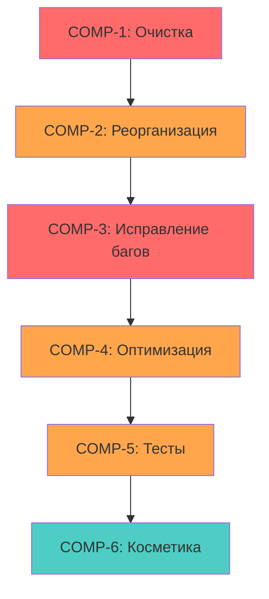
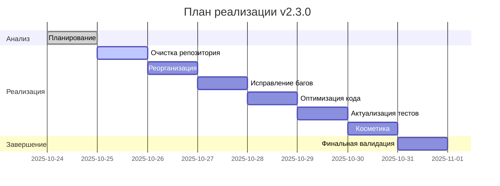

# ЗАДАЧИ ПРОЕКТА: ГЕНЕРАТОР ОТЧЁТОВ BITRIX24

## 📋 ИСТОЧНИК ИСТИНЫ ДЛЯ ВСЕХ ЗАДАЧ

*Этот файл является единственным источником истины для отслеживания всех задач проекта*

## 🚨 КРИТИЧЕСКИЕ ПРАВИЛА
**ОБЯЗАТЕЛЬНО**: Следовать правилам из `memory-bank/user-rules.md`
- ⏰ Использовать РЕАЛЬНОЕ время (PowerShell: `Get-Date`)
- 🐍 Активировать виртуальное окружение `.\\.venv\\Scripts\\Activate.ps1`
- 📚 Context7 для актуальной документации API
- 🛠️ Проверять доступность MCP инструментов
- 🤔 Тщательный анализ на каждом этапе

---

## 🚀 ТЕКУЩАЯ ЗАДАЧА: КОМПЛЕКСНАЯ ДОРАБОТКА ПРОЕКТА v2.3.0 (2025-10-24)

**Идентификатор задачи**: comprehensive-improvements-v2.3.0-2025-10-24
**Сложность**: Level 4 (Complex System)  
**Статус**: 🔄 **PLAN MODE - ПЛАНИРОВАНИЕ ЗАВЕРШЕНО**  
**Время инициализации**: 2025-10-24 22:24:28  
**Время завершения планирования**: 2025-10-24 22:28:28

### 🎯 **СИСТЕМНЫЙ ОБЗОР**

**Назначение**: Комплексная доработка проекта генератора двухлистовых Excel отчётов из Bitrix24, включающая исправление критических багов, оптимизацию кода, реорганизацию структуры и улучшение пользовательского опыта.

**Архитектурное выравнивание**: Задача направлена на повышение качества кода, улучшение архитектурной чистоты (удаление мёртвого кода, исправление неиспользуемых методов) и стабилизацию системы (исправление 5 критических багов).

**Вехи проекта**:
- ✅ **MILESTONE-1**: Анализ и планирование - 2025-10-24 22:28:28 - **Завершено**
- ⏳ **MILESTONE-2**: Очистка репозитория - Целевая дата: День 1
- ⏳ **MILESTONE-3**: Реорганизация структуры - Целевая дата: День 1
- ⏳ **MILESTONE-4**: Исправление критических багов - Целевая дата: День 2
- ⏳ **MILESTONE-5**: Оптимизация кода - Целевая дата: День 2
- ⏳ **MILESTONE-6**: Актуализация тестов - Целевая дата: День 3
- ⏳ **MILESTONE-7**: Косметические улучшения - Целевая дата: День 3
- ⏳ **MILESTONE-8**: Финальная интеграция и валидация - Целевая дата: День 3

---

### 📋 **КОМПОНЕНТЫ И ПОДСИСТЕМЫ**

#### **[COMP-1]: ОЧИСТКА РЕПОЗИТОРИЯ**

**Назначение**: Удаление устаревших файлов, тестовых скриптов и артефактов разработки
**Статус**: ⏳ Не начато  
**Приоритет**: 🔴 Критический (должно быть первым)  
**Зависимости**: Нет

##### **[TASK-1.1]: Идентификация файлов для удаления**
- **Описание**: Анализ корневой директории и идентификация всех файлов для удаления
- **Статус**: ⏳ TODO
- **Оценка времени**: 30 минут
- **Ответственность**: Система
- **Риск**: 🟡 Средний - возможность случайного удаления важных файлов

**Файлы для удаления** (идентифицированы из анализа):
- [ ] `debug_batch_api.py` - отладочный скрипт
- [ ] `debug_batch_crest_format.py` - отладочный скрипт
- [ ] `debug_simple_batch.py` - отладочный скрипт
- [ ] `hello_world_dual_report.xlsx` - тестовый Excel файл
- [ ] `hello_world_excel_test.py` - тестовый скрипт
- [ ] `integration_test_e2e_detailed_report.py` - дубликат теста (есть в tests/)
- [ ] `performance_compatibility_test.py` - дубликат теста (есть в tests/)
- [ ] `proof_of_concept_productrow_api.py` - proof of concept скрипт
- [ ] `quick_vat_test.py` - временный тест
- [ ] `simple_integration_test.py` - дубликат теста (есть в tests/)
- [ ] `test_vat_calculation_detailed.py` - временный тест
- [ ] `dependencies_validation_test.py` - дубликат теста (есть в tests/)
- [ ] `test.xlsx` - тестовый Excel файл
- [ ] `tasks.md` в корне - дубликат (используется memory-bank/tasks.md)
- [ ] `git-history-cleanup.sh` - утилита выполнена

**Стратегия минимизации риска**:
1. Создать резервную копию перед удалением (Git tag)
2. Проверить каждый файл на импорты в основном коде
3. Удалять пакетами с коммитами после каждой группы

##### **[TASK-1.2]: Выполнение удаления**
- **Описание**: Безопасное удаление идентифицированных файлов
- **Статус**: ⏳ TODO
- **Оценка времени**: 15 минут
- **Зависимости**: TASK-1.1
- **Блокирует**: COMP-2

**Subtasks**:
- [ ] Создать Git tag `v2.3.0-before-cleanup`
- [ ] Удалить отладочные скрипты (debug_*.py)
- [ ] Удалить тестовые файлы (test_*.py, *_test.py в корне)
- [ ] Удалить proof of concept файлы
- [ ] Удалить тестовые Excel файлы
- [ ] Удалить устаревшие утилиты
- [ ] Коммит: `chore: удаление устаревших файлов и тестовых артефактов`

---

#### **[COMP-2]: РЕОРГАНИЗАЦИЯ СТРУКТУРЫ**

**Назначение**: Создание логичной и понятной структуры каталогов и файлов
**Статус**: ⏳ Не начато  
**Приоритет**: 🟠 Высокий  
**Зависимости**: COMP-1

##### **[TASK-2.1]: Проектирование новой структуры**
- **Описание**: Разработка оптимальной структуры каталогов
- **Статус**: ⏳ TODO
- **Оценка времени**: 45 минут
- **Риск**: 🟢 Низкий
- **🎨 ТРЕБУЕТ CREATIVE PHASE**: Да (архитектурное решение)

**Варианты для рассмотрения в Creative Phase**:
1. Создание отдельной папки `scripts/` для утилит
2. Реорганизация `docs/` с разделением на типы документации
3. Перенос конфигурационных файлов в `config/`
4. Создание `examples/` для примеров использования
5. Стандартизация именования файлов

##### **[TASK-2.2]: Реализация реорганизации**
- **Описание**: Перенос файлов и обновление импортов
- **Статус**: ⏳ TODO
- **Оценка времени**: 1 час
- **Зависимости**: TASK-2.1 (Creative решение)
- **Блокирует**: COMP-3
- **Риск**: 🔴 Высокий - возможность поломки импортов

**Subtasks**:
- [ ] Создать новые директории согласно решению Creative Phase
- [ ] Перенести файлы с сохранением Git истории (git mv)
- [ ] Обновить все импорты в коде
- [ ] Обновить пути в конфигурационных файлах
- [ ] Обновить документацию с новыми путями
- [ ] Проверить работоспособность всех импортов
- [ ] Коммит: `refactor: реорганизация структуры проекта`

---

#### **[COMP-3]: ИСПРАВЛЕНИЕ КРИТИЧЕСКИХ БАГОВ**

**Назначение**: Исправление 5 выявленных критических багов
**Статус**: ⏳ Не начато  
**Приоритет**: 🔴 Критический  
**Зависимости**: COMP-2

##### **[TASK-3.1]: БАГ-1 - Парсер дат принимает отрицательные timestamp**
- **Описание**: Добавить валидацию отрицательных timestamp в `DateProcessor.parse_date`
- **Файл**: `src/data_processor/date_processor.py` (строки 127-133)
- **Статус**: ⏳ TODO
- **Оценка времени**: 30 минут
- **Риск**: 🟢 Низкий

**Проблема**:
```python
# Текущий код (строки 127-133):
if isinstance(date_value, (int, float)):
    try:
        if date_value > 1e10:  # Миллисекунды
            dt = datetime.fromtimestamp(date_value / 1000)
        else:  # Секунды
            dt = datetime.fromtimestamp(date_value)  # ❌ -1 превращается в 1969 год
```

**Решение**:
```python
if isinstance(date_value, (int, float)):
    # ✅ Добавить проверку на отрицательные значения
    if date_value < 0:
        return DateProcessingResult(
            is_valid=False,
            original_value=str(date_value),
            error_message="Отрицательный timestamp недопустим"
        )
    try:
        if date_value > 1e10:  # Миллисекунды
            dt = datetime.fromtimestamp(date_value / 1000)
        else:  # Секунды
            dt = datetime.fromtimestamp(date_value)
```

**Subtasks**:
- [ ] Добавить проверку `if date_value < 0` перед обработкой timestamp
- [ ] Добавить тест для отрицательных timestamp
- [ ] Проверить существующие тесты на регрессию
- [ ] Коммит: `fix(date_processor): отклонение отрицательных timestamp`

##### **[TASK-3.2]: БАГ-2 - DataProcessor не получает Bitrix24Client**
- **Описание**: Вызвать `set_bitrix_client` в `WorkflowOrchestrator`
- **Файлы**: 
  - `src/core/workflow.py` (строки 95-96)
  - `src/data_processor/data_processor.py` (строка 127)
- **Статус**: ⏳ TODO
- **Оценка времени**: 20 минут
- **Риск**: 🟡 Средний

**Проблема**:
```python
# src/core/workflow.py строка 96:
self.data_processor = data_processor
# ❌ set_bitrix_client не вызывается!
```

**Решение**:
```python
# src/core/workflow.py после строки 96:
self.data_processor = data_processor
self.data_processor.set_bitrix_client(bitrix_client)  # ✅ Устанавливаем клиент
```

**Subtasks**:
- [ ] Добавить вызов `self.data_processor.set_bitrix_client(bitrix_client)` в `WorkflowOrchestrator.__init__`
- [ ] Добавить тест для проверки корректной установки клиента
- [ ] Проверить работу методов `_extract_smart_invoice_inn` и `_extract_smart_invoice_counterparty`
- [ ] Коммит: `fix(workflow): установка Bitrix24Client в DataProcessor`

##### **[TASK-3.3]: БАГ-3 - Удаление мёртвого кода _get_company_info_with_cache**
- **Описание**: Удалить неиспользуемый метод с некорректной логикой
- **Файл**: `src/data_processor/data_processor.py` (строки 136-169)
- **Статус**: ⏳ TODO
- **Оценка времени**: 15 минут
- **Риск**: 🟢 Низкий

**Проблема**:
```python
def _get_company_info_with_cache(self, company_id: str, bitrix_client: Any) -> Dict[str, Any]:
    # Метод нигде не вызывается (мёртвый код)
    # ❌ Обращается к bitrix_client.api_cache, которого нет
```

**Решение**: Полное удаление метода (строки 136-169)

**Subtasks**:
- [ ] Проверить отсутствие вызовов метода в проекте (grep)
- [ ] Удалить метод `_get_company_info_with_cache`
- [ ] Удалить связанные импорты (если не используются)
- [ ] Коммит: `refactor: удаление неиспользуемого метода _get_company_info_with_cache`

##### **[TASK-3.4]: БАГ-4 - Сводный отчёт падает на "нет" в НДС**
- **Описание**: Исправить обработку случая отсутствия НДС
- **Файлы**: 
  - `src/data_processor/data_processor.py` (строка 201)
  - `src/excel_generator/generator.py` (метод `build_summary_report`)
- **Статус**: ⏳ TODO
- **Оценка времени**: 45 минут
- **Риск**: 🟡 Средний

**Проблема**:
```python
# src/data_processor/data_processor.py строка 201:
"vat_amount": tax_val if tax_val > 0 else "нет",  # ❌ Строка + float = TypeError
```

**Решение**: Варианты для рассмотрения:
1. Всегда возвращать числовое значение (0 вместо "нет")
2. Обрабатывать "нет" в Excel генераторе перед суммированием
3. Возвращать None и обрабатывать в генераторе

**🎨 ТРЕБУЕТ CREATIVE PHASE**: Да (выбор оптимального подхода)

**Subtasks**:
- [ ] Анализ всех мест использования `vat_amount`
- [ ] Реализация решения из Creative Phase
- [ ] Обновление тестов для случаев без НДС
- [ ] Тестирование генерации отчёта без НДС
- [ ] Коммит: `fix(excel_generator): корректная обработка отсутствия НДС`

##### **[TASK-3.5]: БАГ-5 - Тест жёстко требует .venv**
- **Описание**: Сделать проверку виртуального окружения более гибкой
- **Файл**: `tests/test_infrastructure.py` (строка 31)
- **Статус**: ⏳ TODO
- **Оценка времени**: 20 минут
- **Риск**: 🟢 Низкий

**Проблема**:
```python
# tests/test_infrastructure.py строка 31:
assert venv_path.name == ".venv", f"Виртуальное окружение не активно: {sys.executable}"
# ❌ Требует именно ".venv", падает в других средах
```

**Решение**:
```python
# Проверяем что Python запущен из виртуального окружения (любого)
is_venv = hasattr(sys, 'real_prefix') or (hasattr(sys, 'base_prefix') and sys.base_prefix != sys.prefix)
assert is_venv, f"Виртуальное окружение не активно: {sys.executable}"
```

**Subtasks**:
- [ ] Заменить проверку имени на проверку наличия venv
- [ ] Обновить сообщение об ошибке
- [ ] Протестировать в разных окружениях
- [ ] Коммит: `fix(tests): гибкая проверка виртуального окружения`

---

#### **[COMP-4]: ОПТИМИЗАЦИЯ И РЕФАКТОРИНГ КОДА**

**Назначение**: Улучшение качества кода, удаление мёртвого кода, оптимизация
**Статус**: ⏳ Не начато  
**Приоритет**: 🟠 Высокий  
**Зависимости**: COMP-3

##### **[TASK-4.1]: Поиск и удаление мёртвого кода**
- **Описание**: Идентификация и удаление неиспользуемых функций и импортов
- **Статус**: ⏳ TODO
- **Оценка времени**: 1.5 часа
- **Риск**: 🟡 Средний

**Subtasks**:
- [ ] Анализ неиспользуемых импортов (с помощью flake8/pylint)
- [ ] Поиск неиспользуемых функций и методов
- [ ] Безопасное удаление с проверкой зависимостей
- [ ] Коммит: `refactor: удаление неиспользуемых импортов и функций`

##### **[TASK-4.2]: Рефакторинг сложных методов**
- **Описание**: Упрощение сложных методов для улучшения читаемости
- **Статус**: ⏳ TODO
- **Оценка времени**: 2 часа
- **Риск**: 🟡 Средний

**Subtasks**:
- [ ] Идентификация методов с высокой сложностью (> 15 строк, вложенность > 3)
- [ ] Разделение на меньшие методы
- [ ] Улучшение именования переменных
- [ ] Добавление docstrings где отсутствуют
- [ ] Коммит: `refactor: упрощение сложных методов для улучшения читаемости`

##### **[TASK-4.3]: Оптимизация производительности**
- **Описание**: Поиск и устранение узких мест
- **Статус**: ⏳ TODO
- **Оценка времени**: 1 час
- **Риск**: 🟢 Низкий

**Subtasks**:
- [ ] Профилирование критических путей
- [ ] Оптимизация частых операций
- [ ] Кэширование где возможно
- [ ] Коммит: `perf: оптимизация производительности критических операций`

---

#### **[COMP-5]: АКТУАЛИЗАЦИЯ ТЕСТОВОГО ПОКРЫТИЯ**

**Назначение**: Обновление и расширение тестового покрытия
**Статус**: ⏳ Не начато  
**Приоритет**: 🟠 Высокий  
**Зависимости**: COMP-4

##### **[TASK-5.1]: Аудит текущих тестов**
- **Описание**: Проверка всех существующих тестов на актуальность
- **Статус**: ⏳ TODO
- **Оценка времени**: 1 час
- **Риск**: 🟢 Низкий

**Subtasks**:
- [ ] Запуск всех тестов и идентификация падающих
- [ ] Проверка coverage текущих тестов
- [ ] Идентификация устаревших тестов
- [ ] Список компонентов без тестов

##### **[TASK-5.2]: Обновление устаревших тестов**
- **Описание**: Приведение тестов в соответствие с текущим кодом
- **Статус**: ⏳ TODO
- **Оценка времени**: 1.5 часа
- **Зависимости**: TASK-5.1
- **Риск**: 🟡 Средний

**Subtasks**:
- [ ] Исправление падающих тестов
- [ ] Обновление моков и фикстур
- [ ] Адаптация к изменениям API
- [ ] Коммит: `test: обновление устаревших тестов`

##### **[TASK-5.3]: Добавление тестов для багфиксов**
- **Описание**: Создание тестов для всех исправленных багов
- **Статус**: ⏳ TODO
- **Оценка времени**: 1 час
- **Зависимости**: COMP-3
- **Риск**: 🟢 Низкий

**Subtasks**:
- [ ] Тест для отрицательных timestamp
- [ ] Тест для set_bitrix_client
- [ ] Тест для обработки "нет" в НДС
- [ ] Тест для гибкой проверки venv
- [ ] Коммит: `test: добавление тестов для исправленных багов`

##### **[TASK-5.4]: Расширение coverage**
- **Описание**: Добавление тестов для некрытых компонентов
- **Статус**: ⏳ TODO
- **Оценка времени**: 2 часа
- **Зависимости**: TASK-5.2
- **Риск**: 🟡 Средний

**Subtasks**:
- [ ] Тесты для edge cases
- [ ] Тесты для error handling
- [ ] Integration тесты
- [ ] Цель: достичь coverage > 85%
- [ ] Коммит: `test: расширение тестового покрытия`

---

#### **[COMP-6]: КОСМЕТИЧЕСКИЕ УЛУЧШЕНИЯ**

**Назначение**: Улучшения UI/UX отчёта и вывода скрипта
**Статус**: ⏳ Не начато  
**Приоритет**: 🟢 Средний  
**Зависимости**: COMP-5

##### **[TASK-6.1]: Центрирование "нет" в отчёте "Полный"**
- **Описание**: Выравнивание текста "нет" в столбце I (Сумма НДС)
- **Файл**: `src/excel_generator/layout.py` или `styles.py`
- **Статус**: ⏳ TODO
- **Оценка времени**: 30 минут
- **Риск**: 🟢 Низкий

**Требования**:
- Столбец I, ячейки со значением "нет"
- Выравнивание по горизонтали: center
- Аналогично столбцу A в отчёте "Краткий"
- Сохранить все остальное форматирование (рамки, цвета, форматы)

**Subtasks**:
- [ ] Найти код форматирования столбца I
- [ ] Добавить условное форматирование для "нет"
- [ ] Установить `alignment=Alignment(horizontal='center')`
- [ ] Проверить не затронуты ли другие ячейки
- [ ] Коммит: `style(excel): центрирование текста "нет" в столбце НДС`

##### **[TASK-6.2]: Улучшение вывода run_detailed_report.py**
- **Описание**: Информативный и красивый вывод в терминал
- **Файл**: `run_detailed_report.py`
- **Статус**: ⏳ TODO
- **Оценка времени**: 1 час
- **Риск**: 🟢 Низкий

**Требования**:
- Убрать "рекламные" сообщения
- Только полезная информация
- Индикация прогресса (spinner/progress bar)
- Отчёт о каждой завершённой подзадаче
- Красивое форматирование (Unicode символы, цвета если возможно)

**Subtasks**:
- [ ] Убрать все "рекламные" сообщения
- [ ] Добавить progress indicator (например, `rich` library или простой spinner)
- [ ] Добавить вывод статуса для каждого этапа
- [ ] Добавить итоговую сводку (количество записей, время выполнения)
- [ ] Коммит: `feat(ui): улучшение вывода прогресса в run_detailed_report.py`

---

### 🔗 **МАТРИЦА ЗАВИСИМОСТЕЙ**



| Задача | Зависит от | Блокирует | Тип | Приоритет |
|--------|-----------|-----------|-----|----------|
| TASK-1.1 | - | TASK-1.2 | Анализ | Критический |
| TASK-1.2 | TASK-1.1 | COMP-2 | Реализация | Критический |
| TASK-2.1 | COMP-1 | TASK-2.2 | Архитектура | Высокий |
| TASK-2.2 | TASK-2.1 | COMP-3 | Реализация | Высокий |
| TASK-3.1 | COMP-2 | - | Багфикс | Критический |
| TASK-3.2 | COMP-2 | - | Багфикс | Критический |
| TASK-3.3 | COMP-2 | - | Рефакторинг | Средний |
| TASK-3.4 | COMP-2, TASK-2.1 | - | Багфикс | Критический |
| TASK-3.5 | COMP-2 | - | Багфикс | Критический |
| TASK-4.1 | COMP-3 | - | Рефакторинг | Высокий |
| TASK-4.2 | COMP-3 | - | Рефакторинг | Средний |
| TASK-4.3 | COMP-3 | - | Оптимизация | Низкий |
| TASK-5.1 | COMP-4 | TASK-5.2, TASK-5.4 | Анализ | Высокий |
| TASK-5.2 | TASK-5.1 | - | Реализация | Высокий |
| TASK-5.3 | COMP-3 | - | Реализация | Высокий |
| TASK-5.4 | TASK-5.2 | - | Реализация | Средний |
| TASK-6.1 | COMP-5 | - | Улучшение | Низкий |
| TASK-6.2 | COMP-5 | - | Улучшение | Низкий |

---

### 🎨 **ФАЗЫ ТРЕБУЮЩИЕ CREATIVE MODE**

**CREATIVE-1**: Проектирование новой структуры проекта  
- **Задача**: TASK-2.1
- **Тип**: Архитектурное решение
- **Описание**: Необходимо принять решение об оптимальной организации файлов и каталогов
- **Варианты**: Несколько подходов к организации (scripts/, examples/, config/ и т.д.)

**CREATIVE-2**: Подход к обработке отсутствия НДС  
- **Задача**: TASK-3.4
- **Тип**: Data Model Design
- **Описание**: Выбор оптимального подхода к представлению отсутствующего НДС
- **Варианты**: 0 vs None vs "нет" с обработкой в генераторе

---

### ⚠️ **РЕЕСТР РИСКОВ**

| ID | Риск | Вероятность | Влияние | Минимизация |
|----|------|-------------|---------|-------------|
| RISK-01 | Случайное удаление важных файлов при очистке | Средняя | Высокое | Git tag перед удалением, поэтапное удаление с коммитами |
| RISK-02 | Поломка импортов при реорганизации | Высокая | Высокое | Создание тестов импортов, поэтапная миграция, запуск тестов после каждого шага |
| RISK-03 | Регрессия функциональности при рефакторинге | Средняя | Среднее | Обязательный запуск всех тестов после изменений, добавление integration тестов |
| RISK-04 | Несовместимость с существующими данными после исправления багов | Низкая | Среднее | Тестирование на реальных данных, обратная совместимость где возможно |
| RISK-05 | Падение coverage при удалении тестов | Низкая | Низкое | Аудит coverage перед и после, добавление новых тестов |
| RISK-06 | Конфликты при merge с другими ветками | Средняя | Среднее | Частые коммиты, логическое разделение изменений |
| RISK-07 | Производственные проблемы из-за косметических изменений | Низкая | Низкое | Тщательное тестирование Excel форматирования |

---

### 📊 **ПРОГРЕСС ВЫПОЛНЕНИЯ**

**Общий прогресс**: 5% (Планирование завершено)

**По компонентам**:
- COMP-1 (Очистка): 0%
- COMP-2 (Реорганизация): 0%
- COMP-3 (Баги): 0%
- COMP-4 (Оптимизация): 0%
- COMP-5 (Тесты): 0%
- COMP-6 (Косметика): 0%



---

### 📝 **ПОСЛЕДНИЕ ОБНОВЛЕНИЯ**

- **2025-10-24 22:28:28**: Планирование Level 4 завершено, создана полная декомпозиция на компоненты и задачи
- **2025-10-24 22:24:28**: Инициализация задачи, определена сложность Level 4

---

### ✅ **КРИТЕРИИ ГОТОВНОСТИ**

**Определение готовности (Definition of Done)**:
- [ ] Все 15 тестовых файлов удалены из корня
- [ ] Структура проекта реорганизована и логична
- [ ] Все 5 критических багов исправлены
- [ ] Все тесты проходят (зелёные)
- [ ] Coverage тестов > 85%
- [ ] Мёртвый код удалён
- [ ] Код отрефакторен и читаем
- [ ] Форматирование Excel улучшено
- [ ] Вывод скрипта информативен
- [ ] Документация обновлена
- [ ] Все изменения закоммичены и запушены
- [ ] Создан финальный тег `v2.3.0`

---

### 🚀 **СЛЕДУЮЩИЙ РЕЖИМ**

**Рекомендуемый переход**: CREATIVE MODE

**Обоснование**: Требуется принятие архитектурных решений для:
1. Оптимальной структуры каталогов проекта (TASK-2.1)
2. Подхода к обработке отсутствия НДС (TASK-3.4)

После Creative Phase: Переход к IMPLEMENT MODE для реализации плана

---