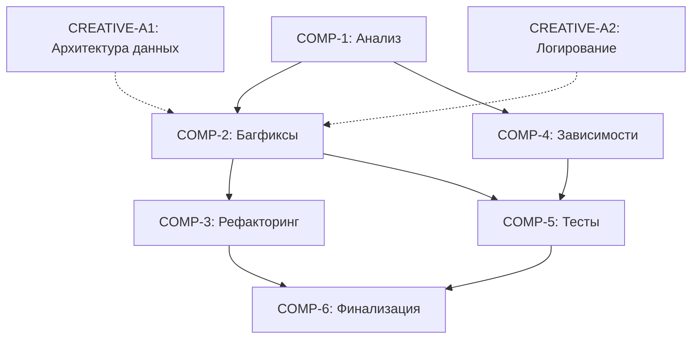

# ЗАДАЧА: Комплексная доработка и оптимизация проекта v2.4.0

**ID**: comprehensive-optimization-v2.4.0  
**Дата создания**: 2025-10-25 23:34:46  
**Дата обновления**: 2025-10-25 23:48:09  
**Статус**: ✅ CREATIVE MODE ЗАВЕРШЁН - ГОТОВ К IMPLEMENT MODE  
**Приоритет**: 🔴 Критический  
**Уровень сложности**: Level 4 (Complex System)  
**Оценка времени**: ~28 часов  
**Текущий прогресс**: 5% ⬛⬜⬜⬜⬜⬜⬜⬜⬜⬜

---

## 📋 ОПИСАНИЕ ЗАДАЧИ

Комплексная доработка проекта включающая:
1. Исправление 5 критических архитектурных проблем
2. Рефакторинг и оптимизация всего кода
3. Актуализация всех зависимостей до последних стабильных версий
4. Полное обновление тестового покрытия

---

## 🏗️ АРХИТЕКТУРНЫЙ ОБЗОР

### Выявленные критические проблемы:

**БАГ-A1**: Строковые суммы в workflow ломают числовое форматирование Excel
- **Файл**: `src/core/workflow.py:357-400`
- **Проблема**: `_process_invoices_data` форматирует суммы в строки ("120 000,00"), а ExcelReportGenerator ожидает числа
- **Влияние**: Невозможность числового форматирования и суммирования в Excel

**БАГ-A2**: DataProcessor постоянно ловит AttributeError при отсутствии клиента
- **Файлы**: `src/data_processor/data_processor.py`
- **Проблема**: Методы проверяют `hasattr(self, "_bitrix_client")`, но атрибут существует всегда (создается в `__init__`), поэтому при None происходит AttributeError
- **Влияние**: Замусоривание логов ложными предупреждениями

**БАГ-A3**: Параметр `use_secure_config` в AppFactory не работает
- **Файл**: `src/core/app.py:354-381`
- **Проблема**: AppFactory принимает флаг, но ReportGeneratorApp всегда использует SecureConfigReader
- **Влияние**: Вводит в заблуждение, невозможно использовать простой ConfigReader

**БАГ-A4**: Логгер не переключает файл на новую дату
- **Файл**: `src/core/app.py:77-108`
- **Проблема**: `_setup_logging` создает FileHandler один раз, старый обработчик остается активным
- **Влияние**: Логи продолжают писаться в старый файл, теряется ротация по дате

**БАГ-A5**: DataProcessor фактически не используется в workflow
- **Файл**: `src/core/workflow.py`
- **Проблема**: Оркестратор дублирует логику обработки данных вместо использования DataProcessor
- **Влияние**: Дублирование кода, сложность поддержки, источник БАГ-A1

---

## 🎯 КОМПОНЕНТЫ И ЗАДАЧИ

### COMP-1: Анализ и подготовка (4 часа)
**Приоритет**: 🔴 Критический (блокирует остальное)  
**Статус**: ⏳ Не начато  
**Зависимости**: Нет

#### TASK-1.1: Детальный аудит кодовой базы (2 часа)
- [ ] Анализ всех файлов в `src/` на наличие мёртвого кода
- [ ] Проверка дублирования логики между модулями
- [ ] Анализ неиспользуемых импортов и функций
- [ ] Создание отчета о технических долгах

#### TASK-1.2: Проверка актуальности зависимостей через Context7 (1 час)
- [ ] Исследование текущих версий: requests, openpyxl, python-dotenv, pytest
- [ ] Проверка совместимости с Python 3.12+
- [ ] Проверка изменений API и breaking changes
- [ ] Документирование необходимых обновлений

#### TASK-1.3: Создание Git checkpoint и ветки (30 минут)
- [ ] Создать Git tag `v2.3.0-before-optimization`
- [ ] Создать feature ветку `feature/comprehensive-optimization-v2.4.0`
- [ ] Подготовить план миграции

#### TASK-1.4: Подготовка тестовой среды (30 минут)
- [ ] Активация виртуального окружения
- [ ] Запуск полного набора тестов (baseline)
- [ ] Документирование текущего покрытия

---

### COMP-2: Исправление критических багов (6 часов)
**Приоритет**: 🔴 Критический  
**Статус**: ⏳ Не начато  
**Зависимости**: COMP-1

#### TASK-2.1: БАГ-A1 - Исправление строковых сумм в workflow (2 часа)
**Creative Phase Required**: ДА (архитектурное решение)

**Подзадачи**:
- [ ] SUB-2.1.1: Анализ использования DataProcessor vs встроенной логики
- [ ] SUB-2.1.2: Проектирование решения (использовать DataProcessor полностью или исправить workflow)
- [ ] SUB-2.1.3: Изменение `_process_invoices_data` для возврата числовых типов
- [ ] SUB-2.1.4: Обновление типов в InvoiceData (Decimal вместо str)
- [ ] SUB-2.1.5: Изменение ExcelReportGenerator для работы с числами
- [ ] SUB-2.1.6: Тестирование числового форматирования в Excel

**Файлы**:
- `src/core/workflow.py` (метод `_process_invoices_data`)
- `src/data_processor/data_processor.py` (структуры данных)
- `src/excel_generator/generator.py` (форматирование)

#### TASK-2.2: БАГ-A2 - Исправление проверки Bitrix24Client (1 час)
**Подзадачи**:
- [ ] SUB-2.2.1: Изменить проверку с `hasattr` на `if self._bitrix_client is not None`
- [ ] SUB-2.2.2: Обновить методы `_extract_smart_invoice_inn` и `_extract_smart_invoice_counterparty`
- [ ] SUB-2.2.3: Добавить unit тесты для обоих случаев (с клиентом и без)
- [ ] SUB-2.2.4: Проверить логи на отсутствие ложных предупреждений

**Файлы**:
- `src/data_processor/data_processor.py`

#### TASK-2.3: БАГ-A3 - Исправление AppFactory.use_secure_config (1 час)
**Подзадачи**:
- [ ] SUB-2.3.1: Добавить параметр в `ReportGeneratorApp.__init__`
- [ ] SUB-2.3.2: Условная инициализация SecureConfigReader vs ConfigReader
- [ ] SUB-2.3.3: Обновить AppFactory для передачи параметра
- [ ] SUB-2.3.4: Добавить тесты для обоих режимов конфигурации

**Файлы**:
- `src/core/app.py`

#### TASK-2.4: БАГ-A4 - Исправление ротации логов (1 час)
**Подзадачи**:
- [ ] SUB-2.4.1: Добавить проверку существующих handlers перед созданием нового
- [ ] SUB-2.4.2: Удалять старые FileHandler при смене даты
- [ ] SUB-2.4.3: Рассмотреть использование `RotatingFileHandler` или `TimedRotatingFileHandler`
- [ ] SUB-2.4.4: Тестирование переключения файла при смене даты

**Файлы**:
- `src/core/app.py` (метод `_setup_logging`)

#### TASK-2.5: БАГ-A5 - Рефакторинг использования DataProcessor (1 час)
**Creative Phase Required**: ДА (архитектурное решение)

**Подзадачи**:
- [ ] SUB-2.5.1: Анализ дублирования между WorkflowOrchestrator и DataProcessor
- [ ] SUB-2.5.2: Проектирование единого подхода к обработке данных
- [ ] SUB-2.5.3: Перенос логики из `_process_invoices_data` в DataProcessor
- [ ] SUB-2.5.4: Обновление WorkflowOrchestrator для использования DataProcessor
- [ ] SUB-2.5.5: Удаление дублирующей логики

**Файлы**:
- `src/core/workflow.py`
- `src/data_processor/data_processor.py`

---

### COMP-3: Рефакторинг и оптимизация кода (8 часов)
**Приоритет**: 🟠 Высокий  
**Статус**: ⏳ Не начато  
**Зависимости**: COMP-2

#### TASK-3.1: Удаление мёртвого кода (2 часа)
- [ ] SUB-3.1.1: Анализ неиспользуемых импортов (через pyflakes/pylint)
- [ ] SUB-3.1.2: Поиск неиспользуемых функций и методов
- [ ] SUB-3.1.3: Удаление закомментированного кода
- [ ] SUB-3.1.4: Проверка через grep на отсутствие ссылок

#### TASK-3.2: Рефакторинг сложных методов (3 часа)
- [ ] SUB-3.2.1: Идентификация методов с высокой цикломатической сложностью
- [ ] SUB-3.2.2: Разбиение на более мелкие методы
- [ ] SUB-3.2.3: Улучшение читаемости и поддерживаемости
- [ ] SUB-3.2.4: Добавление type hints где отсутствуют

#### TASK-3.3: Оптимизация производительности (2 часа)
- [ ] SUB-3.3.1: Профилирование критических участков
- [ ] SUB-3.3.2: Оптимизация циклов и операций с данными
- [ ] SUB-3.3.3: Кеширование повторяющихся запросов
- [ ] SUB-3.3.4: Измерение улучшений производительности

#### TASK-3.4: Улучшение архитектуры (1 час)
- [ ] SUB-3.4.1: Проверка соответствия SOLID принципам
- [ ] SUB-3.4.2: Улучшение separation of concerns
- [ ] SUB-3.4.3: Документирование архитектурных решений

---

### COMP-4: Актуализация зависимостей (4 часа)
**Приоритет**: 🟠 Высокий  
**Статус**: ⏳ Не начато  
**Зависимости**: COMP-1, COMP-2

#### TASK-4.1: Context7 исследование обновлений (1.5 часа)
- [ ] SUB-4.1.1: Проверка requests (текущая 2.32.5)
- [ ] SUB-4.1.2: Проверка openpyxl (текущая 3.1.5)
- [ ] SUB-4.1.3: Проверка python-dotenv (текущая 1.1.1)
- [ ] SUB-4.1.4: Проверка pytest и pytest-cov
- [ ] SUB-4.1.5: Проверка dev зависимостей (black, mypy, flake8)
- [ ] SUB-4.1.6: Документирование breaking changes

#### TASK-4.2: Обновление requirements.txt (30 минут)
- [ ] SUB-4.2.1: Обновление версий до последних стабильных
- [ ] SUB-4.2.2: Проверка совместимости между пакетами
- [ ] SUB-4.2.3: Обновление комментариев в requirements.txt

#### TASK-4.3: Миграция кода для новых API (1.5 часа)
- [ ] SUB-4.3.1: Адаптация кода к breaking changes
- [ ] SUB-4.3.2: Обновление использования deprecated функций
- [ ] SUB-4.3.3: Тестирование с новыми версиями

#### TASK-4.4: Проверка совместимости Python (30 минут)
- [ ] SUB-4.4.1: Проверка на Python 3.12+
- [ ] SUB-4.4.2: Обновление версии в документации
- [ ] SUB-4.4.3: Проверка на deprecated features Python

---

### COMP-5: Обновление тестового покрытия (4 часа)
**Приоритет**: 🟠 Высокий  
**Статус**: ⏳ Не начато  
**Зависимости**: COMP-2, COMP-3

#### TASK-5.1: Аудит существующих тестов (1 час)
- [ ] SUB-5.1.1: Анализ текущего покрытия (coverage report)
- [ ] SUB-5.1.2: Идентификация устаревших тестов
- [ ] SUB-5.1.3: Поиск тестов с плохой изоляцией
- [ ] SUB-5.1.4: Документирование пробелов в покрытии

#### TASK-5.2: Добавление тестов для багфиксов (1.5 часа)
- [ ] SUB-5.2.1: Тесты для БАГ-A1 (числовое форматирование)
- [ ] SUB-5.2.2: Тесты для БАГ-A2 (проверка клиента)
- [ ] SUB-5.2.3: Тесты для БАГ-A3 (use_secure_config)
- [ ] SUB-5.2.4: Тесты для БАГ-A4 (ротация логов)
- [ ] SUB-5.2.5: Тесты для БАГ-A5 (использование DataProcessor)

#### TASK-5.3: Расширение coverage критических путей (1 час)
- [ ] SUB-5.3.1: Добавление тестов для error handlers
- [ ] SUB-5.3.2: Тесты для edge cases
- [ ] SUB-5.3.3: Интеграционные тесты для workflow
- [ ] SUB-5.3.4: Достижение 95%+ покрытия

#### TASK-5.4: Обновление существующих тестов (30 минут)
- [ ] SUB-5.4.1: Рефакторинг устаревших тестов
- [ ] SUB-5.4.2: Улучшение читаемости тестов
- [ ] SUB-5.4.3: Добавление описательных docstrings

---

### COMP-6: Финализация и документация (2 часа)
**Приоритет**: 🟢 Средний  
**Статус**: ⏳ Не начато  
**Зависимости**: COMP-2, COMP-3, COMP-4, COMP-5

#### TASK-6.1: Обновление документации (1 час)
- [ ] SUB-6.1.1: Обновление README.md с новыми возможностями
- [ ] SUB-6.1.2: Обновление CHANGELOG.md
- [ ] SUB-6.1.3: Обновление техническую документацию
- [ ] SUB-6.1.4: Документирование архитектурных изменений

#### TASK-6.2: Финальное тестирование (30 минут)
- [ ] SUB-6.2.1: Полный прогон всех тестов
- [ ] SUB-6.2.2: Проверка генерации отчетов
- [ ] SUB-6.2.3: Ручное тестирование основных сценариев

#### TASK-6.3: Подготовка релиза (30 минут)
- [ ] SUB-6.3.1: Создание Pull Request
- [ ] SUB-6.3.2: Подготовка Release Notes
- [ ] SUB-6.3.3: Создание Git tag v2.4.0

---

## 🎨 CREATIVE PHASES

### ✅ CREATIVE-A1: Архитектура обработки данных (ЗАВЕРШЁН)
**Компонент**: COMP-2 (TASK-2.1, TASK-2.5)  
**Статус**: ✅ ЗАВЕРШЁН  
**Приоритет**: 🔴 Критический  
**Документ**: `memory-bank/creative/creative-data-processing-architecture-v2.4.0.md`

**Проблема**: Дублирование логики между WorkflowOrchestrator и DataProcessor

**ПРИНЯТОЕ РЕШЕНИЕ**: **Вариант 3 - Гибридная архитектура** (9.0/10)

**Ключевые изменения**:
1. DataProcessor получает метод `process_invoice_batch()` для batch обработки
2. Создается новый класс `ProcessedInvoice` с Decimal типами
3. WorkflowOrchestrator упрощается и использует DataProcessor
4. ExcelReportGenerator адаптируется для Decimal форматирования

**Разделение ответственности**:
- `DataProcessor` → Обработка и валидация данных
- `WorkflowOrchestrator` → Координация процесса
- `ExcelReportGenerator` → Форматирование для Excel

**Решенные проблемы**:
- ✅ БАГ-A1: Excel получает числовые типы вместо строк
- ✅ БАГ-A5: DataProcessor полностью используется, дублирование устранено

**Время реализации**: ~2.5 часа

---

### ✅ CREATIVE-A2: Система логирования с ротацией (ЗАВЕРШЁН)
**Компонент**: COMP-2 (TASK-2.4)  
**Статус**: ✅ ЗАВЕРШЁН  
**Приоритет**: 🟠 Высокий  
**Документ**: `memory-bank/creative/creative-logging-rotation-v2.4.0.md`

**Проблема**: Текущая система не поддерживает корректную ротацию по дате

**ПРИНЯТОЕ РЕШЕНИЕ**: **Вариант 1 - TimedRotatingFileHandler** (8.5/10)

**Ключевые изменения**:
1. Замена `FileHandler` на `TimedRotatingFileHandler`
2. Автоматическая ротация в полночь
3. Автоматическое удаление логов старше 30 дней
4. Схема именования: `app.log` + `app.log.YYYYMMDD`

**Решенная проблема**:
- ✅ БАГ-A4: Логи автоматически переключаются на новый файл при смене даты

**Время реализации**: ~20 минут

---

## 📊 МАТРИЦА ЗАВИСИМОСТЕЙ



---

## ⚠️ РЕЕСТР РИСКОВ

| ID | Риск | Вероятность | Влияние | Митигация |
|----|------|-------------|---------|-----------|
| RISK-A1 | Breaking changes в обновленных зависимостях | Средняя | Высокое | Context7 проверка перед обновлением |
| RISK-A2 | Регрессии после рефакторинга DataProcessor | Средняя | Критическое | Comprehensive тесты перед изменением |
| RISK-A3 | Несовместимость Python 3.12+ | Низкая | Среднее | Проверка в виртуальном окружении |
| RISK-A4 | Потеря производительности после изменений | Низкая | Среднее | Профилирование до и после |
| RISK-A5 | Конфликты при мердже с main | Низкая | Низкое | Частые синхронизации с main |

---

## 📈 ВРЕМЕННАЯ ОЦЕНКА

| Компонент | Оценка | Критический путь |
|-----------|--------|------------------|
| COMP-1    | 4 часа | ✅ Да |
| COMP-2    | 6 часов | ✅ Да |
| COMP-3    | 8 часов | ⚠️ Частично |
| COMP-4    | 4 часа | ❌ Нет |
| COMP-5    | 4 часа | ✅ Да |
| COMP-6    | 2 часа | ✅ Да |
| **ИТОГО** | **28 часов** | |

---

## ✅ КРИТЕРИИ ГОТОВНОСТИ

### К переходу в CREATIVE MODE:
- [x] План создан и задокументирован
- [x] Проведен аудит кодовой базы (в рамках планирования)
- [ ] Зависимости проверены через Context7
- [ ] Созданы Git checkpoint и ветка

### К переходу в IMPLEMENT MODE:
- [x] Все Creative решения приняты (2/2) ✅
- [x] Риски проанализированы
- [ ] Тестовая среда подготовлена
- [ ] Git checkpoint создан
- [ ] Feature ветка создана

### К завершению задачи:
- [ ] Все 5 багов исправлены
- [ ] Рефакторинг завершен
- [ ] Зависимости обновлены
- [ ] Тесты проходят с 95%+ coverage
- [ ] Документация обновлена
- [ ] Релиз v2.4.0 подготовлен

---

## 🚀 СЛЕДУЮЩИЙ РЕЖИМ

**Рекомендация**: CREATIVE MODE → **IMPLEMENT MODE** ✅

**Обоснование**: Все архитектурные решения приняты, готовы к реализации:
1. ✅ CREATIVE-A1: Гибридная архитектура (9.0/10)
2. ✅ CREATIVE-A2: TimedRotatingFileHandler (8.5/10)

**Команда для начала**:
```
BUILD или IMPLEMENT
```

**Порядок реализации**:
1. COMP-1: Анализ и подготовка → Context7, Git checkpoint
2. COMP-2: Исправление багов → Используем Creative решения
3. COMP-3-6: Рефакторинг, тесты, финализация

---

*Последнее обновление: 2025-10-25 23:48:09*  
*Текущий режим: CREATIVE MODE ЗАВЕРШЁН*  
*Статус*: ✅ **ГОТОВ К IMPLEMENT MODE**

**Creative документы созданы**:
- `memory-bank/creative/creative-data-processing-architecture-v2.4.0.md`
- `memory-bank/creative/creative-logging-rotation-v2.4.0.md`
