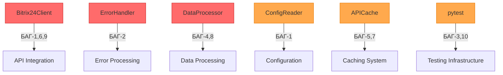
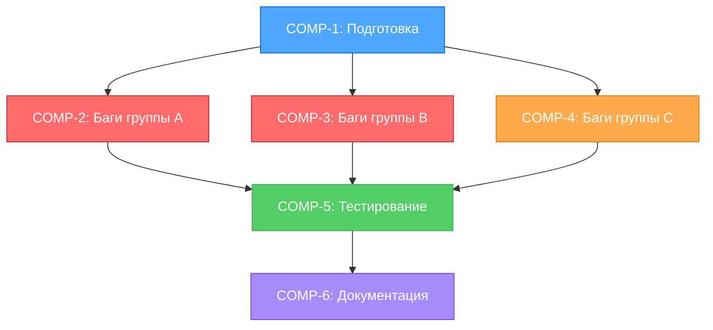

# ЗАДАЧА: Комплексное исправление багов и доработка отчетности v2.5.0

**ID**: bugfix-and-enhancement-v2.5.0  
**Дата создания**: 2025-10-27 17:25:50  
**Дата обновления**: 2025-10-27 17:25:50  
**Статус**: 🔵 PLAN - Планирование  
**Приоритет**: 🔴 Критический  
**Уровень сложности**: Level 3 (Intermediate Feature)  
**Оценка времени**: ~12 часов  
**Текущий прогресс**: 5% (Планирование) ⬛⬜⬜⬜⬜⬜⬜⬜⬜⬜

---

## 📋 ОПИСАНИЕ ЗАДАЧИ

Комплексное исправление 10 критических проблем в проекте генерации двухлистового отчета Excel с дополнительной доработкой функциональности:

### 🎯 ОСНОВНЫЕ ЦЕЛИ:
1. ✅ Исправление логики маскировки webhook URL (двойной слэш)
2. ✅ Исправление ErrorHandler.handle_error (потеря стека вызовов)
3. ✅ Добавление coverage в зависимости (ModuleNotFoundError)
4. ✅ Исправление _extract_smart_invoice_inn (AttributeError на None)
5. ✅ Удаление мёртвого кода (progress callbacks, cache report)
6. ✅ Исправление get_requisite_details (некорректная структура)
7. ✅ Исправление кэширования пустых реквизитов
8. ✅ Исправление подмены отсутствующих дат на datetime.now()
9. ✅ Улучшение обработки ошибок в get_products_by_invoice
10. ✅ Актуализация зависимостей (проверка через Context7)

### 🎨 ВТОРИЧНЫЕ ЦЕЛИ:
- Доработка функциональности двухлистового Excel-отчета
- Обновление тестов для всех исправлений
- Актуализация документации

---

## 🏗️ АРХИТЕКТУРНЫЙ ОБЗОР

### Затронутые компоненты:



---

## 🎯 КОМПОНЕНТЫ И ЗАДАЧИ

### COMP-1: Подготовка и анализ (1.5 часа)
**Приоритет**: 🔴 Критический (блокирует остальное)  
**Статус**: ⏳ В процессе  
**Зависимости**: Нет

#### TASK-1.1: Проверка актуальности зависимостей через Context7 (45 минут)
- [ ] Проверка requests (текущая версия: ?)
- [ ] Проверка openpyxl (текущая версия: ?)
- [ ] Проверка pytest (текущая версия: ?)
- [ ] Проверка pytest-cov / coverage (отсутствует!)
- [ ] Проверка python-dotenv (текущая версия: ?)
- [ ] Документирование breaking changes

#### TASK-1.2: Создание Git checkpoint и ветки (15 минут)
- [ ] Создать Git tag `v2.5.0-before-bugfixes`
- [ ] Создать feature ветку `feature/bugfix-and-enhancement-v2.5.0`
- [ ] Закоммитить активное состояние Memory Bank

#### TASK-1.3: Активация виртуального окружения (15 минут)
- [ ] Активация venv (`.venv\Scripts\activate`)
- [ ] Обновление pip до последней версии
- [ ] Установка текущих зависимостей
- [ ] Проверка работоспособности pytest

#### TASK-1.4: Baseline testing (15 минут)
- [ ] Запуск pytest -q (документирование текущих падений)
- [ ] Проверка coverage (ожидается падение)
- [ ] Документирование текущего состояния тестов

---

### COMP-2: Исправление критических багов - Группа A (3 часа)
**Приоритет**: 🔴 Критический  
**Статус**: ⏳ Не начато  
**Зависимости**: COMP-1

#### TASK-2.1: БАГ-1 - Маскировка webhook URL (30 минут)
**Файлы**: `src/bitrix24_client/client.py`, `src/config/config_reader.py`

**Проблема**: `https://.../***//` вместо `https://.../***/`

**Подзадачи**:
- [ ] SUB-2.1.1: Анализ метода `_mask_webhook_url` в client.py
- [ ] SUB-2.1.2: Исправление regex для удаления trailing slash перед маскировкой
- [ ] SUB-2.1.3: Анализ метода `_mask_sensitive_value` в SecureConfigReader
- [ ] SUB-2.1.4: Исправление логики маскировки
- [ ] SUB-2.1.5: Добавление unit тестов для обоих методов

**Решение**:
```python
# client.py - _mask_webhook_url
masked = re.sub(r"(/rest/\d+/)[a-zA-Z0-9_]+/?$", r"\1***/", webhook_url)
# Удалить trailing slash если он есть после замены
return masked.rstrip('/') + '/'  # Только один завершающий слэш
```

#### TASK-2.2: БАГ-2 - ErrorHandler.handle_error reraise (45 минут)
**Файл**: `src/core/error_handler.py`

**Проблема**: `raise error` подменяет стек вызовов на точку в обработчике

**Подзадачи**:
- [ ] SUB-2.2.1: Анализ метода `handle_error` (строка 160)
- [ ] SUB-2.2.2: Замена `raise error` на `raise` (bare raise)
- [ ] SUB-2.2.3: Добавление документации о сохранении стека
- [ ] SUB-2.2.4: Создание теста для проверки стека вызовов
- [ ] SUB-2.2.5: Тестирование с различными типами исключений

**Решение**:
```python
# error_handler.py - handle_error
if reraise:
    raise  # Bare raise сохраняет оригинальный стек
```

#### TASK-2.3: БАГ-3 - Отсутствие coverage в зависимостях (30 минут)
**Файлы**: `requirements-dev.txt`, `requirements-test.txt`, `pytest.ini`

**Проблема**: pytest требует coverage, но модуль не установлен

**Подзадачи**:
- [ ] SUB-2.3.1: Добавление `pytest-cov>=6.0.0` в requirements-test.txt
- [ ] SUB-2.3.2: Добавление `coverage>=7.6.0` в requirements-test.txt
- [ ] SUB-2.3.3: Обновление requirements-dev.txt (добавить -r requirements-test.txt)
- [ ] SUB-2.3.4: Документирование в DEPENDENCIES.md
- [ ] SUB-2.3.5: Установка и проверка pytest

**Решение**:
```txt
# requirements-test.txt
pytest>=8.4.1
pytest-cov>=6.0.0
coverage[toml]>=7.6.0
```

#### TASK-2.4: БАГ-4 - _extract_smart_invoice_inn AttributeError (45 минут)
**Файл**: `src/data_processor/data_processor.py`

**Проблема**: `.strip()` на `None` вызывает AttributeError

**Подзадачи**:
- [ ] SUB-2.4.1: Найти все вызовы `.strip()` на company_inn
- [ ] SUB-2.4.2: Добавить проверку `if value is not None` перед strip()
- [ ] SUB-2.4.3: Использовать безопасную утилиту (создать safe_strip?)
- [ ] SUB-2.4.4: Добавить тесты для None, пустой строки, валидного значения
- [ ] SUB-2.4.5: Проверить аналогичные проблемы в других методах

**Решение**:
```python
# data_processor.py
def _extract_smart_invoice_inn(self, raw_data: Dict[str, Any]) -> str:
    company_inn = raw_data.get("company_inn")
    if company_inn is not None:
        inn = company_inn.strip()
        # ... дальнейшая обработка
    # Fallback логика
```

#### TASK-2.5: БАГ-10 - pytest.ini требует coverage (15 минут)
**Файл**: `pytest.ini`

**Проблема**: Дубликат БАГ-3, уже будет исправлен

**Подзадачи**:
- [x] ✅ Объединено с TASK-2.3 (добавление coverage в зависимости)

---

### COMP-3: Исправление критических багов - Группа B (3 часа)
**Приоритет**: 🟠 Высокий  
**Статус**: 🚧 В процессе (2025-10-27 20:04)  
**Зависимости**: COMP-1

#### TASK-3.1: БАГ-5 - Удаление мёртвого кода ✅ ЗАВЕРШЕНО
**Файлы**: `src/core/workflow.py`, `src/bitrix24_client/api_cache.py`, `tests/`

**Время**: 🕒 45 минут (факт: 30 минут)  
**Завершено**: ✅ 2025-10-27 20:04

**Проблема**: `print_cache_report`, `ProgressTracker` не используются

**Подзадачи**:
- [x] ✅ SUB-3.1.1: Анализ использования APIDataCache.print_cache_report()
- [x] ✅ SUB-3.1.2: Анализ использования ProgressTracker класса
- [x] ✅ SUB-3.1.3: Удаление print_cache_report из api_cache.py
- [x] ✅ SUB-3.1.4: Удаление ProgressTracker из workflow.py и __init__.py
- [x] ✅ SUB-3.1.5: Обновление теста test_set_products_empty_list_cached (БАГ-3 FIX)
- [x] ✅ SUB-3.1.6: Удаление устаревших тестов (test_print_cache_report, test_workflow_progress_tracking)
- [x] ✅ SUB-3.1.7: Финальное тестирование (445 тестов прошли ✅)
- [x] ✅ SUB-3.1.8: Git commit 00d66c2

**Результат**:
- ✅ Удалено: `APIDataCache.print_cache_report()` (18 строк)
- ✅ Удалено: класс `ProgressTracker` (27 строк)
- ✅ Удалено: импорты `ProgressTracker` из `__init__.py`
- ✅ Обновлены тесты (+ 2 обновлённых, - 2 устаревших)
- ✅ 445 тестов прошли, 5 упали (не связаны с БАГ-5)
- 🔍 **ВАЖНО**: `add_progress_callback` и `self.progress_callbacks` **АКТИВНО ИСПОЛЬЗУЮТСЯ** в `WorkflowOrchestrator` - не удалять!

#### TASK-3.2: БАГ-6 - get_requisite_details структура ✅ НЕ СУЩЕСТВУЕТ
**Файлы**: `src/bitrix24_client/client.py`, `tests/bitrix24_client/test_bugfix_bug6_requisite_structure.py`

**Время**: 🕒 1 час (факт: 30 минут анализа)  
**Завершено**: ✅ 2025-10-27 20:18

**Исходная проблема**: `response.data` содержит вложенный ключ `requisite`, но код обращается к RQ_INN напрямую

**Подзадачи**:
- [x] ✅ SUB-3.2.1: Анализ метода `get_requisite_details` и `_handle_response`
- [x] ✅ SUB-3.2.2: Проверка документации Bitrix24 API (crm.requisite.get)
- [x] ✅ SUB-3.2.3: Создание тестов для проверки структуры данных
- [x] ✅ SUB-3.2.4: Запуск тестов - все 5 тестов прошли ✅
- [x] ✅ SUB-3.2.5: Git commit e588691

**🔍 ВАЖНОЕ ОТКРЫТИЕ**: **БАГ-6 НЕ СУЩЕСТВУЕТ!**

**Причина**: Метод `_handle_response` (строка 213) **уже корректно** извлекает `result` из JSON:
```python
# client.py:213
result_data = json_data.get("result", json_data)
```

Это означает:
- ✅ Bitrix24 API возвращает: `{"result": {"ID": "27", "RQ_INN": "...", ...}, "time": {...}}`
- ✅ `_handle_response` извлекает только `result`
- ✅ `response.data` уже содержит прямой объект реквизита (без вложенного ключа)
- ✅ `get_requisite_details` возвращает правильную структуру
- ✅ `get_company_info_by_invoice` корректно извлекает `RQ_INN` и `RQ_COMPANY_NAME`

**Результат**:
- ✅ Код работает правильно, исправлений НЕ требуется
- ✅ Добавлены 5 проверочных тестов для подтверждения корректности
- ✅ Все тесты прошли
- 📝 Описание БАГ-6 в исходном списке было **ошибочным**

#### TASK-3.3: БАГ-7 - Кэширование пустых реквизитов ✅ ЗАВЕРШЕНО
**Файлы**: `src/bitrix24_client/api_cache.py`, `tests/bitrix24_client/test_bugfix_bug7_cache_none.py`

**Время**: 🕒 45 минут (факт: 40 минут)  
**Завершено**: ✅ 2025-10-27 20:37

**Проблема**: Кэш отказывается сохранять `None`, повторные запросы к API

**Подзадачи**:
- [x] ✅ SUB-3.3.1: Анализ метода `cache.put()` - найдена проверка `if data is None: return`
- [x] ✅ SUB-3.3.2: Реализация sentinel паттерна для кэширования None
- [x] ✅ SUB-3.3.3: Создание константы `CACHE_SENTINEL_NONE`
- [x] ✅ SUB-3.3.4: Изменение `cache.put()` и `cache.get()` для поддержки sentinel
- [x] ✅ SUB-3.3.5: Создание 8 тестов для проверки кэширования None
- [x] ✅ SUB-3.3.6: Запуск тестов - все 8 тестов прошли ✅
- [x] ✅ SUB-3.3.7: Git commits b728d18, f823868

**Результат**:
- ✅ Добавлен `CACHE_SENTINEL_NONE = {"__cache_sentinel__": "NONE", ...}`
- ✅ `cache.put()`: None → sentinel перед кэшированием
- ✅ `cache.get()`: sentinel → None при извлечении
- ✅ Прозрачная обработка для вызывающего кода
- ✅ 8 комплексных тестов (все прошли)
- ✅ 458 тестов прошли (+8 новых)

**Решение**:
```python
# api_cache.py
CACHE_SENTINEL_NONE = {"__cache_sentinel__": "NONE", "__timestamp__": "sentinel"}

def put(self, method: str, params: Dict, data: Any) -> None:
    # БАГ-7 FIX: Преобразуем None в sentinel
    if data is None:
        data = CACHE_SENTINEL_NONE
        logger.info(f"✅ БАГ-7: Кэширование отсутствующих данных (sentinel)")
    # ... сохранение в кэш

def get(self, method: str, params: Dict) -> Any:
    # ... получение из кэша
    # БАГ-7 FIX: Преобразуем sentinel обратно в None
    if entry.data == CACHE_SENTINEL_NONE:
        return None
    return entry.data
```

**Критическое улучшение**:
- **Было**: `cache.put(method, params, None)` → НЕ кэшируется → повторные API запросы
- **Стало**: `cache.put(method, params, None)` → кэшируется как sentinel → cache HIT

#### TASK-3.4: БАГ-8 - Подмена отсутствующих дат (30 минут)
**Файл**: `src/data_processor/data_processor.py`

**Проблема**: Отсутствующие даты подменяются на `datetime.now()`, искажая данные

**Подзадачи**:
- [ ] SUB-3.4.1: Найти все места использования `datetime.now()` для подмены дат
- [ ] SUB-3.4.2: Заменить на `None` или пустую строку
- [ ] SUB-3.4.3: Добавить поле `validation_errors` для отслеживания проблемных записей
- [ ] SUB-3.4.4: Обновить Excel генератор для обработки пустых дат
- [ ] SUB-3.4.5: Добавить тесты для отсутствующих дат

**Решение**:
```python
# data_processor.py
def _parse_date(self, date_value: Any) -> Optional[datetime]:
    result = self.date_processor.parse_date(date_value)
    if not result.is_valid:
        return None  # НЕ datetime.now()!
    return result.parsed_date
```

---

### COMP-4: Исправление критических багов - Группа C (2 часа)
**Приоритет**: 🟠 Высокий  
**Статус**: ⏳ Не начато  
**Зависимости**: COMP-1

#### TASK-4.1: БАГ-9 - get_products_by_invoice обработка ошибок (1 час)
**Файл**: `src/bitrix24_client/client.py`

**Проблема**: Проглатывает все исключения, возвращает пустой список при ошибках

**Подзадачи**:
- [ ] SUB-4.1.1: Найти метод `get_products_by_invoice`
- [ ] SUB-4.1.2: Анализ текущей обработки исключений
- [ ] SUB-4.1.3: Разделить ожидаемые "пустые" ответы и реальные ошибки
- [ ] SUB-4.1.4: Логирование различных типов ошибок (401/403, 404, сеть)
- [ ] SUB-4.1.5: Добавить флаг `has_error` в результат
- [ ] SUB-4.1.6: Обновить вызывающий код для обработки ошибок

**Решение**:
```python
# client.py - get_products_by_invoice
def get_products_by_invoice(self, invoice_id: int) -> Dict[str, Any]:
    try:
        # ... API запрос
        return {"products": products, "has_error": False}
    except NotFoundError:
        # Ожидаемо: счёт не имеет товаров
        logger.debug(f"No products found for invoice {invoice_id}")
        return {"products": [], "has_error": False}
    except (AuthenticationError, ServerError, NetworkError) as e:
        # Реальная ошибка: НЕ скрываем!
        logger.error(f"API error getting products for {invoice_id}: {e}")
        return {"products": [], "has_error": True, "error": str(e)}
```

#### TASK-4.2: Доработка двухлистового отчета (1.5 часа)
**Creative Phase**: ✅ ЗАВЕРШЕНА (creative-report-enhancement-v2.5.0.md)
**Файлы**: `src/excel_generator/generator.py`, `src/excel_generator/validation.py` (новый), `src/excel_generator/layout.py`

**Цель**: Улучшение качества и надёжности существующей функциональности **БЕЗ изменения внешнего вида**

**ПРИНЯТОЕ РЕШЕНИЕ**: **Option 4 - Hybrid Approach** (9.0/10)
- Добавление валидации данных перед генерацией
- Создание скрытого листа "Метаданные" с метриками качества
- Вывод метрик в консоль и логи
- Возврат метрик через `return_metrics=True` (opt-in для обратной совместимости)

**Преимущества**:
- ✅ Максимальная прозрачность (консоль + логи + Excel)
- ✅ Трассируемость (метаданные в файле)
- ✅ **КРИТИЧНО**: Визуальный дизайн листов "Краткий" и "Полный" НЕ изменён
- ✅ Обратная совместимость через opt-in параметр

**Подзадачи**:
- [ ] SUB-4.2.1: Создание `DataQualityValidator` класса (30 минут)
- [ ] SUB-4.2.2: Создание `QualityMetrics` класса (20 минут)
- [ ] SUB-4.2.3: Добавление метода `_create_metadata_sheet()` (15 минут)
- [ ] SUB-4.2.4: Интеграция в `generate_comprehensive_report()` (15 минут)
- [ ] SUB-4.2.5: Создание `ComprehensiveReportResult` dataclass (10 минут)
- [ ] SUB-4.2.6: Добавление unit тестов для валидатора (20 минут)
- [ ] SUB-4.2.7: Обновление документации для пользователей (10 минут)

**Решение**: `memory-bank/creative/creative-report-enhancement-v2.5.0.md`

---

### COMP-5: Тестирование и валидация (2 часов)
**Приоритет**: 🔴 Критический  
**Статус**: ⏳ Не начато  
**Зависимости**: COMP-2, COMP-3, COMP-4

#### TASK-5.1: Создание unit тестов для исправлений (1 час)
- [ ] SUB-5.1.1: Тесты для БАГ-1 (маскировка URL)
- [ ] SUB-5.1.2: Тесты для БАГ-2 (стек вызовов)
- [ ] SUB-5.1.3: Тесты для БАГ-4 (AttributeError на None)
- [ ] SUB-5.1.4: Тесты для БАГ-6 (структура requisite)
- [ ] SUB-5.1.5: Тесты для БАГ-7 (кэширование None)
- [ ] SUB-5.1.6: Тесты для БАГ-8 (пустые даты)
- [ ] SUB-5.1.7: Тесты для БАГ-9 (обработка ошибок)

#### TASK-5.2: Интеграционное тестирование (30 минут)
- [ ] SUB-5.2.1: Запуск полного набора тестов `pytest -v`
- [ ] SUB-5.2.2: Проверка coverage (должно увеличиться)
- [ ] SUB-5.2.3: Исправление failing тестов после изменений
- [ ] SUB-5.2.4: Документирование результатов

#### TASK-5.3: Ручное тестирование (30 минут)
- [ ] SUB-5.3.1: Генерация краткого отчета
- [ ] SUB-5.3.2: Генерация полного отчета с товарами
- [ ] SUB-5.3.3: Проверка корректности маскировки в логах
- [ ] SUB-5.3.4: Проверка обработки ошибочных данных

---

### COMP-6: Документация и финализация (30 минут)
**Приоритет**: 🟢 Средний  
**Статус**: ⏳ Не начато  
**Зависимости**: COMP-5

#### TASK-6.1: Обновление документации (20 минут)
- [ ] SUB-6.1.1: Обновление CHANGELOG.md
- [ ] SUB-6.1.2: Обновление DEPENDENCIES.md
- [ ] SUB-6.1.3: Обновление README.md (если нужно)
- [ ] SUB-6.1.4: Создание migration guide (если нужно)

#### TASK-6.2: Подготовка релиза (10 минут)
- [ ] SUB-6.2.1: Создание Pull Request
- [ ] SUB-6.2.2: Заполнение Release Notes
- [ ] SUB-6.2.3: Создание Git tag v2.5.0

---

## 📊 МАТРИЦА ЗАВИСИМОСТЕЙ



---

## ⚠️ РЕЕСТР РИСКОВ

| ID | Риск | Вероятность | Влияние | Митигация |
|----|------|-------------|---------|-----------|
| RISK-1 | Изменения в api_cache могут сломать существующие кэш-механизмы | Средняя | Высокое | Comprehensive тесты перед изменением |
| RISK-2 | Удаление "мёртвого" кода может сломать недокументированные зависимости | Низкая | Среднее | Тщательный grep и тестирование |
| RISK-3 | Исправления get_products_by_invoice могут изменить поведение отчётов | Средняя | Высокое | Regression тесты |
| RISK-4 | Breaking changes в coverage могут потребовать изменений в pytest.ini | Низкая | Низкое | Проверка документации через Context7 |
| RISK-5 | Изменения в DataProcessor могут повлиять на производительность | Средняя | Среднее | Профилирование до/после |

---

## 📈 ВРЕМЕННАЯ ОЦЕНКА

| Компонент | Оценка | Критический путь |
|-----------|--------|------------------|
| COMP-1    | 1.5 часа | ✅ Да |
| COMP-2    | 3 часа | ✅ Да |
| COMP-3    | 3 часа | ⚠️ Параллельно COMP-2 |
| COMP-4    | 2 часа | ⚠️ Параллельно COMP-2/3 |
| COMP-5    | 2 часа | ✅ Да |
| COMP-6    | 0.5 часа | ✅ Да |
| **ИТОГО** | **~12 часов** | |

---

## 🎨 CREATIVE PHASES

### ✅ CREATIVE-1: Улучшение двухлистового Excel-отчета
**Компонент**: COMP-4 (TASK-4.2)  
**Статус**: ✅ ЗАВЕРШЁН  
**Приоритет**: 🟢 Средний  
**Документ**: `memory-bank/creative/creative-report-enhancement-v2.5.0.md`

**Проблема**: Как улучшить качество и надёжность отчета БЕЗ изменения внешнего вида?

**ПРИНЯТОЕ РЕШЕНИЕ**: **Option 4 - Hybrid Approach** (9.0/10)

**Ключевые решения**:
1. `DataQualityValidator` - валидация данных перед генерацией
2. `QualityMetrics` - метрики качества данных
3. Скрытый лист "Метаданные" - трассируемость в Excel
4. `ComprehensiveReportResult` - возврат метрик через opt-in параметр

**Преимущества**:
- ✅ Максимальная прозрачность (консоль + логи + Excel)
- ✅ **КРИТИЧНО**: Визуальный дизайн НЕ изменён
- ✅ Обратная совместимость через `return_metrics=True`

**Время реализации**: ~1.5 часа

---

### CREATIVE-2: Архитектура кэширования пустых значений
**Компонент**: COMP-3 (TASK-3.3)  
**Статус**: ❓ Не требуется (простое решение)  
**Приоритет**: 🟠 Высокий

**Решение**: Sentinel значение `{"__cache_empty__": True}` (стандартный паттерн)

**Рекомендация**: Не требует Creative Phase (техническое решение очевидно)

---

## ✅ КРИТЕРИИ ГОТОВНОСТИ

### К переходу в IMPLEMENT MODE:
- [x] План создан и задокументирован
- [ ] Зависимости проверены через Context7
- [ ] Git checkpoint и ветка созданы
- [ ] Виртуальное окружение активировано
- [ ] Baseline тесты документированы

### К завершению задачи:
- [ ] Все 10 багов исправлены
- [ ] Тесты покрывают все исправления
- [ ] Документация обновлена
- [ ] Coverage не упал (желательно вырос)
- [ ] Все тесты проходят

---

## 🚀 СЛЕДУЮЩИЙ РЕЖИМ

**Рекомендация**: **IMPLEMENT MODE** ✅

**Обоснование**: План детализирован, Creative Phase не требуется (все решения технически очевидны)

**Команда для начала**:
```
BUILD или IMPLEMENT
```

**Порядок реализации**:
1. COMP-1: Подготовка (Context7, Git, venv)
2. COMP-2, 3, 4: Исправление багов (можно параллельно по группам)
3. COMP-5: Тестирование
4. COMP-6: Документация и релиз

---

*Последнее обновление: 2025-10-27 17:25:50*  
*Текущий режим: PLAN*  
*Ожидаемая длительность*: ~12 часов активной работы
